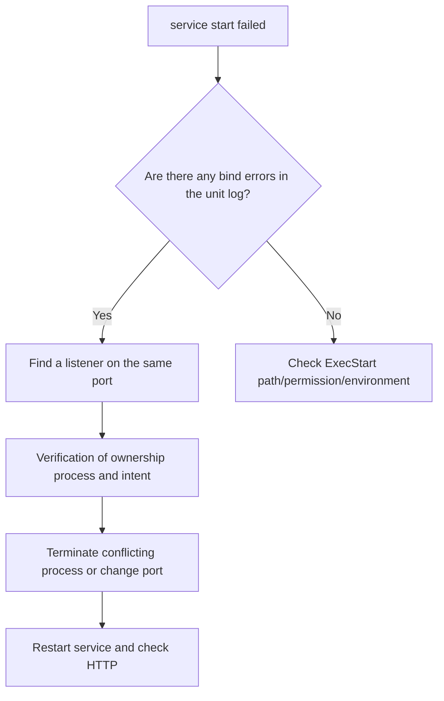

# Service fault diagnosis lab

> lab class: **Local — Linux VM or Linux host** where systemd runs. The only steps using root authority are temporary unit creation and deletion.

## Lab prerequisites

- **Environment**: Use a disposable Linux VM running systemd, not macOS. It does not run on the operating server.
- **Tools**: Requires `python3`, `curl`, `ss`, `systemctl`, `journalctl`.
- **Permissions**: Use `sudo` only at the stage of creating and deleting unit files.
- **Terminal**: Opens two windows: one to hold the process occupying the port and another to run diagnostic commands.
- **What to create**: `/etc/systemd/system/infra-http.service` One file and a temporary Python HTTP process.
- **Finished state**: The unit file and temporary process disappear and the `18080` port is not used by any process.

Before entering the command, check that the above file path does not exist before lab. If there is already a unit with the same name, stop this lab and use another VM.

## Understand the model first

This lab intentionally makes two processes compete for the same port. A TCP listener is bound to an IP address and port combination. If systemd starts a second process while the first Python process occupies `127.0.0.1:18080`, the new process terminates without creating a socket. The existing PIDs shown in systemd's `failed`, journal's bind error, and `ss` show the same event from different perspectives.

| observation | question to answer | unanswerable question |
|---|---|---|
| unit `active` | Is the manager running the main process? | Does it respond normally from the correct port? |
| listening socket | Which process did the kernel assign the address to? | Is the HTTP handler normal? |
| `curl` Success | Has the request/response been completed at this client location? | Is it accessible from other network locations? |

All three observations are set to normal standards and then a disorder is injected. That way, you can compare what has changed after failure.

## Goal

After recording the unit·PID·socket·log standards of normal service, create a port conflict and find the cause of failure, not the result of `failed`.

## 1. Create a temporary service

The next unit runs a static HTTP server on port 18080 of loopback.

```ini
# /etc/systemd/system/infra-http.service
[Unit]
Description=DevOps study HTTP server
After=network.target

[Service]
Type=simple
ExecStart=/usr/bin/python3 -m http.server 18080 --bind 127.0.0.1
Restart=no
MemoryMax=128M

[Install]
WantedBy=multi-user.target
```

```bash
sudo systemctl daemon-reload
sudo systemctl start infra-http
systemctl is-active infra-http
curl -fsS http://127.0.0.1:18080/ >/dev/null
systemctl show infra-http -p MainPID -p ControlGroup -p MemoryCurrent
ss -ltnp | grep ':18080'
```

There are four completion criteria.

- The unit is `active`.
- `MainPID` is not 0.
- There is a listening socket in `127.0.0.1:18080`.
- The HTTP request succeeds.

## 2. Create a port conflict

```bash
sudo systemctl stop infra-http
python3 -m http.server 18080 --bind 127.0.0.1
```

Start the service in another terminal that maintains the foreground process above.

```bash
sudo systemctl start infra-http
systemctl status infra-http --no-pager
journalctl -u infra-http -n 20 --no-pager
ss -ltnp | grep ':18080'
```



The key is not to immediately call the `curl` failure a network problem. In this case, the kernel has already assigned the port to another process and refuses to bind to the new process. The bind error of `journalctl` and the existing listener of `ss` must point to the same cause.

## 3. Recover and leave evidence

Shut down the foreground server as `Ctrl-C` and run the following.

```bash
sudo systemctl reset-failed infra-http
sudo systemctl start infra-http
systemctl is-active infra-http
curl -i http://127.0.0.1:18080/
```

The incident record records symptoms, time of first failure, existing listener PID, recovery action, and time of last successful request.

## resource pressure expansion lab

Do not kill the production process by blindly lowering `MemoryMax`. Use the test process only on a separate VM and prepare the following evidence.

```bash
systemctl show infra-http -p MemoryCurrent -p MemoryMax -p NRestarts
journalctl -k --since "10 minutes ago" | grep -i -E 'oom|killed process'
cat /proc/pressure/memory
```

If OOM has not been reproduced, “OOM recovery complete” is not recorded. The above command only checks the observation path before reproduction.

## Cleanup

```bash
sudo systemctl disable --now infra-http 2>/dev/null || true
sudo rm /etc/systemd/system/infra-http.service
sudo systemctl daemon-reload
sudo systemctl reset-failed
```

First, check whether the deletion target is exactly `/etc/systemd/system/infra-http.service`. Other units or Python processes are not removed by this cleanup command.

## How to interpret the results

In normal conditions, the processes of `MainPID` and `ss` are the same, and `curl` succeeds. In a crash state, the process started by systemd terminates at the bind stage, so there is no stable `MainPID`, and the cause of the address being used remains in the journal. At the same time, the foreground Python process is still visible in `ss`. When these three pieces of evidence match, a port conflict is determined.

If there is no listener in `ss`, the process occupying the port is not the cause. If there is a listener and the local `curl` succeeds, but only the remote request fails, the investigation scope moves to bind address, route, host firewall, and upper network policy. After recovery, check again the new `MainPID`, the expected listener owner, and the last HTTP success.

## Explain it in your own words

1. Why is it insufficient to check just one of `active`, listening socket, and HTTP success?
2. What are the differences between port conflicts and firewall blocking?
3. When OOM is suspected, why should we not conclude only from the application log?

<!-- source: https://www.freedesktop.org/software/systemd/man/latest/systemd.service.html | checked: 2026-09-03 | retrieval-warning: direct page unavailable -->
<!-- source: https://docs.kernel.org/admin-guide/cgroup-v2.html | checked: 2026-09-03 -->
<!-- source: https://docs.kernel.org/accounting/psi.html | checked: 2026-09-03 -->
