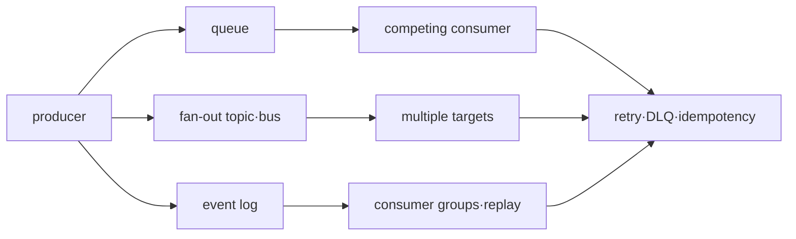

# Messaging and Event Infrastructure Roadmap

## Starting point for beginners

If the ordering service directly calls the payment service, and the payment service stops for a moment, the order request may also fail. If you have a system that stores messages in the middle, the ordering service can leave the fact that “payment is required” and the payment service can process it after recovery. Instead, the application must deal with the problem of the same message coming twice or in a different order.

| New term | Plain-language meaning | Why it matters / when to use it |
|---|---|---|
| message | One piece of data to be passed to another program | Carry a task or event across a program boundary with an explicit processing contract. **Concrete situation (illustrative):** Checkout must ask another service to send a receipt. → Publish a message with a stable order identity. → Verify the receiver can interpret and deduplicate it. |
| producer | program to send a message | Define who creates events and owns their identities, schemas, and publication behavior. **Concrete situation (illustrative):** Order events omit the field consumers need. → Fix the producer's event contract and compatibility tests. → Verify old and new consumers handle the published records. |
| consumer | Program that receives and processes messages | Define who turns delivered records into business effects and handles retries or duplicates. **Concrete situation (illustrative):** Messages arrive, but no invoices appear. → Inspect consumer processing and output commits. → Compare accepted messages with durable invoice records. |
| queue | A line that stores messages to be processed until they are received by the consumer. | Buffer temporary differences between arrival and processing rates, with a bounded backlog policy. **Concrete situation (illustrative):** A sale briefly produces work faster than workers can finish it. → Buffer within the queue's capacity policy. → Track oldest-item age and eventual drain. |
| Acknowledgment | A signal to the messaging system that the consumer has finished processing | Tell the broker when processing reached the agreed completion boundary so delivery can advance. **Concrete situation (illustrative):** A worker acknowledges before writing its result, then crashes. → Move acknowledgment to the agreed durable completion boundary. → Test recovery without losing required work. |
| idempotency | Even if the same request is processed multiple times, the results are the same as processing it once. | Allow uncertain requests to be retried without intentionally repeating the business effect. **Concrete situation (illustrative):** A payment request times out after the server accepted it. → Retry using the same logical request identity. → Verify only one payment effect is recorded. |

The first lab inserts the same event twice and changes the result only once. After that, you learn step by step retry, failure message storage (DLQ), and reprocessing of past events.

## What does it solve

Queues and event streams separate producers and consumers temporally, but successful delivery does not automatically guarantee exactly-once results of business processing. This process divides the roles of SQS, SNS, EventBridge, and Kafka into delivery, ordering, replay, and ownership.

## prerequisite knowledge

- network timeout and partial failure
- transaction boundary and unique constraint
- AWS IAM, metric and incident response

## learning sequence

1. **Delivery·ordering·replay model**: Separates each service and consumer responsibility.
2. **Duplicate·DLQ lab**: Create duplicate and poison messages and verify safe reprocessing.

## Completion criteria

This topic is not something you read once and then stop. First, convert the terminology table into your own words and follow the flow of requests made in the concepts chapter. In the lab, the normal state is first recorded, then a failure is created by changing only one condition, and the cause is explained with evidence before recovery. Finally, expand to more complex environments by answering the operational judgment questions below.

- Determine the storage location of the idempotency key in at-least-once delivery.
- Explains ordering scope and parallel processing trade-off.
- Define cause correction, isolation, and audit procedures before DLQ redrive.

## out of range

Comparison of all Kafka operational parameters, connector catalog and schema registry products is not covered.

## Check your understanding

1. What roles do producers, brokers, and consumers each play in message delivery?
2. What should an application prepare if the same message can arrive twice?

**Confirmation criteria:** Just explain that the producer sends it, the broker stores and delivers it, and the consumer processes it. Idempotency is required so that the work results are the same even in duplicate deliveries.

## Develop operational judgment

1. Why can the business side effects be duplicated even if the broker only delivers the message once?
2. Why doesn't the mere existence of a DLQ automate recovery?
3. What time do queue backlog and consumer lag each represent?

<!-- source: https://docs.aws.amazon.com/AWSSimpleQueueService/latest/SQSDeveloperGuide/welcome.html | checked: 2026-09-03 -->
<!-- source: https://docs.aws.amazon.com/sns/latest/dg/welcome.html | checked: 2026-09-03 -->
<!-- source: https://docs.aws.amazon.com/eventbridge/latest/userguide/eb-what-is.html | checked: 2026-09-03 -->
<!-- source: https://kafka.apache.org/documentation/ | checked: 2026-09-03 -->
