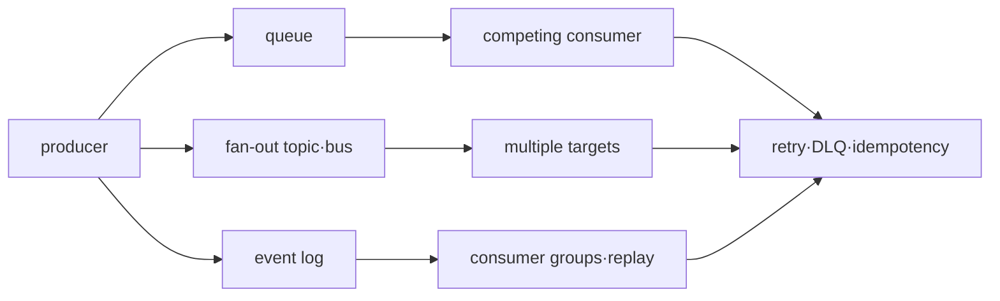

# 메시징과 이벤트 인프라 로드맵

## 처음 보는 사람을 위한 출발점

주문 서비스가 결제 서비스를 직접 호출했는데 결제 서비스가 잠시 멈추면 주문 요청도 함께 실패할 수 있다. 중간에 메시지를 보관하는 시스템을 두면 주문 서비스는 “결제가 필요하다”는 사실을 남기고, 결제 서비스는 회복한 뒤 처리할 수 있다. 대신 같은 메시지가 두 번 오거나 순서가 바뀌는 문제를 애플리케이션이 다뤄야 한다.

| 처음 만나는 말 | 학습용 쉬운 뜻 |
|---|---|
| 메시지(message) | 다른 프로그램에 전달할 데이터 한 건 |
| 생산자(producer) | 메시지를 보내는 프로그램 |
| 소비자(consumer) | 메시지를 받아 처리하는 프로그램 |
| 큐(queue) | 처리할 메시지를 소비자가 가져갈 때까지 보관하는 줄 |
| 확인 응답(acknowledgement) | 소비자가 처리를 끝냈다고 메시지 시스템에 알리는 신호 |
| 멱등성(idempotency) | 같은 요청을 여러 번 처리해도 업무 결과가 한 번 처리한 것과 같게 만드는 성질 |

첫 실습은 같은 event를 두 번 넣고 결과가 한 번만 바뀌게 만든다. 그 뒤 재시도, 실패 메시지 보관소(DLQ), 과거 event 재처리를 단계적으로 배운다.

## 무엇을 해결하는가

queue와 event stream은 producer와 consumer를 시간적으로 분리하지만, 전달 성공이 business 처리의 exactly-once 결과를 자동으로 보장하지 않는다. 이 과정은 SQS·SNS·EventBridge와 Kafka의 역할을 delivery, ordering, replay와 ownership으로 구분한다.

## 선수 지식

- network timeout과 partial failure
- transaction boundary와 unique constraint
- AWS IAM, metric과 incident 대응

## 학습 순서

1. **Delivery·ordering·replay model**: 각 서비스와 consumer 책임을 분리한다.
2. **Duplicate·DLQ 실습**: 중복과 poison message를 만들고 안전한 재처리를 검증한다.

## 완료 조건

이 주제는 한 번 읽고 끝내지 않는다. 먼저 용어 표를 자신의 말로 바꾸고, 개념 장에서 한 요청의 흐름을 따라간다. 실습에서는 정상 상태를 먼저 기록한 뒤 조건 하나만 바꿔 실패를 만들고, 증거로 원인을 설명한 뒤 복구한다. 마지막으로 아래 운영 판단 질문에 답하면서 더 복잡한 환경으로 확장한다.

- at-least-once delivery에서 idempotency key의 저장 위치를 정한다.
- ordering scope와 병렬 처리 trade-off를 설명한다.
- DLQ redrive 전에 원인 수정·격리·감사 절차를 정의한다.

## 범위 밖

모든 Kafka 운영 parameter, connector catalog와 schema registry 제품 비교는 다루지 않는다.

## 처음 이해했는지 확인

1. producer, broker와 consumer는 message 전달에서 각각 무슨 역할을 하는가?
2. 같은 message가 두 번 도착할 수 있다면 application은 무엇을 준비해야 하는가?

**확인 기준:** producer가 보내고 broker가 보관·전달하며 consumer가 처리한다고 설명하면 된다. 중복 delivery에도 업무 결과가 한 번과 같도록 idempotency가 필요하다.

## 운영 판단으로 확장하기

1. broker가 메시지를 한 번만 전달해도 business side effect가 중복될 수 있는 이유는 무엇인가?
2. DLQ가 있다는 사실만으로 복구가 자동화되지 않는 이유는 무엇인가?
3. queue backlog와 consumer lag가 각각 어떤 시간을 나타내는가?

<!-- source: https://docs.aws.amazon.com/AWSSimpleQueueService/latest/SQSDeveloperGuide/welcome.html | checked: 2026-09-03 -->
<!-- source: https://docs.aws.amazon.com/sns/latest/dg/welcome.html | checked: 2026-09-03 -->
<!-- source: https://docs.aws.amazon.com/eventbridge/latest/userguide/eb-what-is.html | checked: 2026-09-03 -->
<!-- source: https://kafka.apache.org/documentation/ | checked: 2026-09-03 -->
