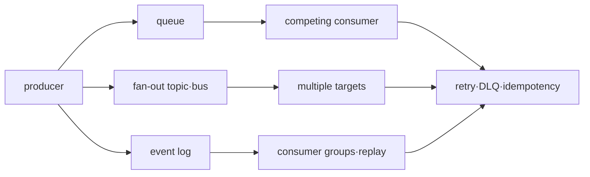

# 메시징과 이벤트 인프라 로드맵

## 무엇을 해결하는가

queue와 event stream은 producer와 consumer를 시간적으로 분리하지만, 전달 성공이 business 처리의 exactly-once 결과를 자동으로 보장하지 않는다. 이 과정은 SQS·SNS·EventBridge와 Kafka의 역할을 delivery, ordering, replay와 ownership으로 구분한다.

## 선수 지식

- network timeout과 partial failure
- transaction boundary와 unique constraint
- AWS IAM, metric과 incident 대응

## 학습 순서

1. **Delivery·ordering·replay model**: 각 서비스와 consumer 책임을 분리한다.
2. **Duplicate·DLQ 실습**: 중복과 poison message를 만들고 안전한 재처리를 검증한다.

## 완료 조건

- at-least-once delivery에서 idempotency key의 저장 위치를 정한다.
- ordering scope와 병렬 처리 trade-off를 설명한다.
- DLQ redrive 전에 원인 수정·격리·감사 절차를 정의한다.

## 범위 밖

모든 Kafka 운영 parameter, connector catalog와 schema registry 제품 비교는 다루지 않는다.

## 스스로 설명해 보기

1. broker가 메시지를 한 번만 전달해도 business side effect가 중복될 수 있는 이유는 무엇인가?
2. DLQ가 있다는 사실만으로 복구가 자동화되지 않는 이유는 무엇인가?
3. queue backlog와 consumer lag가 각각 어떤 시간을 나타내는가?

<!-- source: https://docs.aws.amazon.com/AWSSimpleQueueService/latest/SQSDeveloperGuide/welcome.html | checked: 2026-09-03 -->
<!-- source: https://docs.aws.amazon.com/sns/latest/dg/welcome.html | checked: 2026-09-03 -->
<!-- source: https://docs.aws.amazon.com/eventbridge/latest/userguide/eb-what-is.html | checked: 2026-09-03 -->
<!-- source: https://kafka.apache.org/documentation/ | checked: 2026-09-03 -->
