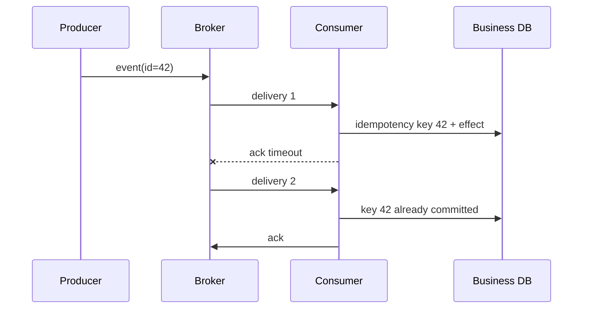

# Delivery, ordering and replay model

## Terms introduced in this chapter

- **broker**: An intermediate system that receives messages from producers, stores them, and delivers them to consumers. **Why it matters / when to use it:** Decouple producer and consumer availability through an intermediary with explicit delivery behavior.
- **delivery**: This is when the broker attempts to process a message to the consumer. **Why it matters / when to use it:** State which losses or duplicates consumers must handle instead of equating receipt with completion.
- **retry**: Retrying failed processing according to certain conditions. **Why it matters / when to use it:** Recover from transient failures when another attempt is safe and fits the remaining budget.
- **DLQ**: A queue that separates messages that have not been processed multiple times from the main flow and stores them for investigation. **Why it matters / when to use it:** Isolate repeatedly failing records so responders can inspect and repair them without blocking all work.
- **ordering**: This is a guarantee that multiple messages are processed in the same order and within what scope they are sent by the producer. **Why it matters / when to use it:** Preserve business sequences where processing a later event first would change the result.
- **replay**: This is the process of rereading and processing messages or events stored in the past. **Why it matters / when to use it:** Rebuild derived state or recover missed processing from retained events under a deduplication policy.

The fact that the message has been stored in the broker is different from the fact that the task has been processed. First, we look at where the process can end between the three steps `delivery → business change → acknowledgment`.

## Understand the model first

Let's say the order service sends the `order.accepted` event and the payment consumer processes it. The producer records an event in the broker, but the consumer may die immediately after updating the payment DB and before sending an acknowledgment. The broker determines that it has not been processed and delivers the same event again. This is why business side effects can run twice even though the messaging system was operating normally.

| point of view | What brokers know | What brokers don’t know |
|---|---|---|
| publish success | accepted the event | Successful business processing for all consumers |
| delivery | sent to consumer | Whether consumer transaction commits |
| acknowledgement | The consumer responded that it was complete | Consistency across external systems |
| retention/replay | Events can be read again | Is it safe to have side effects even if you rerun it? |

Therefore, delivery guarantee and processing outcome are separated. In at-least-once delivery, the possibility of duplication is acknowledged and the consumer uses a durable idempotency key. Ordering also specifies a guaranteed range, like a queue group or Kafka partition, rather than “everything in order.”

SQS, SNS, EventBridge, and Kafka solve different forms of this problem. SQS is close to a queue that distributes work between consumers, SNS and EventBridge fan-out and route to multiple targets, and Kafka reads the retained partition log as an offset by the consumer group. Before choosing a name, you need to decide who owns the event and who is responsible for retry and replay.

## Follow the processing of a single message

1. The producer puts the unique event ID and business data in a message and sends it to the broker.
2. Messages are stored according to the retention period and delivery rules allowed by the broker.
3. The consumer receives the message and changes the business database.
4. After the change is committed, the consumer sends a completion acknowledgment to the broker.
5. If the consumer terminates after step 3 but before step 4, the broker can deliver the same message again.
6. Consumers use event ID to prevent duplication of already completed work results.
7. Messages that repeatedly fail are separated into DLQ, the cause is corrected, and then processed again at a limited speed.

What is stored in the broker, what is delivered to the consumer, and what the work results are committed to are different completion points. Messaging design addresses the failure in between.

## See responsibility more than service name

| composition | main purpose | operational questions |
|---|---|---|
| SQS queue | Work distribution and buffering between consumers | visibility timeout, retry, DLQ, standard/FIFO |
| SNS topic | subscriber fan-out | subscription filter, delivery retry, target failure |
| EventBridge bus | event routing and target integration | rule, schema, archive/replay, target DLQ |
| Kafka log | partitioned durable log and consumer group | partition key, offset, retention, rebalance |

SQS standard queue designs consumers based on the premise of at-least-once delivery and best-effort ordering. The FIFO function must also check ordering and deduplication scope/throughput conditions and does not replace transactions with external side effects.

Kafka's ordering is understood within partitions, not across topics. Increasing the partition can increase parallelism, but it affects ordering, rebalance, and consumer state of the same key.

## Retry and DLQ

Retry absorbs transient failures, but immediate retry storms increase downstream failures. Add exponential backoff, jitter and retry budget. Instead of just increasing the number of retries, poison messages are isolated and the payload, schema version, and consumer error are investigated.

Check the following before DLQ redrive.

1. Classify whether the cause is code, dependency, permission, or data.
2. Check whether consumer fix and idempotency have been deployed.
3. Determine whether the redrive rate does not overwhelm normal traffic and downstream capacity.
4. Reconcile the number of successes, re-failures, and omissions.

## Schema evolution and replay

If producers and consumers are not deployed simultaneously, the schema must have additive change and compatibility rules. When a retained event is replayed by a new consumer, its meaning at the time and the current reference data may differ. Record event time, schema version, producer identity, and replay run ID.

## Explain it in your own words

1. What problems arise when the visibility timeout is too short or too long?
2. Why does the Kafka partition key affect ordering and load distribution at the same time?
3. Why is event replay an operational change rather than simply rereading a file?

<!-- source: https://docs.aws.amazon.com/AWSSimpleQueueService/latest/SQSDeveloperGuide/standard-queues-at-least-once-delivery.html | checked: 2026-09-03 -->
<!-- source: https://docs.aws.amazon.com/AWSSimpleQueueService/latest/SQSDeveloperGuide/sqs-visibility-timeout.html | checked: 2026-09-03 -->
<!-- source: https://docs.aws.amazon.com/eventbridge/latest/userguide/eb-archive-event.html | checked: 2026-09-03 -->
<!-- source: https://kafka.apache.org/documentation/#intro_concepts_and_terms | checked: 2026-09-03 -->
