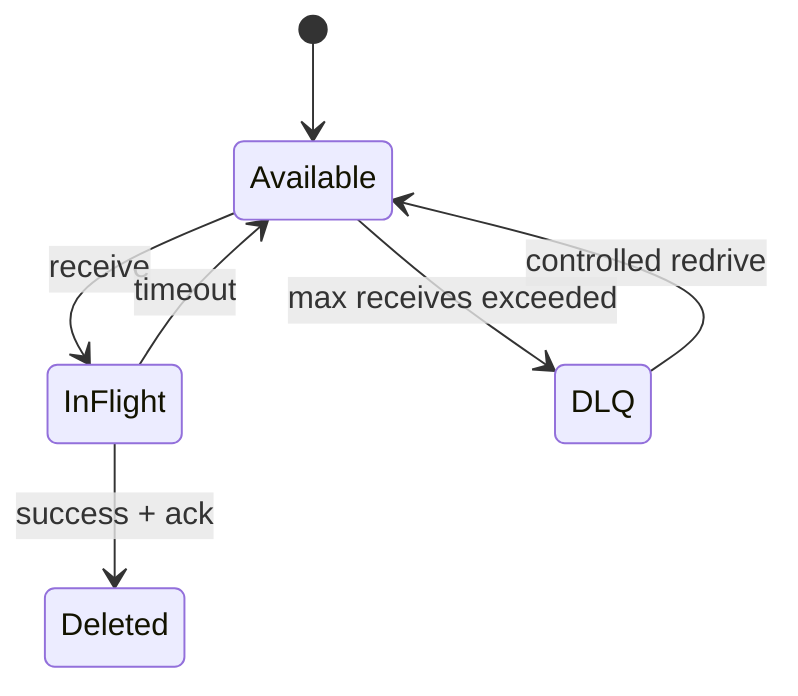

# Duplicate, DLQ and replay lab

> Lab level: State machine is **Local**, managed broker verification is **AWS optional**. When creating an actual queue·topic, check the possibility of charging and cleanup first.

## Lab prerequisites

- **First step**: Understand duplicate processing conditions using a single message and processing record table without a broker.
- **local database**: Use a disposable PostgreSQL database. The session-local temporary tables below disappear when that session closes.
- **Work Result**: Select one row that should not be duplicated, such as order status, and record the value before and after processing.
- **Failure injection**: Process the same `event_id` twice and assume that the process terminates just before the acknowledgment.
- **AWS Selection Step**: Create SQS source queue and DLQ with a dedicated prefix/tag and determine the cost and person responsible for deletion.
- **Finished status**: Organize local test row and optionally created queue, DLQ, alarm, and IAM policy.

Currently, the Local section is not a completed execution example of a broker product, but a database lab that checks idempotency boundaries. To complete the actual delivery·visibility timeout·DLQ movement, an AWS optional environment or a separate local broker is required.

## Understand the model first

In this lab, duplicate is not an exceptional broker malfunction, but a delivery result that must be prepared for normally. If the consumer succeeds in the business DB commit but terminates right before the acknowledgment, the broker may not be aware of the completion and may resend the same event.

Idempotency is not complete with just “ignore the second request.” You must decide which value will be considered the identity of the same event, where and how long the key will be stored, and whether it can be recorded in transactions such as business changes.

| design | Where crashes occur | result |
|---|---|---|
| Save processed key after effect | between two tasks | Effect can be duplicated |
| Effect after saving processed key | between two tasks | Effect may be missing |
| Same DB transaction | Before and after commit | rollback or atomic completion |
| External API side effects | outside local transaction | provider idempotency key·reconciliation required |

## 1. Idempotent consumer contract

It is assumed that the message has an immutable event ID.

```json
{
  "event_id": "evt-00042",
  "type": "order.accepted",
  "schema_version": 1,
  "occurred_at": "2026-09-03T00:00:00Z",
  "data": { "order_id": "demo-42" }
}
```

Create the fixed business fixture once in one `psql` session:

```sql
CREATE TEMP TABLE processed_events (event_id text PRIMARY KEY);
CREATE TEMP TABLE effect_counter (id integer PRIMARY KEY, applied integer NOT NULL);
INSERT INTO effect_counter VALUES (1, 0);
```

Run the following transaction twice in that same session. The returned ID gates the business effect in SQL, so the second delivery cannot increment it:

```sql
BEGIN;
WITH accepted AS (
  INSERT INTO processed_events(event_id) VALUES ('evt-00042')
  ON CONFLICT DO NOTHING
  RETURNING event_id
)
UPDATE effect_counter
SET applied = applied + 1
WHERE id = 1 AND EXISTS (SELECT 1 FROM accepted);
COMMIT;
```

```sql
SELECT (SELECT count(*) FROM processed_events) AS processed,
       (SELECT applied FROM effect_counter WHERE id = 1) AS effects;
```

Expect `(processed, effects) = (1, 1)` after both deliveries. Repeat a transaction for a new ID but replace COMMIT with ROLLBACK: both values must stay at one. Retrying that new ID with COMMIT then produces `(2, 2)`. These temporary tables demonstrate atomicity only; production deduplication needs persistent tables, an existing-target check, immutable payload identity, and retention covering the replay horizon.

Simple `SELECT followed by INSERT` can create a concurrent delivery race. Use unique constraints or equivalent atomic conditional write.

## 2. Duplication and poison message injection

Send the same `event_id` twice and check whether the business row changes only once. Next, send the unsupported `schema_version` and observe repeat failure and DLQ movement.



The observed items are queue depth, oldest age, receive count, processing latency, duplicate suppression count, and DLQ depth.

## 3. Controlled redrive

- Modify the consumer to safely reject or process the new schema.
- Record the DLQ snapshot and number of messages.
- Redrive some at a low rate to check normal processing and idempotency.
- Reconcile the number of source/DLQ/business records after full redrive.

In AWS optional, SQS source queue, redrive policy, and DLQ are created with dedicated prefix/tag. Check that there is no sensitive information in the queue URL, ARN, and payload. After completion, delete source queue, DLQ, alarm, and IAM policy in reverse order of inventory.

## judgment of failure

- The business side effect repeats with each duplicate delivery.
- Poison messages create hot loops or disappear without DLQ.
- The processing/failure/remaining total after redrive does not match the original DLQ count.
- The atomic boundary is divided, like the side effect before ack and the state record after ack.

## Example results

Expected PostgreSQL transcript for the fixed business fixture:

```text
# First delivery
BEGIN
UPDATE 1
COMMIT
# Identical retry
BEGIN
UPDATE 0
COMMIT
 processed | effects
-----------+---------
         1 |       1
# A new ID followed by ROLLBACK
 processed | effects
-----------+---------
         1 |       1
# Retry that new ID with COMMIT
 processed | effects
-----------+---------
         2 |       2
```

The business-effect count, not only the inbox count, is the pass condition. For an illustrative DLQ ledger of 10 messages, 7 successful + 2 failed again + 1 remaining reconciles to 10. These ledger numbers are worksheet inputs; the SQL lab has not exercised a broker or redrive API.

## How to interpret the results

After sending the same event twice, `processed_events` must be one row and the business result must be only once. If there is only one processed row but two business effects, the atomic boundary of the two operations has diverged. If duplication is prevented by setting the process memory, repeat the same test after restart to check the limit.

When the poison message moves to the DLQ, the main consumer's hot loop has stopped, but business processing is still in a failed state. It examines the payload, schema version, and error class, fixes the consumer, and redrives at a limited rate. The original DLQ number must match the sum of success, refailure, and remaining numbers.

If the oldest message age continues to increase, the front part of the backlog is not recovered even if new messages are being processed. Expected drain time can be calculated by looking at queue depth, throughput, retry, and downstream capacity together.

## Explain it in your own words

1. If the idempotency key is placed only in process memory, what problems will occur after restart?
2. Why does the error repeat if I immediately redrive the DLQ message without modifying it?
3. Why do we need the oldest message age as well as the retry count?

<!-- source: https://docs.aws.amazon.com/AWSSimpleQueueService/latest/SQSDeveloperGuide/sqs-dead-letter-queues.html | checked: 2026-09-03 -->
<!-- source: https://docs.aws.amazon.com/AWSSimpleQueueService/latest/SQSDeveloperGuide/sqs-configure-dead-letter-queue-redrive.html | checked: 2026-09-03 -->
<!-- source: https://docs.aws.amazon.com/AWSSimpleQueueService/latest/SQSDeveloperGuide/standard-queues-at-least-once-delivery.html | checked: 2026-09-03 -->
<!-- source: https://kafka.apache.org/documentation/#semantics | checked: 2026-09-03 -->
