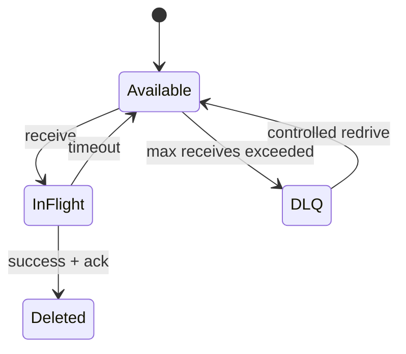

# Duplicate, DLQ와 replay 실습

> 실습 등급: state machine은 **Local**, managed broker 검증은 **AWS optional**이다. 실제 queue·topic을 만들면 과금과 cleanup 가능성을 먼저 확인한다.

## 1. Idempotent consumer 계약

message는 immutable event ID를 가진다고 가정한다.

```json
{
  "event_id": "evt-00042",
  "type": "order.accepted",
  "schema_version": 1,
  "occurred_at": "2026-09-03T00:00:00Z",
  "data": { "order_id": "demo-42" }
}
```

consumer는 business effect와 processed ID 기록을 가능한 한 같은 transaction boundary에 둔다.

```sql
BEGIN;
INSERT INTO processed_events(event_id) VALUES ('evt-00042')
ON CONFLICT DO NOTHING;
-- 위 INSERT가 실제로 새 row를 만든 경우에만 business change 수행
COMMIT;
```

단순 `SELECT 후 INSERT`는 concurrent delivery race를 만들 수 있다. unique constraint 또는 동등한 atomic conditional write를 사용한다.

## 2. 중복과 poison message 주입

동일한 `event_id`를 두 번 보내고 business row가 한 번만 바뀌는지 확인한다. 다음에는 지원하지 않는 `schema_version`을 보내 반복 실패와 DLQ 이동을 관찰한다.



관측 항목은 queue depth, oldest age, receive count, processing latency, duplicate suppression count와 DLQ depth다.

## 3. Controlled redrive

- consumer가 새 schema를 안전하게 거부하거나 처리하도록 수정한다.
- DLQ snapshot과 message 수를 기록한다.
- 낮은 rate로 일부를 redrive해 정상 처리와 idempotency를 확인한다.
- 전체 redrive 뒤 source/DLQ/business record 수를 reconciliation한다.

AWS optional에서는 SQS source queue와 redrive policy, DLQ를 전용 prefix/tag로 만든다. queue URL, ARN과 payload에 민감 정보가 없는지 확인한다. 완료 후 source queue, DLQ, alarm, IAM policy를 inventory 역순으로 삭제한다.

## 실패 판정

- duplicate delivery마다 business side effect가 반복된다.
- poison message가 hot loop를 만들거나 DLQ 없이 사라진다.
- redrive 뒤 처리·실패·잔여 합계가 원래 DLQ count와 맞지 않는다.
- ack 전에 side effect, ack 뒤 state 기록처럼 atomic boundary가 갈라져 있다.

## 스스로 설명해 보기

1. idempotency key를 process memory에만 두면 restart 뒤 어떤 문제가 생기는가?
2. DLQ message를 수정 없이 바로 redrive하면 왜 장애가 반복되는가?
3. retry 횟수뿐 아니라 oldest message age가 필요한 이유는 무엇인가?

<!-- source: https://docs.aws.amazon.com/AWSSimpleQueueService/latest/SQSDeveloperGuide/sqs-dead-letter-queues.html | checked: 2026-09-03 -->
<!-- source: https://docs.aws.amazon.com/AWSSimpleQueueService/latest/SQSDeveloperGuide/sqs-configure-dead-letter-queue-redrive.html | checked: 2026-09-03 -->
<!-- source: https://docs.aws.amazon.com/AWSSimpleQueueService/latest/SQSDeveloperGuide/standard-queues-at-least-once-delivery.html | checked: 2026-09-03 -->
<!-- source: https://kafka.apache.org/documentation/#semantics | checked: 2026-09-03 -->
