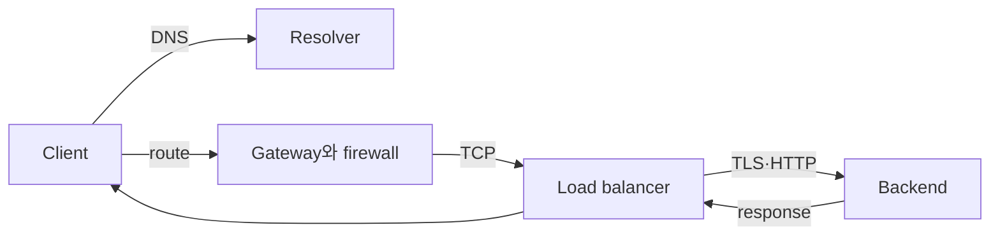

# 네트워크와 요청 경로 로드맵

네트워크 장애는 “연결이 안 된다”가 아니라 **이름, 경로, 연결, 암호화, 애플리케이션 응답 중 어느 단계가 실패했는지**로 나눠야 진단할 수 있다.

## 한 문장 모델

> client 요청은 `DNS → route/NAT/firewall → TCP → TLS → HTTP → load balancer → backend`의 연속된 계약이며, 앞 단계가 성공해야 다음 단계의 오류를 해석할 수 있다.

## 읽는 순서

1. [DNS부터 backend까지](01-request-path-model.md): 각 계층의 입력·출력과 AWS·Kubernetes 대응을 연결한다.
2. [계층별 장애 분리 실습](02-layered-diagnosis-lab.md): `dig`, `ip route`, `curl`, `openssl`, `ss`로 실패 위치를 좁힌다.

## Infra specialist가 지켜야 할 경계

| 질문 | 답을 주는 계층 |
|---|---|
| 이름이 어느 주소로 풀리는가? | DNS record, resolver와 cache |
| packet이 어느 interface·gateway로 나가는가? | route table과 policy routing |
| 연결을 허용하는가? | security group, NACL, host firewall, NetworkPolicy |
| server가 port를 받고 있는가? | listening socket과 load balancer listener |
| 상대가 맞고 암호화됐는가? | TLS certificate, hostname과 trust store |
| 요청 의미가 맞는가? | HTTP method, host, path, status와 timeout |

AWS VPC와 Kubernetes network는 이 모델을 다른 resource로 구현한다. VPC route table·gateway·security group과 Kubernetes Service·EndpointSlice·Gateway·NetworkPolicy의 이름을 섞지 말고 packet이 지나는 실제 순서로 연결한다.

## 완료 기준

- 하나의 URL을 DNS answer, destination IP, route, TCP peer, TLS identity, HTTP status와 backend로 분해한다.
- timeout, connection refused, TLS verification failure와 HTTP 5xx를 서로 다른 실패로 진단한다.
- [AWS 인프라 기반](../aws-foundations/00-roadmap.md)에서 subnet·route·gateway의 reachability를 설명할 수 있다.

## 스스로 설명해 보기

1. DNS가 성공했는데 TCP timeout이 날 수 있는 이유는 무엇인가?
2. load balancer health check 성공과 실제 사용자 요청 성공이 다른 이유는 무엇인가?
3. 같은 `403`이라도 network policy가 아니라 HTTP 계층 문제라고 볼 근거는 무엇인가?

<!-- source: https://datatracker.ietf.org/doc/html/rfc9293 | checked: 2026-09-03 -->
<!-- source: https://datatracker.ietf.org/doc/html/rfc8446 | checked: 2026-09-03 -->
<!-- source: https://datatracker.ietf.org/doc/html/rfc9110 | checked: 2026-09-03 -->
<!-- source: https://kubernetes.io/docs/concepts/services-networking/ | checked: 2026-09-03 -->
