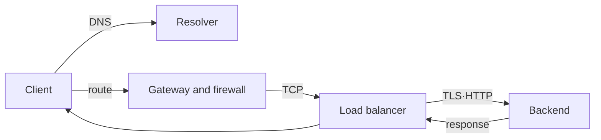

# Network and request path roadmap

## Starting point for beginners

Let's start with a situation where you enter an address in your browser, but the screen doesn't open. It cannot be fixed with just one sentence, “The Internet doesn’t work.” You need to determine whether it was a failure to convert the address to a number, whether the path to the server was blocked, or whether the server was not ready to receive the request.

| New term | Plain-language meaning | Why it matters / when to use it |
|---|---|---|
| hostname | A server name that is easy for people to remember. Example: `api.example.com` | Keep service addresses understandable while allowing address records to change independently. **Concrete situation (illustrative):** A service moves to a new server. → Keep its hostname and update the appropriate address records. → Check resolution from the affected clients. |
| IP address | A numeric address used to locate a computer or connection point on a network. | Identify a network destination when checking routing and endpoint reachability. **Concrete situation (illustrative):** One endpoint is reachable while another is not. → Compare their destination IPs and routes. → Verify which address actually receives the request. |
| DNS | A system that retrieves records for a name, including addresses through A/AAAA records; reverse lookup is a separate query | Resolve service names before connecting and isolate name-resolution failures from transport failures. **Concrete situation (illustrative):** A known IP is reachable but the service name fails to resolve. → Query the relevant DNS records. → Separate missing records from connection failures. |
| route | Rules that determine which direction to send packets to the destination IP | Choose the next network hop and explain why packets reach or miss a destination. **Concrete situation (illustrative):** A private server cannot reach a required destination. → Inspect the route selected for that IP. → Verify the next hop exists and supports the path. |
| port | A number that identifies the program that will receive the request within a computer | Direct traffic to the intended listener and distinguish network reachability from application readiness. **Concrete situation (illustrative):** The host responds, but requests to port 8080 fail. → Inspect which process listens on that port. → Check its bound address and connection result. |
| connection | A communication state that allows two programs to exchange data | Reason about setup, reuse, timeout, and closure costs along a request path. **Concrete situation (illustrative):** The first request is slow but reused requests are fast. → Separate connection setup from application processing. → Compare timings with and without connection reuse. |

This process tests each step, from name resolution to application response. At first, only success and failure of `curl` are compared, and then the scope is expanded to specialized boundaries such as TCP, TLS, and load balancer.

Network failures can be diagnosed not by saying “no connection,” but by determining which step among name, path, connection, encryption, and application response failed.

## The model in one sentence

> Diagnose a fresh HTTPS request through name resolution, the network route, transport, TLS, and HTTP handling. A load balancer may terminate some layers and start a separate backend connection. Cached connections and HTTP/3 change the observed sequence.

## Reading order

1. [From DNS to backend](01-request-path-model.md): Connects the input and output of each layer and AWS·Kubernetes correspondence.
2. [Fault separation by layer lab](02-layered-diagnosis-lab.md): Narrow down the failure location to `dig`, `ip route`, `curl`, `openssl`, and `ss`.

## Boundaries that DevOps specialists must follow

| question | Layer that gives answers |
|---|---|
| To which address is the name resolved? | DNS records, resolvers and caches |
| Which interface/gateway does the packet go out to? | Route table and policy routing |
| Do you allow connections? | security group, NACL, host firewall, NetworkPolicy |
| Is the server receiving the port? | listening socket and load balancer listener |
| Is the opponent correct and encrypted? | TLS certificate, hostname and trust store |
| Is the meaning of the request correct? | HTTP method, host, path, status and timeout |

AWS VPC and Kubernetes network implement this model with different resources. Do not mix the names of VPC route table·gateway·security group and Kubernetes Service·EndpointSlice·Gateway·NetworkPolicy, but connect them in the actual order in which packets pass.

## Completion criteria

This topic is not something you read once and then stop. First, convert the terminology table into your own words and follow the flow of requests made in the concepts chapter. In the lab, the normal state is first recorded, then a failure is created by changing only one condition, and the cause is explained with evidence before recovery. Finally, expand to more complex environments by answering the operational judgment questions below.

- Decomposes one URL into DNS answer, destination IP, route, TCP peer, TLS identity, HTTP status and backend.
- Diagnose timeout, connection refused, TLS verification failure, and HTTP 5xx as different failures.
- [The reachability of subnet·route·gateway can be explained in AWS infrastructure-based](../aws-foundations/00-roadmap.md).

## Check your understanding

1. What are names like `api.example.com` and IP addresses respectively?
2. Why can a web request fail even though a DNS lookup succeeds?

**Confirmation criteria:** You just need to be able to explain that DNS is just a step to change a name to an address, and that the route·TCP·TLS·HTTP steps remain separately.

## Develop operational judgment

1. Why does a TCP timeout occur even though DNS is successful?
2. Why is the success of the load balancer health check different from the success of the actual user request?
3. Even if it is the same `403`, what evidence is there to consider it to be an HTTP layer problem rather than a network policy?

<!-- source: https://datatracker.ietf.org/doc/html/rfc9293 | checked: 2026-09-03 -->
<!-- source: https://datatracker.ietf.org/doc/html/rfc8446 | checked: 2026-09-03 -->
<!-- source: https://datatracker.ietf.org/doc/html/rfc9110 | checked: 2026-09-03 -->
<!-- source: https://kubernetes.io/docs/concepts/services-networking/ | checked: 2026-09-03 -->
