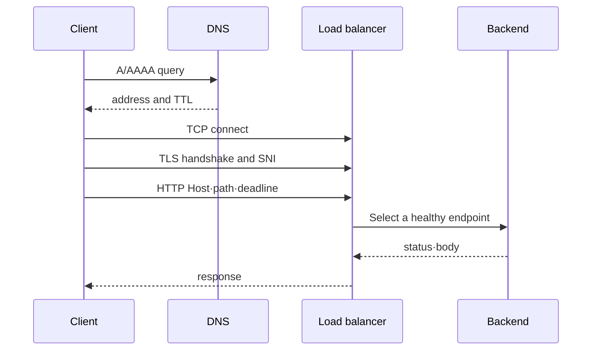

# From DNS to backend

<!-- source: https://www.rfc-editor.org/rfc/rfc9114.html | checked: 2026-09-10 | TCP scope and HTTP/3 over QUIC -->

## Terms introduced in this chapter

- **client**: This is the program that initiates the request. It can be a browser or `curl`. **Why it matters / when to use it:** Locate request initiation and control the caller's timeout, retries, and observations. **Concrete situation (illustrative):** The browser times out while the server keeps working. → Inspect the client's deadline and retry behavior. → Check whether repeated requests duplicate server work.
- **backend**: A server program that processes actual business logic and creates responses. **Why it matters / when to use it:** Separate request forwarding from the application that owns the business result. **Concrete situation (illustrative):** The proxy accepts traffic but checkout fails. → Follow the request to the checkout backend. → Check that backend's response and dependency errors.
- **packet**: A small unit through which the network divides and transmits data. **Why it matters / when to use it:** Inspect loss, routing, and delivery at the network layer when requests fail. **Concrete situation (illustrative):** Connections intermittently retransmit data. → Inspect packet-level evidence in an authorized test capture. → Compare retransmissions with application delay.
- **TCP**: This is a rule that creates an ordered byte transmission path between two programs. **Why it matters / when to use it:** Exchange an ordered byte stream when the application needs reliable transport between endpoints. **Concrete situation (illustrative):** TCP connects successfully but the API returns an error. → Separate transport establishment from application response. → Inspect the HTTP result instead of declaring success.
- **TLS**: A rule that verifies the identity of the other server and encrypts communication content. **Why it matters / when to use it:** Protect traffic in transit and verify the intended peer before exchanging sensitive data. **Concrete situation (illustrative):** A client rejects the server certificate. → Check the requested hostname, certificate validity, and trust chain. → Verify with certificate checking still enabled.
- **load balancer**: It is an intermediate point that forwards incoming requests to one of several backends. **Why it matters / when to use it:** Spread requests over available backends and remove unhealthy destinations from eligible traffic. **Concrete situation (illustrative):** Requests fail only when routed to one replica. → Compare backend health and direct test requests. → Confirm the unhealthy target stops receiving eligible traffic.

The point of this chapter is not to memorize abbreviations, but to ensure that the results of the previous step become the input to the next step. If DNS doesn't give you an IP, there's nothing to try for a TCP connection yet.

## Understand the model first

For a new HTTPS connection using HTTP/1.1 or HTTP/2 over TCP, the client resolves an address, selects a route, establishes TCP, and negotiates TLS before exchanging HTTP data. A cached address or an existing pooled connection can skip work on a later request. HTTP/3 uses QUIC over UDP; the TCP-specific sequence below does not describe that transport.

| step | input | What you get when you succeed | representative failure |
|---|---|---|---|
| DNS | hostname | One or more IP addresses | NXDOMAIN, timeout, old record |
| route | destination IP | interface and next hop | no route, wrong NAT path |
| TCP | IP and port | Two-way byte stream | refused, timeout, reset |
| TLS | TCP stream and server name | Verified encrypted session | Name mismatch, expiration, trust failure |
| HTTP | method·path·header·body | status·header·body | 4xx, 5xx, upstream timeout |

The output of each step is the input to the next step. The symptom that users see is usually “no connection,” but fixing the load balancer health check when the DNS is wrong or opening the security group when the TLS name is wrong does not help. Finally, finding successful tiers allows you to narrow down the scope of your investigation.

## Follow each request step by step

1. The client asks `api.example.com` to DNS to obtain an IP address.
2. The operating system selects the interface and next gateway to send the packet to that IP.
3. Creates a TCP connection using the IP and port selected by the client.
4. In HTTPS, TLS verifies the certificate's name and trust chain and creates an encryption path.
5. The client sends the HTTP method, path, and header through that channel.
6. The load balancer selects a healthy backend and forwards the request.
7. The backend's response returns to the client through the opposite path.

For the fresh TCP connection modeled here, an earlier failure prevents the dependent later step. Real clients can race IPv4/IPv6 addresses, reuse connections, or use a proxy that performs DNS resolution elsewhere. Identify the actual protocol, proxy, and remote address before assigning a failure to a layer.

## Hierarchy is a tool for separating responsibilities

Real packets do not “call” the textbook layers one after the other, but the operator uses the contracts of each layer to isolate failures.

| step | evidence of success | representative failure |
|---|---|---|
| DNS | The expected record and TTL response for the requested name. | NXDOMAIN, stale cache, split-horizon differences |
| route | The interface selected as the destination and the next hop | Wrong route, blackhole, missing NAT route |
| TCP | Connection established after SYN | timeout, refused, conntrack·backlog exhaustion |
| TLS | Certificate chain and hostname verification | Expired, name mismatch, missing trust root |
| HTTP | status·header·body and deadline | 4xx, 5xx, redirect loop, upstream timeout |
| backend | Readiness and processing results of selected endpoints | No endpoint, overload, dependency failure |

TCP provides a reliable byte stream, but does not know the meaning of the request. TLS creates a peer identity and cryptographic boundary, but does not replace application authorization. HTTP status is the result returned by the application or proxy after the connection is established.



## Address and route

CIDR represents an address range, and a subnet places that range as part of a routing domain. The route table selects the next hop according to the destination prefix. NAT changes addresses, but it is not the same as an access policy.

In AWS, a subnet belongs to an Availability Zone and the route table determines the direction of traffic. Internet gateway, NAT gateway, and VPC endpoint are different next hops depending on their purpose. In Kubernetes, the Pod network provides a path between Pods and places a stable access point in front of a set of endpoints where the Service changes.

## allow policy looks both ways

When seeing a connection failure, check the source egress and destination ingress together. Stateful permissions, stateless ACL, host firewall, and Kubernetes NetworkPolicy of intermediate devices can exist simultaneously.

The single sentence “the security group is open” is not sufficient evidence. Observation of source, destination, protocol, port, direction and actual flow log or packet is required.

## timeout budget

If the sum of internal retries is longer than the client deadline, the client fails but the backend continues to work.

```text
DNS + connect + TLS + proxy queue + backend + response
  <                    client deadline                    >
```

retry is new traffic. As the failure rate increases, per-attempt timeout, maximum number of times, and backoff are set together so that retry does not increase the load.

## Explain it in your own words

1. Why aren't inbound connections automatically allowed even though I have a NAT gateway?
2. Let's talk about three cases in which TLS fails even after a successful TCP connection.
3. What observations will we see when the Service IP is alive but there are 0 backends?

<!-- source: https://datatracker.ietf.org/doc/html/rfc9293 | checked: 2026-09-03 -->
<!-- source: https://datatracker.ietf.org/doc/html/rfc8446 | checked: 2026-09-03 -->
<!-- source: https://datatracker.ietf.org/doc/html/rfc9110 | checked: 2026-09-03 -->
<!-- source: https://docs.aws.amazon.com/vpc/latest/userguide/what-is-amazon-vpc.html | checked: 2026-09-03 -->
<!-- source: https://kubernetes.io/docs/concepts/services-networking/ | checked: 2026-09-03 -->
