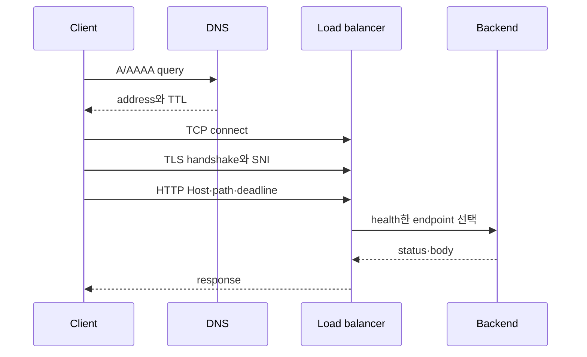

# DNS부터 backend까지

## 먼저 이해하기

브라우저에 `https://api.example`을 입력하면 곧바로 서버에 HTTP 요청이 도착하는 것이 아니다. client는 먼저 이름을 IP address로 바꾸고, 그 address까지 packet을 보낼 route를 찾고, TCP connection을 만든 뒤 TLS로 상대 identity와 암호화 조건을 합의한다. 그 위에서야 HTTP request와 response가 흐른다.

| 단계 | 입력 | 성공했을 때 얻는 것 | 대표 실패 |
|---|---|---|---|
| DNS | hostname | 하나 이상의 IP address | NXDOMAIN, timeout, 오래된 record |
| route | destination IP | interface와 next hop | no route, 잘못된 NAT path |
| TCP | IP와 port | 양방향 byte stream | refused, timeout, reset |
| TLS | TCP stream과 server name | 검증된 encrypted session | 이름 불일치, 만료, trust failure |
| HTTP | method·path·header·body | status·header·body | 4xx, 5xx, upstream timeout |

각 단계의 출력이 다음 단계의 입력이다. 사용자가 보는 증상은 대개 “접속 안 됨” 하나지만, DNS가 틀렸는데 load balancer health check를 고치거나 TLS 이름이 틀렸는데 security group을 여는 조치는 도움이 되지 않는다. 마지막으로 성공한 계층을 찾으면 조사 범위를 줄일 수 있다.

## 계층은 책임 분리 도구다

실제 packet은 교과서의 층을 차례로 “호출”하지 않지만, 운영자는 실패를 분리하기 위해 각 계층의 계약을 사용한다.

| 단계 | 성공 증거 | 대표 실패 |
|---|---|---|
| DNS | 질문한 이름에 기대한 record와 TTL 응답 | NXDOMAIN, stale cache, split-horizon 차이 |
| route | 목적지에 선택된 interface와 next hop | 잘못된 route, blackhole, NAT 경로 누락 |
| TCP | SYN 이후 연결 성립 | timeout, refused, conntrack·backlog 고갈 |
| TLS | certificate chain과 hostname 검증 | 만료, 이름 불일치, trust root 누락 |
| HTTP | status·header·body와 deadline | 4xx, 5xx, redirect loop, upstream timeout |
| backend | 선택된 endpoint의 readiness와 처리 결과 | endpoint 없음, overload, dependency failure |

TCP는 신뢰 가능한 byte stream을 제공하지만 요청의 의미를 알지 못한다. TLS는 peer identity와 암호화 경계를 만들지만 application authorization을 대신하지 않는다. HTTP status는 연결이 성립한 뒤 application 또는 proxy가 반환한 결과다.



## 주소와 경로

CIDR은 주소 범위를 표현하고 subnet은 그 범위를 한 routing domain의 일부로 배치한다. route table은 목적지 prefix에 따라 next hop을 고른다. NAT는 주소를 바꾸지만 접근 허용 정책과 동일하지 않다.

AWS에서는 subnet이 한 Availability Zone에 속하고 route table이 traffic의 방향을 정한다. internet gateway, NAT gateway와 VPC endpoint는 목적에 따라 다른 next hop이다. Kubernetes에서는 Pod network가 Pod 간 경로를 제공하고 Service가 바뀌는 endpoint 집합 앞에 안정된 접근점을 둔다.

## allow 정책은 양쪽을 본다

연결 실패를 볼 때 source egress와 destination ingress를 함께 확인한다. 중간 장비의 stateful 허용, stateless ACL, host firewall, Kubernetes NetworkPolicy가 동시에 존재할 수 있다.

“security group이 열려 있다”는 한 문장은 충분한 증거가 아니다. source, destination, protocol, port, direction과 실제 flow log 또는 packet 관찰이 필요하다.

## timeout budget

client deadline보다 내부 retry들의 합이 길면 client는 실패했는데 backend는 계속 일하는 결과가 생긴다.

```text
DNS + connect + TLS + proxy queue + backend + response
  <                    client deadline                    >
```

retry는 새로운 traffic이다. 실패율이 올라갈수록 retry가 부하를 증폭하지 않도록 per-attempt timeout, 최대 횟수와 backoff를 함께 둔다.

## 스스로 설명해 보기

1. NAT gateway가 있다고 inbound 연결이 자동 허용되지 않는 이유는 무엇인가?
2. TCP 연결 성공 뒤에도 TLS가 실패하는 세 가지 경우를 말해 보자.
3. Service IP가 살아 있지만 backend가 0개일 때 어떤 관찰값을 볼 것인가?

<!-- source: https://datatracker.ietf.org/doc/html/rfc9293 | checked: 2026-09-03 -->
<!-- source: https://datatracker.ietf.org/doc/html/rfc8446 | checked: 2026-09-03 -->
<!-- source: https://datatracker.ietf.org/doc/html/rfc9110 | checked: 2026-09-03 -->
<!-- source: https://docs.aws.amazon.com/vpc/latest/userguide/what-is-amazon-vpc.html | checked: 2026-09-03 -->
<!-- source: https://kubernetes.io/docs/concepts/services-networking/ | checked: 2026-09-03 -->
