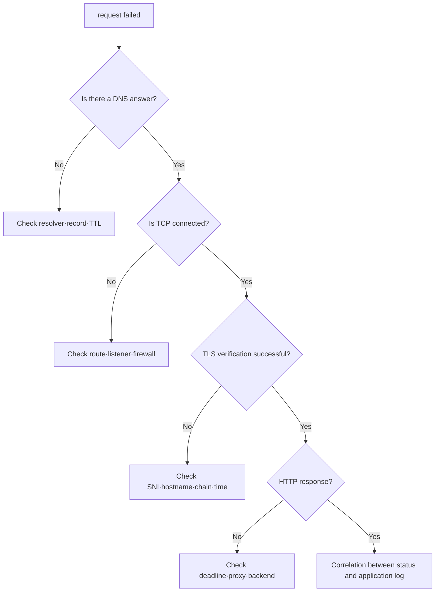

# Fault separation lab by layer

> lab level: **Local**. Only `tcpdump` requires packet capture authority; the rest can be run as regular users.

## Lab prerequisites

- **Environment**: Use a Linux or macOS terminal that can access the Internet.
- **Tools**: Requires `dig`, `curl`, `openssl`. To check the route/socket of Linux, `ip` and `ss` are used.
- **Target**: Initially, use the names `example.com` and reserved `.invalid` instead of the production address, which you do not operate.
- **Record**: For each command, write `success/failure`, the last successful step, and the next item to be checked one line at a time.
- **Cleanup**: This basic lab does not create resources. If you created an optional Kubernetes test Pod, check whether it has been deleted using the `--rm` action in the command.

macOS does not have Linux's `ip` and `ss` by default. In this case, change route confirmation to `route -n get 1.1.1.1` and listening port confirmation to `lsof -nP -iTCP -sTCP:LISTEN`, and record that the output items are not completely the same.

## Understand the model first

The purpose of this lab is not to run a bunch of network commands, but to isolate points of failure. At every step, we ask, “Have we succeeded up to this point?” and do not investigate further below the level of success.

For example, if DNS returns the correct address and the TCP probe shows a successful connection, basic name resolution and TCP 443 path will work. Afterwards, if `curl` generates a certificate error, the scope of the problem is narrowed to TLS identity. Conversely, if TCP is timeout, it is not the stage to discuss HTTP status.

| Confirmation order | evidence to use | success criteria | Next investigation in case of failure |
|---:|---|---|---|
| 1 | `dig` or `nslookup` | Expected resolver and address | record·resolver·search domain |
| 2 | route lookup | Expected interface·next hop | local route·VPN·NAT |
| 3 | TCP probe | connect or explicitly refuse | firewall·listener·return path |
| 4 | `openssl s_client` | Hostname and chain verification | certificate·SNI·clock·trust store |
| 5 | `curl -v` | Expected status and body | proxy·backend·application |

## Goal

Instead of repeatedly calling a single URL with the same command, divide it into DNS, route, TCP, TLS, and HTTP evidence.

## 1. Creating a normal baseline

Instead of a public target, use a hostname that you operate or is permitted for lab use.

```bash
target_host="example.com"
target_url="https://example.com/"

dig +noall +answer "$target_host" A
ip route get 1.1.1.1
curl -sSvo /dev/null --connect-timeout 3 --max-time 8 "$target_url"
openssl s_client -connect "${target_host}:443" -servername "$target_host" </dev/null
```

The values ​​to be recorded are answer, TTL, selected route, remote IP, TLS subject·issuer·verification result, HTTP status, and total time. Do not make excessive repeated calls to public sites.

## 2. Comparison of failure shapes

### DNS failure

```bash
dig +noall +answer does-not-exist.invalid A
```

`.invalid` is a top-level domain reserved for name resolution failure lab. Look at the fact that there is no answer and the status returned by the resolver.

### TCP refused

```bash
curl -v --connect-timeout 2 http://127.0.0.1:65535/
ss -ltn | grep ':65535' || true
```

If there is no listener locally, it is generally rejected immediately. On the other hand, if the packet is discarded in the middle, it may appear as a connect timeout.

### Observe TLS name mismatch

```bash
openssl s_client -connect example.com:443 -servername wrong.invalid </dev/null
```

This command is a diagnostic tool that displays handshake data. It is not treated as the same success decision as the application client forcing hostname verification. Do not use `-k` as a recovery method by turning off the basic certificate verification of `curl`.



## Kubernetes extensions

```bash
kubectl get service,endpointslice -A
kubectl describe service -n default sample
kubectl get networkpolicy -A
kubectl run netcheck --rm -it --restart=Never --image=curlimages/curl -- \
  curl -sv --max-time 5 http://sample.default.svc.cluster.local/
```

Since there is a separate external dependency called image pull, pod creation failure should not be misunderstood as a service network failure. First, check `kubectl get pod` and event.

## incident record format

| time | hierarchy | observation | verdict |
|---|---|---|---|
| T0 | DNS | answer and TTL | Name resolution success/failure |
| T1 | TCP | remote IP, connect result | path·listener candidate |
| T2 | TLS | SNI, certificate verification | identity success/failure |
| T3 | HTTP | status, latency | proxy/backend candidates |

## How to interpret the results

`connection refused` shows the possibility that the packet has reached its destination and there is no listener to receive the port, or it has been explicitly rejected. `timeout` leaves a wider range such as packet drop, wrong route, return path, and stateful policy. Treating both results as the same “connection failure” confuses the order of investigation.

Verification does not end with the mere fact that a certificate has been received from TLS. Check the request hostname, Subject Alternative Name, validity period, issuer chain, and client trust. A successful curl with verification turned off with `-k` only shows the possibility of an encrypted connection and does not prove the success of production identity verification.

If you see HTTP status, check who created the response. Proxies, load balancers, and applications can all create status. By connecting the response header, request ID, and log timestamp for each hop, you can find the component that last saw the request.

## Explain it in your own words

1. Why does `connection refused` suspect the absence of a listener before blocking the firewall?
2. Why can't we declare application TLS verification successful by just looking at the `openssl s_client` output?
3. If it fails only within the pod, what are the differences in DNS·route·policy compared to the host?

<!-- source: https://datatracker.ietf.org/doc/html/rfc2606 | checked: 2026-09-03 -->
<!-- source: https://datatracker.ietf.org/doc/html/rfc9293 | checked: 2026-09-03 -->
<!-- source: https://datatracker.ietf.org/doc/html/rfc8446 | checked: 2026-09-03 -->
<!-- source: https://kubernetes.io/docs/tasks/administer-cluster/dns-debugging-resolution/ | checked: 2026-09-03 -->
