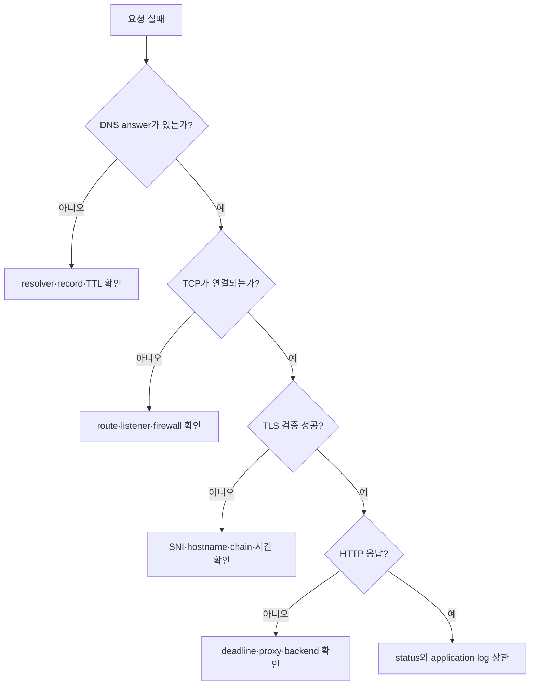

# 계층별 장애 분리 실습

> 실습 등급: **Local**. `tcpdump`만 packet capture 권한이 필요하며 나머지는 일반 사용자로 실행할 수 있다.

## 목표

URL 하나를 같은 명령으로 반복 호출하지 않고 DNS, route, TCP, TLS, HTTP 증거로 나눈다.

## 1. 정상 기준 만들기

공개 대상 대신 자신이 운영하거나 실습용으로 허용된 hostname을 사용한다.

```bash
target_host="example.com"
target_url="https://example.com/"

dig +noall +answer "$target_host" A
ip route get 1.1.1.1
curl -sSvo /dev/null --connect-timeout 3 --max-time 8 "$target_url"
openssl s_client -connect "${target_host}:443" -servername "$target_host" </dev/null
```

기록할 값은 answer와 TTL, 선택 route, remote IP, TLS subject·issuer·검증 결과, HTTP status와 전체 시간이다. 공개 사이트를 과도하게 반복 호출하지 않는다.

## 2. 실패 모양 비교

### DNS 실패

```bash
dig +noall +answer does-not-exist.invalid A
```

`.invalid`는 이름 해석 실패 실습용으로 예약된 top-level domain이다. answer가 없다는 사실과 resolver가 반환한 status를 본다.

### TCP refused

```bash
curl -v --connect-timeout 2 http://127.0.0.1:65535/
ss -ltn | grep ':65535' || true
```

local에서 listener가 없으면 일반적으로 즉시 거절된다. 반면 packet이 중간에서 버려지면 connect timeout으로 보일 수 있다.

### TLS 이름 불일치 관찰

```bash
openssl s_client -connect example.com:443 -servername wrong.invalid </dev/null
```

이 명령은 handshake 자료를 보여 주는 진단 도구다. application client가 hostname 검증을 강제하는 것과 동일한 성공 판정으로 취급하지 않는다. `curl`의 기본 certificate 검증을 끄는 `-k`를 복구 방법으로 쓰지 않는다.



## Kubernetes 확장

```bash
kubectl get service,endpointslice -A
kubectl describe service -n default sample
kubectl get networkpolicy -A
kubectl run netcheck --rm -it --restart=Never --image=curlimages/curl -- \
  curl -sv --max-time 5 http://sample.default.svc.cluster.local/
```

이미지 pull이라는 별도 외부 dependency가 있으므로 Pod 생성 실패를 service network 실패로 오해하지 않는다. 먼저 `kubectl get pod`와 event를 확인한다.

## incident 기록 형식

| 시각 | 계층 | 관찰 | 판정 |
|---|---|---|---|
| T0 | DNS | answer와 TTL | 이름 해석 성공/실패 |
| T1 | TCP | remote IP, connect 결과 | path·listener 후보 |
| T2 | TLS | SNI, certificate 검증 | identity 성공/실패 |
| T3 | HTTP | status, latency | proxy/backend 후보 |

## 스스로 설명해 보기

1. `connection refused`가 firewall 차단보다 listener 부재를 먼저 의심하게 하는 이유는 무엇인가?
2. `openssl s_client` 출력만 보고 application TLS 검증 성공을 선언하면 안 되는 이유는 무엇인가?
3. Pod 안에서만 실패한다면 host와 비교할 DNS·route·policy 차이는 무엇인가?

<!-- source: https://datatracker.ietf.org/doc/html/rfc2606 | checked: 2026-09-03 -->
<!-- source: https://datatracker.ietf.org/doc/html/rfc9293 | checked: 2026-09-03 -->
<!-- source: https://datatracker.ietf.org/doc/html/rfc8446 | checked: 2026-09-03 -->
<!-- source: https://kubernetes.io/docs/tasks/administer-cluster/dns-debugging-resolution/ | checked: 2026-09-03 -->
