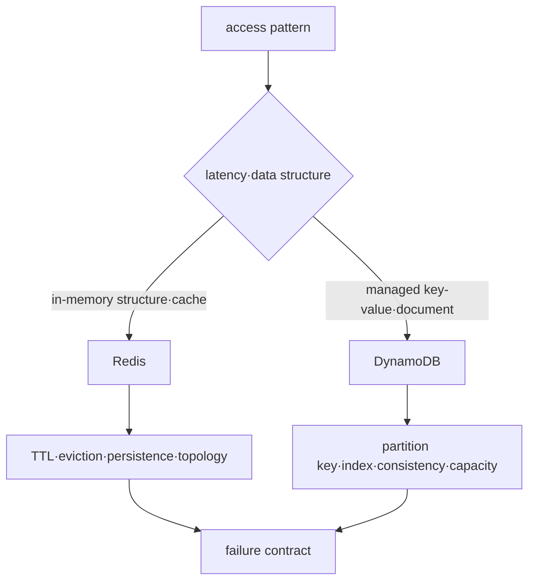

# Redis와 DynamoDB 로드맵

## 먼저 제품이 아니라 access pattern을 고른다

Redis와 DynamoDB는 모두 “NoSQL”로 묶이지만 상태 위치, durability, partition, consistency와 failure boundary가 다르다. 이 과정은 동일 제품의 대체재 비교가 아니라 각 access pattern에 어떤 운영 계약이 필요한지 다룬다.

## 선수 지식

- key-value, hash와 partition의 기본 개념
- latency, throughput, durability와 consistency의 차이
- AWS IAM과 VPC endpoint의 기본 경계

## 학습 순서

1. **두 저장 모델**: Redis와 DynamoDB의 state·partition·failure를 구분한다.
2. **TTL·hot key 실습**: Redis expiration을 관찰하고 DynamoDB key design을 검증한다.

## 완료 조건

- cache miss와 durable data loss를 구분한다.
- DynamoDB access pattern에서 partition key와 index를 먼저 설계한다.
- hot key가 client retry, capacity와 latency에 미치는 영향을 설명한다.

## 범위 밖

MongoDB·Cassandra·OpenSearch 운영과 제품별 migration 비교는 포함하지 않는다.

## 스스로 설명해 보기

1. Redis를 cache로 쓰는 경우와 source of truth로 쓰는 경우의 복구 계약은 어떻게 다른가?
2. DynamoDB에서 임의 ad-hoc query를 나중에 추가하기 어려울 수 있는 이유는 무엇인가?
3. 평균 traffic이 낮아도 hot partition이 생길 수 있는 이유는 무엇인가?

<!-- source: https://redis.io/docs/latest/develop/data-types/ | checked: 2026-09-03 -->
<!-- source: https://redis.io/docs/latest/operate/oss_and_stack/management/persistence/ | checked: 2026-09-03 -->
<!-- source: https://docs.aws.amazon.com/amazondynamodb/latest/developerguide/HowItWorks.CoreComponents.html | checked: 2026-09-03 -->
