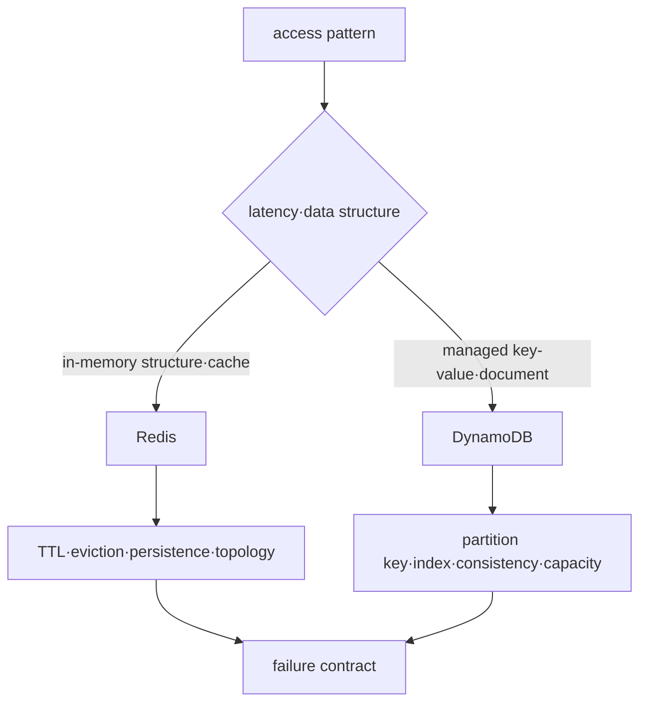

# Redis and DynamoDB Roadmap

## Starting point for beginners

All data does not need to be stored in the same format in the same database. Login credentials that can disappear after 10 minutes and order records that need to remain for years have different needs. This process does not start with the conclusion that “NoSQL is faster,” but first determines which questions to ask and how often and whether data can be lost.

| New term | Plain-language meaning | Why it matters / when to use it |
|---|---|---|
| key | A unique name to use when finding your data again. | Retrieve or update the intended item without scanning unrelated values. |
| value | Actual data stored by linking to the key | Store the application information that will be retrieved through its key. |
| TTL | Time remaining until data disappears automatically | Expire short-lived data such as sessions or caches according to an explicit lifetime policy. |
| memory | Storage space that is very fast but requires separate consideration of how to preserve it after a power failure | Serve frequently accessed data quickly while designing persistence and capacity separately. |
| partition key | A key used by DynamoDB to determine where to place data. | Distribute DynamoDB access and avoid concentrating a workload on a few placement keys. |
| Consistency | Guarantees that the latest value is visible when read immediately after writing | Choose the required read visibility when stale data would change the application's decision. |

Redis and DynamoDB both use keys, but they are not substitutes for the same product. Learn the difference between Redis' expiring cache and DynamoDB's persistent order inquiry as separate examples.

## First, choose an access pattern, not a product.

Both Redis and DynamoDB are classified as “NoSQL,” but their state location, durability, partition, consistency, and failure boundary are different. This process is not a comparison of substitutes for the same product, but rather addresses what operating agreements are required for each access pattern.

## prerequisite knowledge

- Basic concepts of key-value, hash and partition
- Differences between latency, throughput, durability and consistency
- Default boundary between AWS IAM and VPC endpoints

## learning sequence

1. **Two storage models**: Distinguish between state·partition·failure of Redis and DynamoDB.
2. **TTL·hot key lab**: Observe Redis expiration and verify DynamoDB key design.

## Completion criteria

This topic is not something you read once and then stop. First, convert the terminology table into your own words and follow the flow of requests made in the concepts chapter. In the lab, the normal state is first recorded, then a failure is created by changing only one condition, and the cause is explained with evidence before recovery. Finally, expand to more complex environments by answering the operational judgment questions below.

- Distinguish between cache miss and durable data loss.
- In the DynamoDB access pattern, design the partition key and index first.
- Explains the impact of hot keys on client retry, capacity and latency.

## out of range

It does not include comparison of MongoDB, Cassandra, and OpenSearch operations and migration by product.

## Check your understanding

1. What is the difference between cache and source of truth when data disappears?
2. Even though Redis and DynamoDB both use keys, why can't they be considered the same role?

**Verification criteria:** The cache can be recreated from the original, but loss of source of truth can result in loss of business data. The two products have different storage locations, persistence, distribution methods, and inquiry contracts.

## Develop operational judgment

1. How are the recovery contracts different when using Redis as a cache and as a source of truth?
2. Why can it be difficult to add arbitrary ad-hoc queries later in DynamoDB?
3. Why can hot partitions occur even when average traffic is low?

<!-- source: https://redis.io/docs/latest/develop/data-types/ | checked: 2026-09-03 -->
<!-- source: https://redis.io/docs/latest/operate/oss_and_stack/management/persistence/ | checked: 2026-09-03 -->
<!-- source: https://docs.aws.amazon.com/amazondynamodb/latest/developerguide/HowItWorks.CoreComponents.html | checked: 2026-09-03 -->
