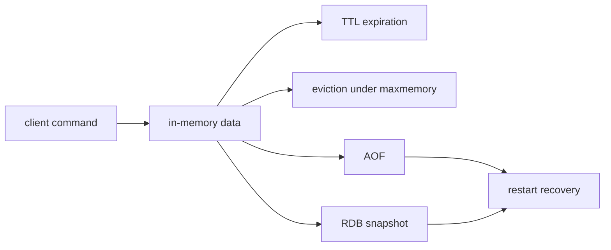
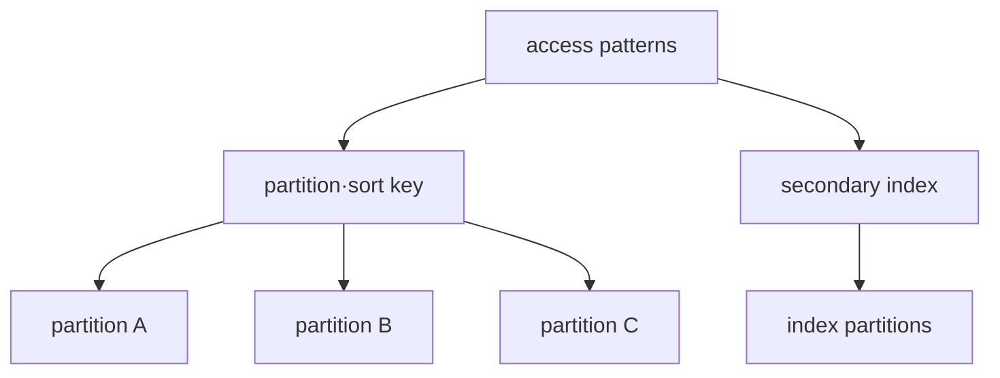

# Different models for Redis and DynamoDB

## Terms introduced in this chapter

- **source of truth**: This is the original data that will ultimately be judged correct when other copies are incorrect. **Why it matters / when to use it:** Resolve disagreements between caches, replicas, and other copies using an authoritative record.
- **cache**: A copy of the result that is temporarily stored nearby to reduce slow lookup of the original. **Why it matters / when to use it:** Reduce repeated origin work for results that can be safely reused for a defined period.
- **eviction**: This is an operation to remove some keys according to a set policy when memory is insufficient. **Why it matters / when to use it:** Keep a memory-limited cache operating by choosing which entries can be discarded.
- **persistence**: This method leaves data on a separate storage device so that it can be recovered even if the process is terminated or restarted. **Why it matters / when to use it:** Recover required state after restart instead of relying solely on process memory.
- **partition**: A unit that divides a lot of data into several storage areas. **Why it matters / when to use it:** Spread storage or processing work while defining the resulting ordering and access boundaries.
- **secondary index**: An additional index maintained to find data using conditions other than the primary key. **Why it matters / when to use it:** Support additional query patterns without scanning all items by the primary key layout.

At first, consider the case of storing the login session in Redis and the case of retrieving orders in DynamoDB separately. Before comparing the function tables of the two products, first write down the results when data disappears and the commonly used queries.

## Understand the model first

Let’s compare an online store’s shopping cart and order ledger. Even if the shopping cart cache disappears for a moment, it can be recreated from the source database, and very low latency can be important. The order ledger must reliably find, preserve, and audit specific orders. Both can be accessed by key, but the required durability and recovery contract are different.

Redis is a server that places data structures in memory and manipulates them very quickly. You can configure persistence and replication, but the range you can lose upon restart varies depending on which settings you choose. DynamoDB is a service that AWS manages partitioned storage operations, and the application must project the access pattern to the primary key and index in advance.

| question to ask first | Meaning in Redis | Meaning in DynamoDB |
|---|---|---|
| What is key? | identifier to find data type | partition·sort identity of item |
| Can data disappear? | Decide whether to cache or source of truth | Determination of backup·PITR·replication requirements |
| How to scale? | memory, replica, shard and client routing | Key distribution and partition capacity |
| How recent should the readings be? | Consider replication/failover timing | read consistency options and index boundaries |
| What if you get caught up in one key? | Single-threaded command path and large key influence | Hot partition and throttling potential |

The explanation that “NoSQL has no schema” is also insufficient. Even if table DDL can be free, key format, TTL meaning, value shape, and consumer expectation exist as an application contract. If you do not version this contract, the data cannot be interpreted by the reader even if it is stored.

## Compare two data requests step by step

Assume that the login session is stored in Redis and the order details are stored in DynamoDB.

1. After logging in, the application stores `session ID → user information` in Redis and sets an expiration time.
2. The next request reads the same key. If the key has expired, the user must authenticate again.
3. Whether eviction is possible when memory is insufficient is determined depending on whether the data is original or cached.
4. When creating an order, the application stores items using the DynamoDB partition key and sort key.
5. Order inquiry searches for items using pre-determined key conditions and selects the required consistency.
6. When requests are concentrated for a specific customer or status, the partition design is reexamined by observing key distribution and throttling.

Both are read by key, but the business impact of session loss and order loss are different. First, decide on a recovery contract and then choose product settings.

## Redis: Operates data structures in memory

Redis' types such as string, hash, set, sorted set, and stream change command meaning and cost. TTL is a logical expiration policy and is not the same as the eviction policy of memory pressure. Since the timing of expired key removal is also affected by access and background cycle, it is not assumed that memory is returned exactly immediately after TTL.

RDB snapshot and AOF have different durability, recovery time, and write overhead. Replication helps with availability but does not replace backup. Sentinel and Cluster have different topology purposes and the client must support failover and redirection.

## DynamoDB: Project access pattern to partition key

Items in a DynamoDB table are identified by a primary key. A partition key or partition+sort key is used, and the secondary index provides a separate query access pattern. If the key distribution is skewed, requests may be concentrated on a specific key even if the overall table capacity is sufficient.

Choosing between eventually consistent read and strongly consistent read depends on the API, cost/latency, and scope of support. Global secondary index reads are eventually consistent. Even if a transaction API exists, relational joins and arbitrary multi-row transaction models are not expected.

## selection table

| question | The core of Redis | The core of DynamoDB |
|---|---|---|
| data identity | key and data type | primary key and item |
| scale boundary | memory·shard·replica | Partition key distribution/capacity mode |
| lifetime | TTL·eviction | TTL deletion is an asynchronous lifecycle function |
| recovery | RDB/AOF·backup·replication | PITR·on-demand backup·global table judgment |
| failure symptom | memory pressure·failover·fork/I/O | throttling·hot key·index lag |

## Explain it in your own words

1. Why are Redis TTL and maxmemory eviction different policies?
2. Why does DynamoDB's GSI have different failure/consistency boundaries than the base table?
3. Why is a separate backup necessary even if a replica exists?

<!-- source: https://redis.io/docs/latest/develop/data-types/ | checked: 2026-09-03 -->
<!-- source: https://redis.io/docs/latest/develop/reference/eviction/ | checked: 2026-09-03 -->
<!-- source: https://redis.io/docs/latest/operate/oss_and_stack/management/persistence/ | checked: 2026-09-03 -->
<!-- source: https://docs.aws.amazon.com/amazondynamodb/latest/developerguide/HowItWorks.CoreComponents.html | checked: 2026-09-03 -->
<!-- source: https://docs.aws.amazon.com/amazondynamodb/latest/developerguide/HowItWorks.ReadConsistency.html | checked: 2026-09-03 -->
