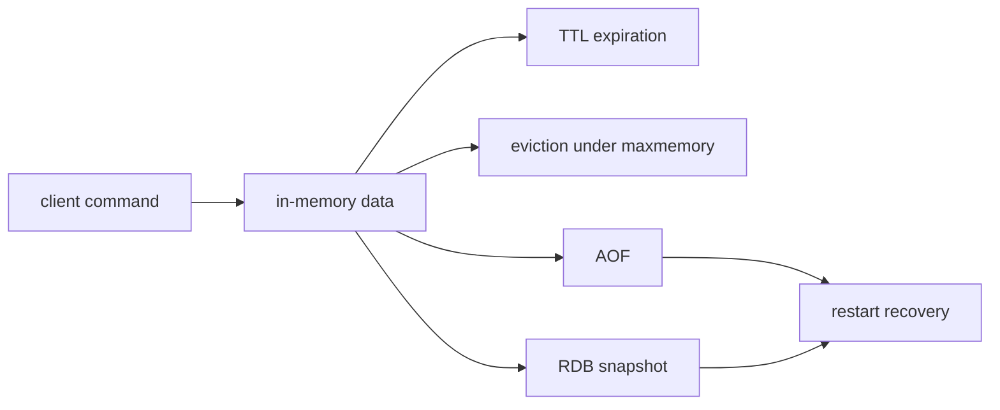
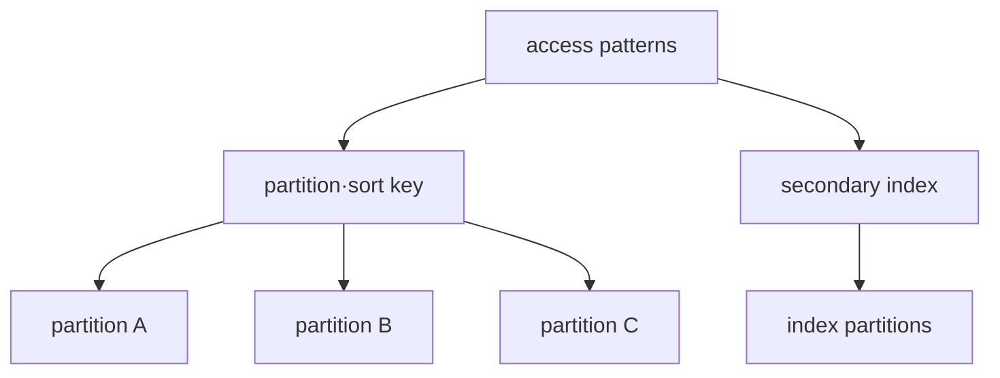

# Redis와 DynamoDB의 서로 다른 모델

## 이 장에서 처음 쓰는 말

- **source of truth**: 다른 복사본이 틀렸을 때 최종적으로 맞다고 판단할 원본 데이터다.
- **cache**: 느린 원본 조회를 줄이기 위해 결과를 잠시 가까이 보관한 복사본이다.
- **eviction**: memory가 부족할 때 정해진 정책으로 일부 key를 제거하는 동작이다.
- **persistence**: process가 종료되거나 재시작해도 데이터를 복구할 수 있도록 별도 저장 장치에 남기는 방식이다.
- **partition**: 많은 데이터를 여러 저장 구역에 나누어 두는 단위다.
- **secondary index**: 기본 key가 아닌 다른 조건으로 데이터를 찾기 위해 유지하는 추가 색인이다.

처음에는 로그인 session을 Redis에 저장하는 경우와 주문을 DynamoDB에서 조회하는 경우를 따로 생각한다. 두 제품의 기능표를 비교하기 전에 데이터가 사라졌을 때의 결과와 주로 사용하는 조회를 먼저 적는다.

## 먼저 이해하기

온라인 상점의 장바구니와 주문 원장을 비교해 보자. 장바구니 cache는 잠시 사라져도 source database에서 다시 만들 수 있고 아주 낮은 latency가 중요할 수 있다. 주문 원장은 특정 주문을 안정적으로 찾고 보존·감사해야 한다. 둘 다 key로 접근할 수 있지만 필요한 durability와 복구 계약은 다르다.

Redis는 memory에 data structure를 두고 매우 빠르게 조작하는 서버다. persistence와 replication을 구성할 수 있지만 어떤 설정을 선택했는지에 따라 restart 시 잃을 수 있는 범위가 달라진다. DynamoDB는 AWS가 partitioned storage 운영을 관리하는 서비스이며, application은 access pattern을 primary key와 index에 미리 투영해야 한다.

| 먼저 물을 질문 | Redis에서의 의미 | DynamoDB에서의 의미 |
|---|---|---|
| key는 무엇인가? | data type을 찾는 identifier | item의 partition·sort identity |
| 데이터가 사라져도 되는가? | cache인지 source of truth인지 결정 | backup·PITR·replication 요구 결정 |
| 어떻게 확장하는가? | memory, replica, shard와 client routing | key 분포와 partition capacity |
| 읽은 값은 얼마나 최신이어야 하는가? | replication·failover 시점 고려 | read consistency 옵션과 index 경계 |
| 한 key에 몰리면? | single-threaded command path와 large key 영향 | hot partition과 throttling 가능성 |

“NoSQL은 schema가 없다”는 설명도 부족하다. table DDL이 자유로울 수 있어도 key format, TTL 의미, value shape와 consumer expectation은 application contract로 존재한다. 이 contract를 versioning하지 않으면 데이터는 저장돼도 읽는 쪽이 해석하지 못한다.

## 두 가지 데이터 요청을 한 단계씩 비교하기

로그인 session은 Redis에, 주문 상세는 DynamoDB에 둔다고 가정한다.

1. 로그인 뒤 application이 `session ID → 사용자 정보`를 Redis에 저장하고 만료 시간을 건다.
2. 다음 요청은 같은 key를 읽는다. key가 만료됐으면 사용자는 다시 인증하면 된다.
3. memory가 부족할 때 eviction이 가능한지는 이 데이터가 원본인지 cache인지에 따라 결정한다.
4. 주문 생성에서는 application이 DynamoDB partition key와 sort key를 사용해 item을 저장한다.
5. 주문 조회는 미리 정한 key 조건으로 item을 찾고 필요한 consistency를 선택한다.
6. 특정 고객이나 상태에 요청이 몰리면 key 분포와 throttling을 관찰해 partition 설계를 다시 검토한다.

둘 다 key로 읽지만 session 손실과 주문 손실의 업무 영향은 다르다. 먼저 복구 계약을 정한 뒤 제품 설정을 고른다.

## Redis: memory의 data structure를 운영한다

Redis의 string, hash, set, sorted set, stream 같은 type은 명령 의미와 비용을 바꾼다. TTL은 logical expiration 정책이며 memory pressure의 eviction policy와 같지 않다. expired key 제거 시점도 access와 background cycle의 영향을 받으므로 TTL 직후 memory가 정확히 즉시 반환된다고 가정하지 않는다.

RDB snapshot과 AOF는 durability·recovery time·write overhead가 다르다. replication은 availability에 도움을 주지만 backup을 대체하지 않는다. Sentinel과 Cluster는 topology 목적이 다르며 client가 failover와 redirection을 지원해야 한다.

## DynamoDB: access pattern을 partition key에 투영한다

DynamoDB table의 item은 primary key로 식별된다. partition key 또는 partition+sort key를 사용하며 secondary index는 별도의 query access pattern을 제공한다. key 분포가 치우치면 전체 table capacity가 충분해도 특정 key에 요청이 몰릴 수 있다.

eventually consistent read와 strongly consistent read의 선택은 API, 비용·latency와 지원 범위를 확인한다. global secondary index read는 eventually consistent다. transaction API가 존재해도 relational join과 arbitrary multi-row transaction model을 그대로 기대하지 않는다.

## 선택 표

| 질문 | Redis 쪽 핵심 | DynamoDB 쪽 핵심 |
|---|---|---|
| data identity | key와 data type | primary key와 item |
| scale boundary | memory·shard·replica | partition key 분포·capacity mode |
| lifetime | TTL·eviction | TTL deletion은 비동기적 수명주기 기능 |
| recovery | RDB/AOF·backup·replication | PITR·on-demand backup·global table 판단 |
| failure symptom | memory pressure·failover·fork/I/O | throttling·hot key·index lag |

## 스스로 설명해 보기

1. Redis TTL과 maxmemory eviction이 서로 다른 정책인 이유는 무엇인가?
2. DynamoDB의 GSI가 base table과 다른 failure·consistency 경계를 갖는 이유는 무엇인가?
3. replica가 존재해도 별도 backup이 필요한 이유는 무엇인가?

<!-- source: https://redis.io/docs/latest/develop/data-types/ | checked: 2026-09-03 -->
<!-- source: https://redis.io/docs/latest/develop/reference/eviction/ | checked: 2026-09-03 -->
<!-- source: https://redis.io/docs/latest/operate/oss_and_stack/management/persistence/ | checked: 2026-09-03 -->
<!-- source: https://docs.aws.amazon.com/amazondynamodb/latest/developerguide/HowItWorks.CoreComponents.html | checked: 2026-09-03 -->
<!-- source: https://docs.aws.amazon.com/amazondynamodb/latest/developerguide/HowItWorks.ReadConsistency.html | checked: 2026-09-03 -->
