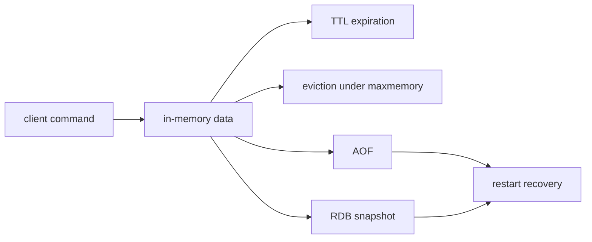
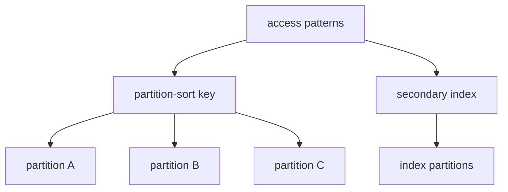

# Redis와 DynamoDB의 서로 다른 모델

## Redis: memory의 data structure를 운영한다

Redis의 string, hash, set, sorted set, stream 같은 type은 명령 의미와 비용을 바꾼다. TTL은 logical expiration 정책이며 memory pressure의 eviction policy와 같지 않다. expired key 제거 시점도 access와 background cycle의 영향을 받으므로 TTL 직후 memory가 정확히 즉시 반환된다고 가정하지 않는다.

RDB snapshot과 AOF는 durability·recovery time·write overhead가 다르다. replication은 availability에 도움을 주지만 backup을 대체하지 않는다. Sentinel과 Cluster는 topology 목적이 다르며 client가 failover와 redirection을 지원해야 한다.

## DynamoDB: access pattern을 partition key에 투영한다

DynamoDB table의 item은 primary key로 식별된다. partition key 또는 partition+sort key를 사용하며 secondary index는 별도의 query access pattern을 제공한다. key 분포가 치우치면 전체 table capacity가 충분해도 특정 key에 요청이 몰릴 수 있다.

eventually consistent read와 strongly consistent read의 선택은 API, 비용·latency와 지원 범위를 확인한다. global secondary index read는 eventually consistent다. transaction API가 존재해도 relational join과 arbitrary multi-row transaction model을 그대로 기대하지 않는다.

## 선택 표

| 질문 | Redis 쪽 핵심 | DynamoDB 쪽 핵심 |
|---|---|---|
| data identity | key와 data type | primary key와 item |
| scale boundary | memory·shard·replica | partition key 분포·capacity mode |
| lifetime | TTL·eviction | TTL deletion은 비동기적 수명주기 기능 |
| recovery | RDB/AOF·backup·replication | PITR·on-demand backup·global table 판단 |
| failure symptom | memory pressure·failover·fork/I/O | throttling·hot key·index lag |

## 스스로 설명해 보기

1. Redis TTL과 maxmemory eviction이 서로 다른 정책인 이유는 무엇인가?
2. DynamoDB의 GSI가 base table과 다른 failure·consistency 경계를 갖는 이유는 무엇인가?
3. replica가 존재해도 별도 backup이 필요한 이유는 무엇인가?

<!-- source: https://redis.io/docs/latest/develop/data-types/ | checked: 2026-09-03 -->
<!-- source: https://redis.io/docs/latest/develop/reference/eviction/ | checked: 2026-09-03 -->
<!-- source: https://redis.io/docs/latest/operate/oss_and_stack/management/persistence/ | checked: 2026-09-03 -->
<!-- source: https://docs.aws.amazon.com/amazondynamodb/latest/developerguide/HowItWorks.CoreComponents.html | checked: 2026-09-03 -->
<!-- source: https://docs.aws.amazon.com/amazondynamodb/latest/developerguide/HowItWorks.ReadConsistency.html | checked: 2026-09-03 -->
