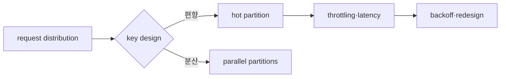

# TTL, eviction과 hot key 실습

> 실습 등급: Redis는 **Local**, DynamoDB design은 **Plan only**이며 선택적으로 격리된 table에서 **AWS optional**로 검증한다.

## 실습 전에 준비할 것

- **Redis 환경**: 지워도 되는 local Redis instance와 `redis-cli`가 필요하다. 공유·운영 Redis에서는 실행하지 않는다.
- **연결 확인**: `redis-cli PING`이 `PONG`을 반환하고 현재 database에 중요한 key가 없는지 확인한다.
- **실습 key**: `session:demo`처럼 `infra-study:` 또는 별도 prefix를 붙인 key만 사용한다.
- **DynamoDB 단계**: 먼저 종이에 access pattern과 partition key를 설계한다. AWS table 생성은 선택 사항이다.
- **비용·권한**: AWS optional 단계에서는 격리된 Region·table·temporary role과 cleanup owner를 정한다.
- **끝난 상태**: 실습 Redis key와 선택적으로 만든 DynamoDB table·alarm이 모두 정리돼야 한다.

TTL 실습은 기다리는 시간이 포함된다. 처음 `TTL` 결과와 10초 이후 `GET` 결과를 둘 다 기록해야 “설정했다”가 아니라 “실제로 만료됐다”고 말할 수 있다.

## 먼저 이해하기

Redis에서 key가 없어지는 길은 하나가 아니다. TTL이 끝나 논리적으로 만료될 수 있고, `maxmemory`에 도달해 eviction policy가 key를 제거할 수 있으며, persistence 설정과 마지막 저장 시점 때문에 restart 뒤 일부 key가 돌아오지 않을 수도 있다. 원인이 다르면 복구와 예방도 다르다.

DynamoDB의 hot key는 저장 용량 문제가 아니라 request 분포 문제다. table 전체 요청량이 낮아도 하나의 partition key에 traffic이 집중되면 해당 partition에서 latency나 throttling이 나타날 수 있다. key design은 값을 저장하는 형식이면서 동시에 load를 분산하는 규칙이다.

| 현상 | 먼저 확인 | 잘못된 단정 |
|---|---|---|
| Redis key 없음 | TTL, eviction counter, write/restart 시점 | 누군가 `DEL`했다 |
| Redis write 실패 | maxmemory와 policy | network 장애다 |
| DynamoDB throttling | key별 traffic·index·capacity mode | table 전체 capacity만 부족하다 |
| query가 Scan 필요 | access pattern과 key/index | NoSQL은 원래 전부 scan한다 |

## 1. Redis TTL 관찰

disposable Redis instance에서 실행한다.

```bash
redis-cli SET session:demo active EX 10
redis-cli TTL session:demo
redis-cli GET session:demo
```

10초 전후에 TTL과 GET 결과를 관찰한다. `TTL=-2`는 key가 없고, `TTL=-1`은 key가 있지만 expiration이 없다는 뜻이다.

## 2. Eviction 사고 실험

production instance에서 즉흥적으로 `maxmemory`를 낮추지 않는다. disposable instance에 작은 한도를 정하고 선택한 policy에서 key가 제거되는지 관찰한다.

```bash
redis-cli CONFIG GET maxmemory
redis-cli CONFIG GET maxmemory-policy
redis-cli INFO memory
redis-cli INFO stats
```

`evicted_keys`, memory, application cache miss와 source-of-truth 부하를 같은 시간축으로 본다. `noeviction`에서는 write가 실패할 수 있으므로 “아무 key도 안 지워진다”와 “서비스가 정상이다”는 같은 말이 아니다.

## 3. DynamoDB key worksheet

주문 조회 요구를 key에 매핑한다.

| access pattern | PK | SK 또는 index | 위험 |
|---|---|---|---|
| 고객별 최근 주문 | `CUSTOMER#<id>` | `ORDER#<time>#<id>` | 대형 고객 hot key |
| 주문 ID 단건 조회 | `ORDER#<id>` | metadata | 두 identity 중복 모델 |
| 상태별 운영 조회 | GSI partition=`STATUS#<value>` | time | 특정 상태 집중 |

고정된 단일 partition key에 모든 event를 넣는 설계와 충분히 분산되는 synthetic key를 비교한다. AWS optional 실습에서는 table에 공통 tag와 낮은 test traffic을 사용하고 CloudWatch의 throttled requests·latency를 확인한다.



## 완료 판정과 정리

- Redis에서는 expiration과 eviction을 별도 실험으로 판정한다.
- DynamoDB에서는 각 query가 Scan 없이 어떤 key/index로 수행되는지 설명한다.
- AWS optional table, index, backup와 test IAM policy를 inventory 역순으로 삭제하고 billing·resource view를 재확인한다.

## 결과를 이렇게 읽는다

`TTL`이 양수에서 `-2`로 바뀌면 key가 만료되어 더는 존재하지 않는 최소 흐름을 확인한 것이다. `-1`이라면 key는 있지만 expiration이 설정되지 않았다. 두 음수 값을 구분해야 session이 영구히 남는 설정 누락과 정상 만료를 나눌 수 있다.

`evicted_keys`가 증가하면 memory pressure 때문에 policy가 key를 제거했다는 뜻이다. cache라면 source DB의 miss traffic이 함께 증가할 수 있고 source of truth라면 data loss 사건일 수 있다. 같은 counter라도 workload 역할에 따라 심각도가 다르다.

DynamoDB worksheet에서는 각 요구가 `GetItem` 또는 `Query`의 key condition으로 표현되는지 확인한다. 운영 화면 하나를 위해 status 값 하나에 모든 item이 몰리는 GSI를 만들면 새로운 hot partition을 만들 수 있다. 시간 bucket이나 write sharding을 쓰면 read fan-out과 정렬 비용이 생기므로 함께 비교한다.

## 스스로 설명해 보기

1. Redis의 `evicted_keys` 증가가 왜 DB 장애로 번질 수 있는가?
2. DynamoDB Scan이 동작한다는 사실이 key design 성공을 뜻하지 않는 이유는 무엇인가?
3. hot key retry에 jittered backoff만 추가해도 근본 문제가 남을 수 있는 이유는 무엇인가?

<!-- source: https://redis.io/docs/latest/commands/ttl/ | checked: 2026-09-03 -->
<!-- source: https://redis.io/docs/latest/develop/reference/eviction/ | checked: 2026-09-03 -->
<!-- source: https://docs.aws.amazon.com/amazondynamodb/latest/developerguide/bp-partition-key-design.html | checked: 2026-09-03 -->
<!-- source: https://docs.aws.amazon.com/amazondynamodb/latest/developerguide/Query.html | checked: 2026-09-03 -->
