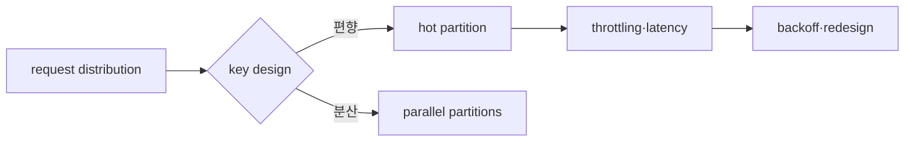

# TTL, eviction과 hot key 실습

> 실습 등급: Redis는 **Local**, DynamoDB design은 **Plan only**이며 선택적으로 격리된 table에서 **AWS optional**로 검증한다.

## 1. Redis TTL 관찰

disposable Redis instance에서 실행한다.

```bash
redis-cli SET session:demo active EX 10
redis-cli TTL session:demo
redis-cli GET session:demo
```

10초 전후에 TTL과 GET 결과를 관찰한다. `TTL=-2`는 key가 없고, `TTL=-1`은 key가 있지만 expiration이 없다는 뜻이다.

## 2. Eviction 사고 실험

production instance에서 즉흥적으로 `maxmemory`를 낮추지 않는다. disposable instance에 작은 한도를 정하고 선택한 policy에서 key가 제거되는지 관찰한다.

```bash
redis-cli CONFIG GET maxmemory
redis-cli CONFIG GET maxmemory-policy
redis-cli INFO memory
redis-cli INFO stats
```

`evicted_keys`, memory, application cache miss와 source-of-truth 부하를 같은 시간축으로 본다. `noeviction`에서는 write가 실패할 수 있으므로 “아무 key도 안 지워진다”와 “서비스가 정상이다”는 같은 말이 아니다.

## 3. DynamoDB key worksheet

주문 조회 요구를 key에 매핑한다.

| access pattern | PK | SK 또는 index | 위험 |
|---|---|---|---|
| 고객별 최근 주문 | `CUSTOMER#<id>` | `ORDER#<time>#<id>` | 대형 고객 hot key |
| 주문 ID 단건 조회 | `ORDER#<id>` | metadata | 두 identity 중복 모델 |
| 상태별 운영 조회 | GSI partition=`STATUS#<value>` | time | 특정 상태 집중 |

고정된 단일 partition key에 모든 event를 넣는 설계와 충분히 분산되는 synthetic key를 비교한다. AWS optional 실습에서는 table에 공통 tag와 낮은 test traffic을 사용하고 CloudWatch의 throttled requests·latency를 확인한다.



## 완료 판정과 정리

- Redis에서는 expiration과 eviction을 별도 실험으로 판정한다.
- DynamoDB에서는 각 query가 Scan 없이 어떤 key/index로 수행되는지 설명한다.
- AWS optional table, index, backup와 test IAM policy를 inventory 역순으로 삭제하고 billing·resource view를 재확인한다.

## 스스로 설명해 보기

1. Redis의 `evicted_keys` 증가가 왜 DB 장애로 번질 수 있는가?
2. DynamoDB Scan이 동작한다는 사실이 key design 성공을 뜻하지 않는 이유는 무엇인가?
3. hot key retry에 jittered backoff만 추가해도 근본 문제가 남을 수 있는 이유는 무엇인가?

<!-- source: https://redis.io/docs/latest/commands/ttl/ | checked: 2026-09-03 -->
<!-- source: https://redis.io/docs/latest/develop/reference/eviction/ | checked: 2026-09-03 -->
<!-- source: https://docs.aws.amazon.com/amazondynamodb/latest/developerguide/bp-partition-key-design.html | checked: 2026-09-03 -->
<!-- source: https://docs.aws.amazon.com/amazondynamodb/latest/developerguide/Query.html | checked: 2026-09-03 -->
