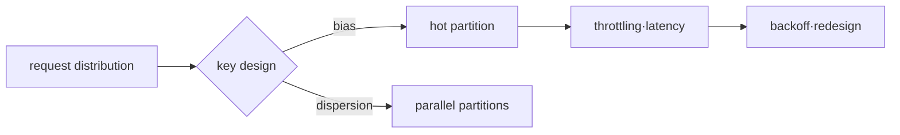

# TTL, eviction and hot key lab

> Lab grade: Redis is **Local**, DynamoDB design is **Plan only**, and optionally verified as **AWS optional** in an isolated table.

## Lab prerequisites

- **Redis environment**: A local Redis instance that can be deleted and `redis-cli` are required. It does not run on shared/operated Redis.
- **Confirm connection**: `redis-cli PING` returns `PONG` and check whether there are any important keys in the current database.
- **lab key**: Use only keys with a separate prefix such as `infra-study:` or `session:demo`.
- **DynamoDB Step**: First, design the access pattern and partition key on paper. Creating AWS tables is optional.
- **Cost/Permissions**: In the AWS optional step, the isolated Region·table·temporary role and cleanup owner are determined.
- **Finished state**: All lab Redis keys and optionally created DynamoDB tables and alarms must be cleaned up.

TTL lab includes waiting time. You need to record both the initial `TTL` result and the `GET` result 10 seconds later so that you can say "it actually expired" rather than "it was set."

## Understand the model first

There is more than one way to lose a key in Redis. TTL may end and logically expire, keys may be removed by eviction policy when `maxmemory` is reached, and some keys may not return after restart due to persistence settings and last save time. If the cause is different, recovery and prevention are also different.

DynamoDB's hot key is not a storage capacity issue, but a request distribution issue. Even if the overall table request volume is low, if traffic is concentrated on one partition key, latency or throttling may occur in that partition. Key design is a format for storing values ​​and at the same time a rule for distributing the load.

| phenomenon | check first | wrong conclusion |
|---|---|---|
| No Redis key | TTL, eviction counter, write/restart time | Someone said `DEL` |
| Redis write failed | maxmemory and policy | network is a problem |
| DynamoDB throttling | Traffic·index·capacity mode by key | The entire table capacity is insufficient. |
| query requires Scan | access pattern and key/index | NoSQL originally scans everything. |

## 1. Observe Redis TTL

Runs on a disposable Redis instance.

```bash
redis-cli SET session:demo active EX 10
redis-cli TTL session:demo
redis-cli GET session:demo
```

Observe the TTL and GET results around 10 seconds. `TTL=-2` means there is no key, and `TTL=-1` means there is a key but no expiration.

## 2. Eviction thought experiment

Do not lower `maxmemory` spontaneously in a production instance. Set a small limit on disposable instances and observe whether keys are removed from the selected policy.

```bash
redis-cli CONFIG GET maxmemory
redis-cli CONFIG GET maxmemory-policy
redis-cli INFO memory
redis-cli INFO stats
```

`evicted_keys`, memory, application cache miss and source-of-truth load are viewed on the same time axis. Since writing may fail in `noeviction`, “no key is erased” and “service is normal” are not the same thing.

## 3. DynamoDB key worksheet

Map order inquiry requests to keys.

| access pattern | PK | SK or index | danger |
|---|---|---|---|
| Recent orders by customer | `CUSTOMER#<id>` | `ORDER#<time>#<id>` | Large customer hot key |
| Order ID single inquiry | `ORDER#<id>` | metadata | Two identity overlapping models |
| Operation inquiry by status | GSI partition=`STATUS#<value>` | time | Focus on a specific state |

We compare a design that puts all events in a single fixed partition key and a sufficiently distributed synthetic key. AWS optional lab uses common tags and low test traffic in tables and checks throttled requests·latency in CloudWatch.



## Judgment of completion and summary

- In Redis, expiration and eviction are determined as separate experiments.
- DynamoDB explains with what key/index each query is performed without Scan.
- Delete the AWS optional table, index, backup, and test IAM policy in reverse inventory order and recheck the billing·resource view.

## How to interpret the results

When `TTL` changes from a positive number to `-2`, the key has expired and the minimum flow that no longer exists has been confirmed. If it is `-1`, the key exists but expiration has not been set. You must distinguish between the two negative values ​​to distinguish between missing settings, which cause the session to remain permanently, and normal expiration.

If `evicted_keys` increases, it means that the policy has removed the key due to memory pressure. If it is a cache, miss traffic in the source DB may increase, and if it is a source of truth, it may be a data loss event. Even for the same counter, the severity varies depending on the workload role.

In the DynamoDB worksheet, check whether each request is expressed as a key condition of `GetItem` or `Query`. If you create a GSI where all items are concentrated in one status value for one operating screen, you can create a new hot partition. When using time bucket or write sharding, read fan-out and sorting costs are incurred, so compare them together.

## Explain it in your own words

1. Why can an increase in `evicted_keys` in Redis lead to a DB failure?
2. Why doesn't the fact that DynamoDB Scan works mean that the key design was successful?
3. Why can simply adding a jittered backoff to hot key retry leave behind the fundamental problem?

<!-- source: https://redis.io/docs/latest/commands/ttl/ | checked: 2026-09-03 -->
<!-- source: https://redis.io/docs/latest/develop/reference/eviction/ | checked: 2026-09-03 -->
<!-- source: https://docs.aws.amazon.com/amazondynamodb/latest/developerguide/bp-partition-key-design.html | checked: 2026-09-03 -->
<!-- source: https://docs.aws.amazon.com/amazondynamodb/latest/developerguide/Query.html | checked: 2026-09-03 -->
