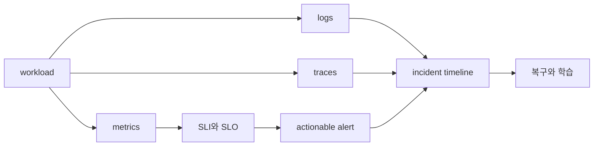

# Observability와 SRE 로드맵

## 무엇을 해결하는가

관측 도구가 많아도 사용자가 겪는 실패와 연결되지 않으면 운영 판단에 도움이 되지 않는다. 이 과정은 metric·log·trace를 같은 요청과 시간축에 놓고, SLI·SLO·error budget으로 대응 우선순위를 정하는 법을 다룬다.

## 선수 지식

- [Kubernetes 로드맵](../kubernetes/00-roadmap.md)의 workload와 Service
- Linux process·socket과 네트워크 요청 경로
- 비율, percentile과 시간 구간을 읽는 기본 수학

## 학습 순서

1. **Signal과 reliability model**: Prometheus, Alertmanager, OpenTelemetry와 SLO의 책임을 구분한다.
2. **상관관계·alert 실습**: 같은 요청의 metric·log·trace를 연결하고 SLO alert를 판정한다.

## 완료 조건

- 사용자 관점의 SLI를 정의하고 측정식의 분자·분모를 설명한다.
- page alert와 조사 dashboard의 목적을 구분한다.
- incident timeline에 증거, 가설, 조치와 결과를 분리해 기록한다.

## 범위 밖

Grafana 화면 제작 강좌, 특정 SaaS 선택 비교와 모든 exporter 목록은 다루지 않는다. 도구보다 운영 계약을 우선한다.

## 스스로 설명해 보기

1. CPU가 높다는 사실만으로 page를 보내면 안 되는 이유는 무엇인가?
2. trace ID가 log와 metric 조사에 어떤 연결 고리를 제공하는가?
3. error budget을 배포 속도와 연결할 때 필요한 조직적 합의는 무엇인가?

<!-- source: https://prometheus.io/docs/introduction/overview/ | checked: 2026-09-03 -->
<!-- source: https://opentelemetry.io/docs/collector/ | checked: 2026-09-03 -->
<!-- source: https://sre.google/workbook/implementing-slos/ | checked: 2026-09-03 -->
