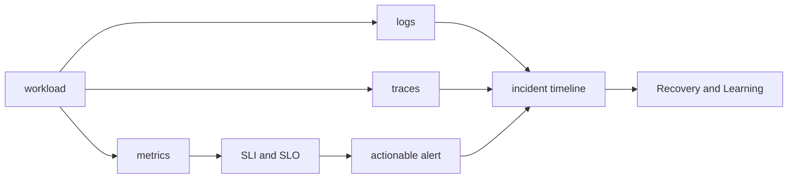

# Observability and SRE Roadmap

## Starting point for beginners

When a user reports that “the service is slow,” it is impossible to tell which request is slow and why by looking at the CPU graph alone. By looking at the numbers left behind by the program, the event log, and the request path, it is possible to explain what problem actually occurred to the user. Observability is about designing the evidence, and SRE is an approach that connects reliability goals and operational methods.

| New term | Plain-language meaning |
|---|---|
| metric | A number measured repeatedly over time. Example: Requests per second |
| log | A record of events that occurred in the program along with time |
| trace | The route a single request takes through multiple services and how long it takes |
| SLI | How to measure the results your users receive in numbers |
| SLO | A goal that determines what level the measurement should be |
| alert | A signal that tells a person that he or she needs to take action |

Initially, we send one request and look for the same event in metrics·log·trace. Then, we calculate SLI by combining multiple requests and design alerts that lead to actual actions.

## What does it solve

Even if there are many observation tools, if they are not connected to the failures experienced by users, they are not helpful in making operational decisions. This process places metrics·log·trace on the same request and time axis and deals with setting response priorities using SLI·SLO·error budget.

## prerequisite knowledge

- [Kubernetes Roadmap](../kubernetes/00-roadmap.md) workload and service
- Linux process·socket and network request path
- Basic math for reading ratios, percentiles and time intervals

## learning sequence

1. **Signal and reliability model**: Separate responsibilities between Prometheus, Alertmanager, OpenTelemetry and SLO.
2. **Correlation·alert lab**: Connects metrics·log·trace of the same request and determines SLO alert.

## Completion criteria

This topic is not something you read once and then stop. First, convert the terminology table into your own words and follow the flow of requests made in the concepts chapter. In the lab, the normal state is first recorded, then a failure is created by changing only one condition, and the cause is explained with evidence before recovery. Finally, expand to more complex environments by answering the operational judgment questions below.

- Define SLI from the user's perspective and explain the numerator and denominator of the measurement equation.
- Distinguish between the purposes of page alerts and research dashboards.
- Separately record evidence, hypotheses, actions, and results in the incident timeline.

## out of range

Grafana screen creation tutorials, comparison of specific SaaS selections, and list of all exporters are not covered. Prioritize operating agreements over tools.

## Check your understanding

1. What questions do metrics, log, and trace each answer?
2. What is the difference between SLI and SLO?

**Confirmation criteria:** You can explain that metric is the overall trend, log is individual events, trace mainly shows the request path, SLI is a measurement method, and SLO is the goal of that value.

## Develop operational judgment

1. Why not send a page just because the CPU is high?
2. What bridge does trace ID provide for log and metric investigation?
3. What organizational consensus is needed when linking error budget to deployment speed?

<!-- source: https://prometheus.io/docs/introduction/overview/ | checked: 2026-09-03 -->
<!-- source: https://opentelemetry.io/docs/collector/ | checked: 2026-09-03 -->
<!-- source: https://sre.google/workbook/implementing-slos/ | checked: 2026-09-03 -->
