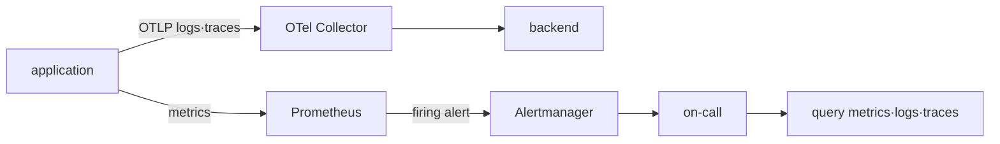
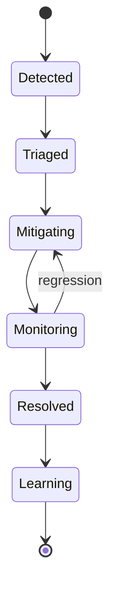

# Signal, SLO와 incident model

## Signal의 역할은 서로 다르다

| signal | 강한 질문 | 흔한 한계 |
|---|---|---|
| metric | 얼마나 자주, 얼마나 오래 발생했는가? | 개별 요청의 상세 맥락이 적다 |
| log | 그 시점에 component가 무엇을 기록했는가? | volume·형식·누락에 민감하다 |
| trace | 한 요청이 어디서 시간을 썼는가? | sampling과 context 전파가 필요하다 |

Prometheus는 label이 붙은 time series를 수집하고 PromQL로 질의한다. Alertmanager는 Prometheus가 만든 alert를 grouping·inhibition·silence하고 receiver로 전달한다. OpenTelemetry Collector는 receiver→processor→exporter pipeline으로 telemetry를 받아 가공하고 내보낸다.



## SLI에서 alert까지

availability SLI의 한 예는 다음과 같다.

```text
good requests / valid requests
```

성공의 정의, 제외할 요청과 측정 위치가 먼저 정해져야 한다. 30일 SLO가 99.9%라면 error budget은 단순히 `0.1%`라고 외우는 것이 아니라 실제 valid event 수 또는 시간으로 환산해 사용한다.

multi-window burn-rate alert는 짧은 구간의 급격한 소진과 긴 구간의 지속적 소진을 함께 본다. 정확한 threshold와 window는 traffic과 대응 시간에 맞춰 검증해야 한다.

## Incident 상태 전이



복구 중에는 root cause를 완전히 증명하는 것보다 impact를 안전하게 줄이는 것이 우선일 수 있다. timeline에는 관측 사실, 당시 가설, 실행한 변경과 결과를 구분한다. postmortem은 개인의 실수 목록이 아니라 재발 가능성을 낮출 system action을 남긴다.

## 운영 판단

- cardinality가 큰 label은 저장 비용과 query 성능을 악화시킬 수 있다.
- 모든 trace를 보존하는 방식과 sampling은 조사 가능성·비용의 trade-off다.
- dashboard가 유용해도 즉시 행동할 수 없는 조건이면 page alert로 만들지 않는다.
- telemetry pipeline 자체의 queue, drop, export failure도 관측한다.

## 스스로 설명해 보기

1. Alertmanager가 metric을 직접 평가하는 component가 아닌 이유는 무엇인가?
2. SLO 분모에서 health check를 제외할지 결정하려면 무엇을 확인해야 하는가?
3. sampling된 trace만으로 장애 범위를 과신하면 안 되는 이유는 무엇인가?

<!-- source: https://prometheus.io/docs/introduction/overview/ | checked: 2026-09-03 -->
<!-- source: https://prometheus.io/docs/alerting/latest/alertmanager/ | checked: 2026-09-03 -->
<!-- source: https://opentelemetry.io/docs/collector/configuration/ | checked: 2026-09-03 -->
<!-- source: https://sre.google/sre-book/service-level-objectives/ | checked: 2026-09-03 -->
