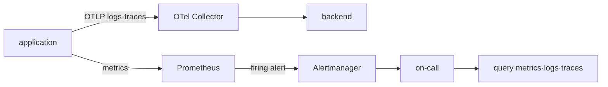
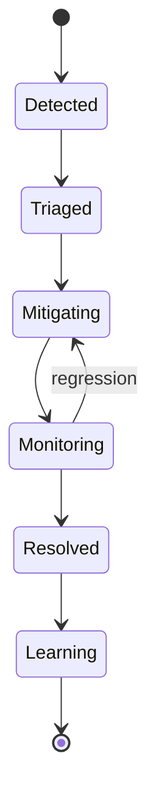

# Signal, SLO and incident model

## Terms introduced in this chapter

- **telemetry**: This is metric·log·trace data that the system exports so that its state can be observed externally. **Why it matters / when to use it:** Provide observable evidence for troubleshooting, service measurement, and incident analysis. **Concrete situation (illustrative):** The service stays healthy while its monitoring becomes silent. → Inspect telemetry generation and export separately. → Mark missing observations as unknown, not successful operation.
- **latency**: This is the time it takes to receive a response after sending a request. **Why it matters / when to use it:** Measure user waiting time and locate slow steps before adjusting request budgets. **Concrete situation (illustrative):** Average latency is stable but some users wait much longer. → Compare the latency distribution and slow traces. → Check tail behavior against the user requirement.
- **error rate**: The ratio of failed requests out of all requests. **Why it matters / when to use it:** Compare failures with eligible attempts so traffic changes do not disguise reliability changes. **Concrete situation (illustrative):** Failures double while request volume triples. → Calculate failures divided by eligible attempts. → Compare ratios before deciding reliability worsened.
- **SLI**: This is a method of measuring the results received by the user in actual numbers. **Why it matters / when to use it:** Turn a user's success or failure into a consistently measurable operational signal. **Concrete situation (illustrative):** A dashboard counts HTTP success although orders are rejected. → Define an SLI around accepted order outcomes. → Reconcile its numerator and denominator with request records.
- **SLO**: This is the goal that SLI must achieve over a set period of time. **Why it matters / when to use it:** Agree on an acceptable service outcome and prioritize work against that target. **Concrete situation (illustrative):** Teams disagree whether a slow service is acceptable. → Agree on a measurable outcome and SLO window. → Compare observations with that target.
- **incident**: An incident that has user impact and requires detection, response, recovery, and learning. **Why it matters / when to use it:** Coordinate recovery and learning around a defined period of user harm. **Concrete situation (illustrative):** Checkout stops working during a deployment. → Define the incident's impact and time window. → Track recovery through successful checkout outcomes.

Metrics, log, and trace are not competing tools. The same request is explained from different angles. Initially, the three signals are connected using two clues: the request ID and the time of occurrence.

## Understand the model first

Let's say the user tried to make a payment and received `503` 10 seconds later. The operator asks at least three types of questions. The metric provides a good answer as to how often this problem occurs out of total requests. The log shows what errors the application recorded in the request. The trace explains which section of API → Payment Service → Database took time. One signal does not completely replace the other two.

Connect the reliability term here.

| Term | meaning | Payment API example |
|---|---|---|
| SLI | Reliability indicators that actually measure | Percentage of valid payment requests that succeed |
| SLO | SLI goals you want to achieve over a period of time | 30-day success rate 99.9% |
| error budget | The margin of failure allowed by the goal. | 0.1% of total valid requests |
| alert | conditions under which a person must act | Budget is being exhausted at a dangerous rate |
| incident | Response life cycle of user impact | Detection → Mitigation → Recovery → Learning |

CPU utilization may be a candidate for the cause, but by itself it is not a user-successful SLI. Even if the CPU is high, if the request is normal, there is little reason to page immediately, and even if the CPU is low, all payments may fail due to dependency timeout. SLO is the standard that connects infrastructure signals to user results.

## How one failed request leads to a response

1. The client sends an HTTP request with a request ID.
2. While the application is processing, important events are logged and the time for each section is recorded in the trace.
3. The number of successes/failures and latency are accumulated in the metric.
4. The operator connects logs and traces with the same request ID and time to directly find the point of failure.
5. Calculate SLI using metrics from multiple requests and compare it to the determined SLO.
6. When an objective is exhausted to the point where a human needs to act, alert initiates an incident response.
7. After recovery, check whether user requests and SLI have returned to normal range.

An individual trace does not represent the state of the entire user, and a single overall error rate does not tell you which request failed and why. You have to connect different pieces of evidence.

## Signal’s role is different

| signal | strong question | common limitations |
|---|---|---|
| metric | How often and for how long did it occur? | There is little detailed context for individual requests. |
| log | What has the component recorded at that point? | Sensitive to volume, format, and omission |
| trace | Where does one request spend its time? | Sampling and context propagation are necessary. |

Prometheus collects labeled time series and queries them with PromQL. Alertmanager groups, inhibits, and silences alerts created by Prometheus and delivers them to the receiver. OpenTelemetry Collector receives, processes, and exports telemetry through the receiver→processor→exporter pipeline.



## From SLI to alert

An example of availability SLI is as follows:

```text
good requests / valid requests
```

The definition of success, what requests to exclude and where to measure must first be determined. If the 30-day SLO is 99.9%, the error budget is not simply memorized as `0.1%`, but converted to the actual number or time of valid events.

The multi-window burn-rate alert sees both rapid burnout in short sections and continuous burnout in long sections. The exact threshold and window must be verified according to traffic and response time.

## Incident state transition



During recovery, safely reducing impact may be a priority rather than completely proving the root cause. The timeline distinguishes observation facts, hypotheses at the time, changes implemented, and results. Postmortem leaves behind a system action that will reduce the likelihood of recurrence, rather than a list of individual mistakes.

## Operational judgment

- Labels with large cardinality can worsen storage costs and query performance.
- The method of preserving all traces and sampling is a trade-off in investigation possibility and cost.
- Even if the dashboard is useful, if it is a condition that cannot be acted upon immediately, do not create a page alert.
- We also observe queue, drop, and export failure of the telemetry pipeline itself.

## Explain it in your own words

1. Why isn't Alertmanager a component that directly evaluates metrics?
2. What should I check to determine whether to exclude health checks from the SLO denominator?
3. Why should we not overestimate the extent of the fault based on sampled traces alone?

<!-- source: https://prometheus.io/docs/introduction/overview/ | checked: 2026-09-03 -->
<!-- source: https://prometheus.io/docs/alerting/latest/alertmanager/ | checked: 2026-09-03 -->
<!-- source: https://opentelemetry.io/docs/collector/configuration/ | checked: 2026-09-03 -->
<!-- source: https://sre.google/sre-book/service-level-objectives/ | checked: 2026-09-03 -->
