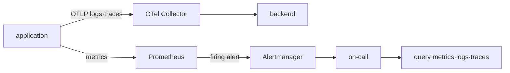
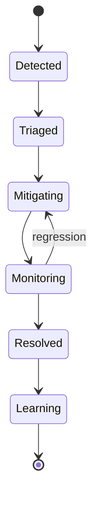

# Signal, SLO와 incident model

## 이 장에서 처음 쓰는 말

- **telemetry**: 시스템이 자신의 상태를 밖에서 관찰할 수 있도록 내보내는 metric·log·trace 데이터다.
- **latency**: 요청을 보낸 뒤 응답을 받을 때까지 걸린 시간이다.
- **error rate**: 전체 요청 중 실패한 요청의 비율이다.
- **SLI**: 사용자가 받은 결과를 실제 숫자로 재는 방법이다.
- **SLO**: 정해진 기간 동안 SLI가 달성해야 할 목표다.
- **incident**: 사용자 영향이 발생해 탐지·대응·복구·학습이 필요한 사건이다.

metric, log, trace는 서로 경쟁하는 도구가 아니다. 같은 요청을 서로 다른 각도에서 설명한다. 처음에는 요청 ID와 발생 시각 두 단서로 세 신호를 연결한다.

## 먼저 이해하기

사용자가 결제를 시도했는데 10초 뒤 `503`을 받았다고 하자. 운영자는 최소 세 종류의 질문을 한다. 이 문제가 전체 요청 중 얼마나 자주 생기는지는 metric이 잘 답한다. 해당 요청에서 application이 어떤 error를 기록했는지는 log가 보여 준다. API→결제 서비스→database 중 어느 구간에서 시간이 걸렸는지는 trace가 설명한다. 한 signal이 다른 둘을 완전히 대신하지 않는다.

여기에 reliability 용어를 연결한다.

| 용어 | 의미 | 결제 API 예시 |
|---|---|---|
| SLI | 실제로 측정하는 신뢰성 지표 | 유효 결제 요청 중 성공한 비율 |
| SLO | 일정 기간 동안 달성하려는 SLI 목표 | 30일 성공률 99.9% |
| error budget | 목표가 허용하는 실패 여유 | 전체 유효 요청의 0.1% |
| alert | 사람이 행동해야 할 조건 | budget이 위험한 속도로 소진됨 |
| incident | 사용자 영향의 대응 수명주기 | 탐지→완화→회복→학습 |

CPU 사용률은 원인 후보가 될 수 있지만 그 자체는 사용자 성공 SLI가 아니다. CPU가 높아도 요청이 정상이라면 즉시 page할 이유가 약하고, CPU가 낮아도 dependency timeout으로 모든 결제가 실패할 수 있다. SLO는 infrastructure 신호를 사용자 결과와 연결하는 기준이다.

## 실패한 요청 하나가 대응으로 이어지는 과정

1. client가 request ID를 가진 HTTP 요청을 보낸다.
2. application이 처리 중 중요한 사건을 log로 남기고 trace에 구간별 시간을 기록한다.
3. 성공·실패 수와 latency가 metric에 누적된다.
4. 운영자는 같은 request ID와 시각으로 log와 trace를 연결해 직접 실패 지점을 찾는다.
5. 여러 요청의 metric으로 SLI를 계산하고 정한 SLO와 비교한다.
6. 사람이 행동해야 할 정도로 목표를 소모하면 alert가 incident 대응을 시작한다.
7. 복구 뒤 사용자 요청과 SLI가 정상 범위로 돌아왔는지 확인한다.

개별 trace 하나는 전체 사용자의 상태를 대표하지 않고, 전체 error rate 하나는 어느 요청이 왜 실패했는지 알려 주지 않는다. 서로 다른 증거를 연결해야 한다.

## Signal의 역할은 서로 다르다

| signal | 강한 질문 | 흔한 한계 |
|---|---|---|
| metric | 얼마나 자주, 얼마나 오래 발생했는가? | 개별 요청의 상세 맥락이 적다 |
| log | 그 시점에 component가 무엇을 기록했는가? | volume·형식·누락에 민감하다 |
| trace | 한 요청이 어디서 시간을 썼는가? | sampling과 context 전파가 필요하다 |

Prometheus는 label이 붙은 time series를 수집하고 PromQL로 질의한다. Alertmanager는 Prometheus가 만든 alert를 grouping·inhibition·silence하고 receiver로 전달한다. OpenTelemetry Collector는 receiver→processor→exporter pipeline으로 telemetry를 받아 가공하고 내보낸다.



## SLI에서 alert까지

availability SLI의 한 예는 다음과 같다.

```text
good requests / valid requests
```

성공의 정의, 제외할 요청과 측정 위치가 먼저 정해져야 한다. 30일 SLO가 99.9%라면 error budget은 단순히 `0.1%`라고 외우는 것이 아니라 실제 valid event 수 또는 시간으로 환산해 사용한다.

multi-window burn-rate alert는 짧은 구간의 급격한 소진과 긴 구간의 지속적 소진을 함께 본다. 정확한 threshold와 window는 traffic과 대응 시간에 맞춰 검증해야 한다.

## Incident 상태 전이



복구 중에는 root cause를 완전히 증명하는 것보다 impact를 안전하게 줄이는 것이 우선일 수 있다. timeline에는 관측 사실, 당시 가설, 실행한 변경과 결과를 구분한다. postmortem은 개인의 실수 목록이 아니라 재발 가능성을 낮출 system action을 남긴다.

## 운영 판단

- cardinality가 큰 label은 저장 비용과 query 성능을 악화시킬 수 있다.
- 모든 trace를 보존하는 방식과 sampling은 조사 가능성·비용의 trade-off다.
- dashboard가 유용해도 즉시 행동할 수 없는 조건이면 page alert로 만들지 않는다.
- telemetry pipeline 자체의 queue, drop, export failure도 관측한다.

## 스스로 설명해 보기

1. Alertmanager가 metric을 직접 평가하는 component가 아닌 이유는 무엇인가?
2. SLO 분모에서 health check를 제외할지 결정하려면 무엇을 확인해야 하는가?
3. sampling된 trace만으로 장애 범위를 과신하면 안 되는 이유는 무엇인가?

<!-- source: https://prometheus.io/docs/introduction/overview/ | checked: 2026-09-03 -->
<!-- source: https://prometheus.io/docs/alerting/latest/alertmanager/ | checked: 2026-09-03 -->
<!-- source: https://opentelemetry.io/docs/collector/configuration/ | checked: 2026-09-03 -->
<!-- source: https://sre.google/sre-book/service-level-objectives/ | checked: 2026-09-03 -->
