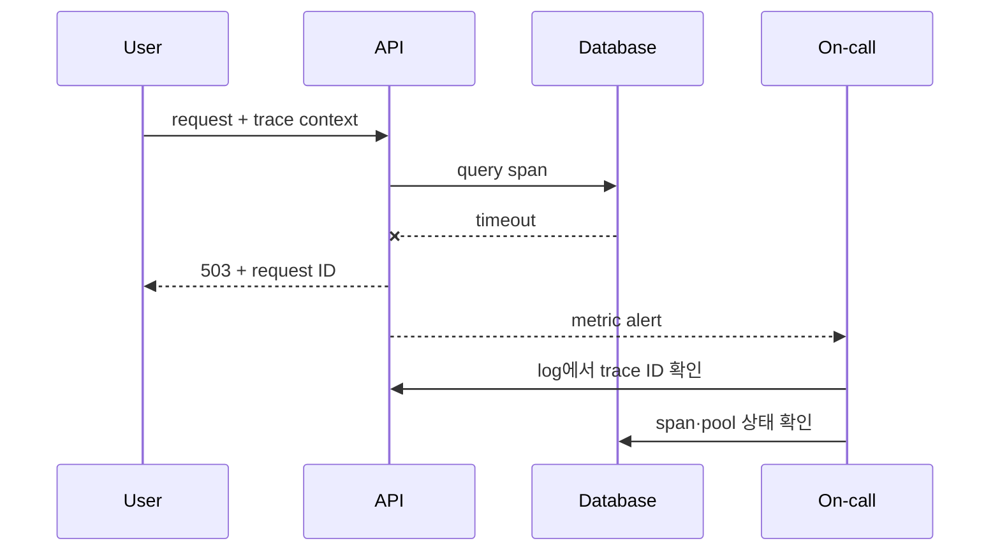

# Signal 상관관계와 SLO alert 실습

> 실습 등급: **Local**. 이미 Prometheus와 OpenTelemetry demo 환경이 있다면 그 환경을 사용하고, 없으면 아래 데이터로 질의 의미를 먼저 검증한다.

## 1. 요청 계약 정하기

sample API에 다음 공통 필드를 둔다.

```text
request_id=8f3... trace_id=4bf... route=/checkout status=503 duration_ms=842
```

counter는 `http_server_requests_total{route,status_class}`처럼 bounded label을 쓴다. `request_id`나 `user_id`를 metric label로 넣지 않는다. 개별 요청 identity는 log와 trace에 둔다.

## 2. Availability와 latency 관찰

5분 availability 비율의 예다.

```promql
sum(rate(http_server_requests_total{status_class!="5xx"}[5m]))
/
sum(rate(http_server_requests_total[5m]))
```

histogram에서 95 percentile을 계산하는 예다.

```promql
histogram_quantile(
  0.95,
  sum by (le, route) (rate(http_server_request_duration_seconds_bucket[5m]))
)
```

traffic이 0일 때 분모가 0이 되는 상황, retry가 요청 수를 늘리는 상황과 ingress/client 중 어느 지점에서 측정하는지를 기록한다.

## 3. 장애 시간축 연결

오류 요청 하나를 골라 다음 표를 채운다.

| 시간 | 증거 | 가설 | 조치 | 판정 |
|---|---|---|---|---|
| T0 | availability SLI 하락 | upstream 오류 | trace ID 조회 | 조사 중 |
| T1 | DB span latency 증가 | connection saturation | pool metric 확인 | active=max |
| T2 | pool 제한 조정 후 burn 감소 | 병목 완화 | rollback 준비 | 관찰 중 |



## 4. Alert 검증

alert rule은 테스트 가능한 expression, `for`, severity와 runbook label을 가진다.

```yaml
groups:
  - name: sample-api-slo
    rules:
      - alert: SampleApiFastBurn
        expr: sample_api:error_budget_burn_rate5m > 14
        for: 2m
        labels:
          severity: page
        annotations:
          summary: Sample API error budget is burning quickly
```

실제 threshold는 예시 값을 복사하지 말고 SLO window와 alerting policy로 계산한다. 정상·오류·무트래픽 시계열을 입력해 firing과 recovery를 모두 시험한다.

## 완료 판정과 정리

- alert 발생 시 사용자 impact와 연결되는 dashboard·runbook이 열린다.
- request 또는 trace ID로 log와 trace를 오갈 수 있다.
- 복구 후 짧은 window와 긴 window가 정상화되는 시점을 확인한다.
- 임시 alert rule, demo workload와 telemetry 저장 데이터를 삭제한다.

## 스스로 설명해 보기

1. request ID를 metric label에 넣으면 왜 위험한가?
2. 503 증가와 DB span latency 증가가 인과관계를 곧바로 증명하지는 않는 이유는 무엇인가?
3. alert recovery를 시험하지 않으면 어떤 운영 문제가 남는가?

<!-- source: https://prometheus.io/docs/prometheus/latest/querying/basics/ | checked: 2026-09-03 -->
<!-- source: https://prometheus.io/docs/prometheus/latest/configuration/alerting_rules/ | checked: 2026-09-03 -->
<!-- source: https://opentelemetry.io/docs/concepts/signals/ | checked: 2026-09-03 -->
<!-- source: https://sre.google/workbook/alerting-on-slos/ | checked: 2026-09-03 -->
