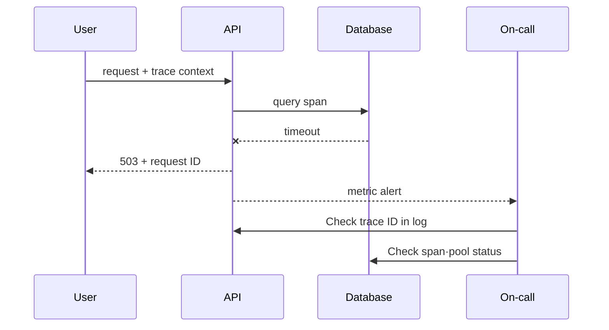

# Signal correlation and SLO alert lab

> lab level: **Local**. If you already have a Prometheus and OpenTelemetry demo environment, use that environment. If not, first verify the meaning of the query with the data below.

## Lab prerequisites

- **Prerequisite understanding**: You must first be able to explain the differences between HTTP status, request processing time, and metrics·log·trace.
- **Execution environment**: If Prometheus and OpenTelemetry demo are present, execute actual query. If not, this chapter is a worksheet that reads formulas and event records and is not completed as an execution lab.
- **Required data**: Request counter, latency histogram, log with request ID, trace with trace ID are required.
- **Time fixation**: Record the failure start, mitigation, and recovery time and query window in the same timezone.
- **Scope of change**: The first run does not connect alerts to the production pager, but only checks local rule evaluation.
- **Finished state**: Remove temporary rules and test traffic and check whether the original metric trend has returned.

Before entering the PromQL below as is, check your metric name and label. If the names are different, no data will be output even if the grammar is correct, and the result does not mean that the service is normal.

## Understand the model first

What we are trying to create in this lab is not a dashboard, but an explainable incident chain. Starting from one failed user request, we find the request ID and trace ID, check whether that request is included in the overall failure rate, and then narrow down which span and dependency the time increased.

Counters such as `http_server_requests_total` are accumulated after the process starts. Therefore, rather than dividing the current values, use `rate` of a certain window. The histogram bucket is the cumulative number of requests below each latency boundary, and `histogram_quantile` estimates the percentile using multiple buckets. Its role is different from trace, which shows the exact time of each individual request.

| observation | What can be known | Things to watch out for |
|---|---|---|
| 5 minute error ratio | Failure rate in recent traffic | If there is little traffic, even small numbers can cause significant shaking. |
| p95 latency | Top delays experienced by most requests | Slowest request is not a single value |
| trace span | Time per hop for selected requests | Sampling does not represent all requests |
| error log | Detailed context recorded by the component | Possible missing records and clock differences |
| burn-rate alert | Budget exhaustion speed exceeds response standards | Threshold must be calculated in SLO window |

## 1. Set request contract

Place the following common fields in the sample API.

```text
request_id=8f3... trace_id=4bf... route=/checkout status=503 duration_ms=842
```

The counter uses a bounded label like `http_server_requests_total{route,status_class}`. Do not include `request_id` or `user_id` as a metric label. Individual request identities are stored in logs and traces.

## 2. Observation of availability and latency

This is an example of a 5-minute availability rate.

```promql
sum(rate(http_server_requests_total{status_class!="5xx"}[5m]))
/
sum(rate(http_server_requests_total[5m]))
```

This is an example of calculating 95 percentile in a histogram.

```promql
histogram_quantile(
  0.95,
  sum by (le, route) (rate(http_server_request_duration_seconds_bucket[5m]))
)
```

It records situations where the denominator becomes 0 when traffic is 0, situations where retry increases the number of requests, and at which point among ingress/client it is measured.

## 3. Failure time base connection

Select one error request and fill out the following table.

| hour | evidence | hypothesis | action | verdict |
|---|---|---|---|---|
| T0 | availability SLI decline | upstream error | trace ID lookup | Investigating |
| T1 | Increased DB span latency | connection saturation | Check pool metrics | active=max |
| T2 | Burn reduction after adjusting pool limit | Relieve bottlenecks | Prepare for rollback | observing |



## 4. Alert verification

The alert rule has a testable expression, `for`, severity, and runbook label.

```yaml
groups:
  - name: sample-api-slo
    rules:
      - alert: SampleApiFastBurn
        expr: sample_api:error_budget_burn_rate5m > 14
        for: 2m
        labels:
          severity: page
        annotations:
          summary: Sample API error budget is burning quickly
```

The actual threshold is calculated using the SLO window and alerting policy rather than copying the example value. Input normal, error, and no-traffic time series to test both firing and recovery.

## Judgment of completion and summary

- When an alert occurs, a dashboard/runbook linked to the user impact is opened.
- You can go back and forth between log and trace by request or trace ID.
- After recovery, check when the short window and long window normalize.
- Delete temporary alert rule, demo workload, and telemetry stored data.

## How to interpret the results

If the value of the availability expression is `0.98`, it means that about 98% of the areas within the selected 5-minute window and label range were classified as good. The meaning varies depending on which request is excluded from valid or good. Inadvertently subtracting health checks or client cancels from the denominator can hide actual user failures.

If the time when p95 rises overlaps with the increase in DB span, the dependency bottleneck hypothesis becomes stronger, but the causal relationship has not yet been confirmed. View the parent-child time, connection pool, DB wait, and change time of the same trace together. After mitigation, check whether burn rate, tail latency, and backlog, as well as single successful requests, return to normal ranges.

If an alert is fired but there is no action on-call, making the rule more sensitive is not the solution. Conditions associated with user impact, owner, first diagnostic query, and safe mitigation actions must be bundled into a runbook.

## Explain it in your own words

1. Why is it dangerous to put request ID in metric label?
2. Why do the increase in 503 and DB span latency not immediately prove causality?
3. What operational problems are left without testing alert recovery?

<!-- source: https://prometheus.io/docs/prometheus/latest/querying/basics/ | checked: 2026-09-03 -->
<!-- source: https://prometheus.io/docs/prometheus/latest/configuration/alerting_rules/ | checked: 2026-09-03 -->
<!-- source: https://opentelemetry.io/docs/concepts/signals/ | checked: 2026-09-03 -->
<!-- source: https://sre.google/workbook/alerting-on-slos/ | checked: 2026-09-03 -->
