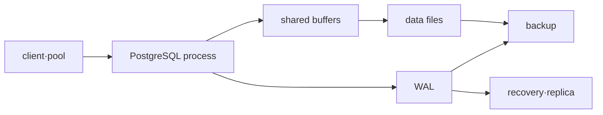

# PostgreSQL 운영 로드맵

## 무엇을 해결하는가

SQL 작성 능력과 데이터베이스 운영 능력은 다르다. 이 과정은 transaction의 보이는 상태, WAL과 checkpoint, VACUUM, query plan, lock, backup·restore를 연결해 “데이터가 안전하고 서비스가 회복됐다”는 판정 기준을 만든다.

## 선수 지식

- Linux process·memory·filesystem과 TCP connection
- transaction, index와 SQL의 기본 개념
- RPO·RTO는 [신뢰성·DR·FinOps](../reliability-finops/00-roadmap.md)에서 확장한다.

## 학습 순서

1. **MVCC·WAL·query model**: transaction과 durable change의 경로를 설명한다.
2. **Lock·backup·restore 실습**: blocking을 관찰하고 restore 결과를 query로 검증한다.

## 완료 조건

- long transaction이 VACUUM과 storage에 미치는 영향을 설명한다.
- `EXPLAIN` 추정과 `EXPLAIN ANALYZE` 실측을 구분한다.
- backup 파일 존재가 아니라 별도 instance의 restore와 데이터 검증으로 완료를 판정한다.

## 버전 기준

이 과정은 확인일 현재 PostgreSQL 18 문서를 기준으로 한다. managed RDS의 parameter, extension, backup와 failover 책임은 PostgreSQL 자체 동작과 분리해 확인한다.

## 스스로 설명해 보기

1. MVCC가 lock을 모두 없애 주지 않는 이유는 무엇인가?
2. WAL archive만 있고 base backup이 없으면 복구가 불완전할 수 있는 이유는 무엇인가?
3. connection 수를 늘리는 것이 처리량을 항상 높이지 않는 이유는 무엇인가?

<!-- source: https://www.postgresql.org/docs/18/mvcc.html | checked: 2026-09-03 | version: PostgreSQL 18 -->
<!-- source: https://www.postgresql.org/docs/18/wal-intro.html | checked: 2026-09-03 | version: PostgreSQL 18 -->
<!-- source: https://www.postgresql.org/docs/18/backup.html | checked: 2026-09-03 | version: PostgreSQL 18 -->
