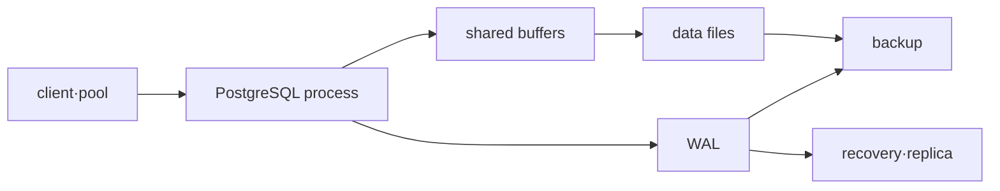

# PostgreSQL Operations Roadmap

## Starting point for beginners

Suppose the application responds, “I reduced the account balance by 10,000 won.” Even if other users change their balances at the same time or the server is shut down immediately, the results must remain safe and secure exactly once. PostgreSQL operation goes beyond using SQL grammar and involves managing what is visible and what remains on disk when multiple requests change data simultaneously.

| New term | Plain-language meaning | Why it matters / when to use it |
|---|---|---|
| database | A system that stores structured data and coordinates reading and writing of multiple programs | Keep shared data durable and coordinate concurrent access under defined rules. **Concrete situation (illustrative):** Two API replicas must read and update the same orders. → Store shared records under database constraints. → Test concurrent updates and retained committed results. |
| transaction | A unit of work that either succeeds or cancels multiple data changes. | Keep related data changes together so a partially completed business operation is not accepted. **Concrete situation (illustrative):** A transfer debits one account but the second update fails. → Execute related updates within a transaction. → Verify partial balances are not committed. |
| row | One line of data representing one object in a table | Declare the unit represented by a record before designing keys, joins, and totals. **Concrete situation (illustrative):** A report counts order lines as if each were a complete order. → Declare what one row represents. → Compare order counts using the appropriate identifiers. |
| lock | A device that makes some operations wait so that conflicting changes do not complete at the same time. | Serialize conflicting operations when simultaneous completion would break data rules. **Concrete situation (illustrative):** Two workers attempt to update the same account. → Inspect the conflicting locks and transaction boundaries. → Verify the final balance and waiting behavior. |
| index | Separate structures to help you quickly find the data you want without having to read every row | Reduce work for selective lookups, while accounting for extra storage and write maintenance. **Concrete situation (illustrative):** Looking up one customer scans a large table. → Evaluate an index matching the query pattern. → Compare the plan, reads, and write overhead. |
| backup | A copy of your data set aside for recovery if the original disappears | Retain a recoverable copy when deletion, corruption, or infrastructure loss affects the original. **Concrete situation (illustrative):** A test table is accidentally deleted. → Restore a verified backup into an isolated database. → Check required rows and recovery-point age. |

Terms like MVCC, WAL, and VACUUM are internal methods to solve the above problem. First, we directly observe transactions and locks, and then connect the time when data is seen and the process of safely remaining on disk.

## What does it solve

SQL writing skills and database operating skills are different. This process connects the visible status of the transaction, WAL, checkpoint, VACUUM, query plan, lock, and backup/restore to create a judgment standard that “the data is safe and the service has been restored.”

## prerequisite knowledge

- Linux process·memory·filesystem and TCP connection
- Basic concepts of transaction, index and SQL
- RPO·RTO expands from [Reliability·DR·FinOps](../reliability-finops/00-roadmap.md).

## learning sequence

1. **MVCC·WAL·query model**: Describes the path of transactions and durable changes.
2. **Lock·backup·restore lab**: Observe blocking and verify restore results with query.

## Completion criteria

This topic is not something you read once and then stop. First, convert the terminology table into your own words and follow the flow of requests made in the concepts chapter. In the lab, the normal state is first recorded, then a failure is created by changing only one condition, and the cause is explained with evidence before recovery. Finally, expand to more complex environments by answering the operational judgment questions below.

- Explains the impact of long transactions on VACUUM and storage.
- Distinguish between `EXPLAIN` estimation and `EXPLAIN ANALYZE` actual measurement.
- Completion is determined by restoration of a separate instance and data verification, not by the existence of a backup file.

## By version

This process is based on the PostgreSQL 18 document as of the confirmation date. The parameters, extensions, backup, and failover responsibilities of managed RDS are checked separately from PostgreSQL's own operations.

## Check your understanding

1. What are the results of commit and rollback in a transaction?
2. Why can't it be said that recovery is possible just because a backup file was created?

**Confirmation criteria:** Commit is confirmation of a change, rollback is cancellation, and backup requires restoration to a separate database and reading the data to confirm the recovery path.

## Develop operational judgment

1. Why doesn't MVCC clear all locks?
2. Why can recovery be incomplete if there is only a WAL archive and no base backup?
3. Why doesn't increasing the number of connections always increase throughput?

<!-- source: https://www.postgresql.org/docs/18/mvcc.html | checked: 2026-09-03 | version: PostgreSQL 18 -->
<!-- source: https://www.postgresql.org/docs/18/wal-intro.html | checked: 2026-09-03 | version: PostgreSQL 18 -->
<!-- source: https://www.postgresql.org/docs/18/backup.html | checked: 2026-09-03 | version: PostgreSQL 18 -->
