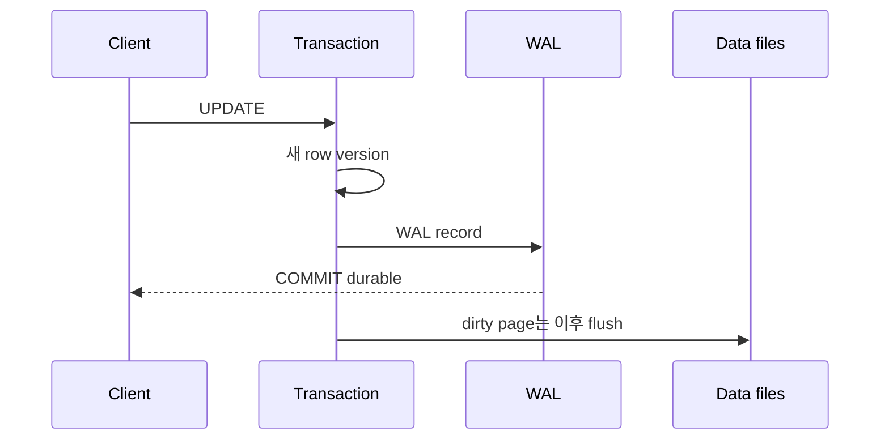

# MVCC, WAL과 query plan

## 한 변경이 보이고 남는 과정

PostgreSQL은 각 statement가 어떤 row version을 볼 수 있는지 snapshot과 isolation 규칙으로 정한다. 변경된 page가 data file에 기록되기 전에 WAL record가 durable storage에 먼저 기록되는 write-ahead 규칙은 crash recovery의 기반이다.



checkpoint는 recovery가 시작할 WAL 지점을 전진시키지만, 너무 잦으면 write pressure가 커질 수 있고 너무 드물면 crash recovery 시간이 늘 수 있다. WAL 생성률·storage latency·recovery 목표를 함께 본다.

## VACUUM의 책임

UPDATE와 DELETE로 더는 어떤 transaction에도 보이지 않는 row version이 생긴다. VACUUM은 이를 재사용 가능하게 하고 visibility map과 transaction ID wraparound 방지에 관여한다. 일반 VACUUM과 table을 다시 쓰며 더 강한 lock을 요구하는 `VACUUM FULL`을 동일하게 취급하지 않는다.

long-running transaction이나 방치된 replication slot은 cleanup과 WAL 보존을 지연시킬 수 있다. table size만 보지 말고 transaction age, dead tuple, autovacuum activity와 slot의 retained WAL을 관찰한다.

## Query plan은 가설과 실측을 나눈다

```sql
EXPLAIN SELECT * FROM orders WHERE customer_id = 42;
EXPLAIN (ANALYZE, BUFFERS) SELECT * FROM orders WHERE customer_id = 42;
```

`EXPLAIN ANALYZE`는 query를 실제 실행하므로 변경 query나 큰 workload에서 영향 범위를 먼저 확인한다. estimated rows와 actual rows 차이는 statistics, data skew와 predicate correlation 문제를 드러낼 수 있다. index가 존재해도 selectivity와 I/O cost에 따라 sequential scan이 더 저렴할 수 있다.

## Connection과 lock

각 backend connection은 자원을 소비한다. pool은 connection storm을 완충하지만 transaction을 오래 잡거나 session state를 오용하면 병목을 숨길 수 있다.

```sql
SELECT pid, state, wait_event_type, wait_event, xact_start, query_start
FROM pg_stat_activity
WHERE datname = current_database();
```

blocking query를 종료하기 전 owner, transaction 내용, rollback 비용과 재시도 가능성을 확인한다. lock waiter만 죽이면 blocker가 남아 장애가 반복된다.

## 스스로 설명해 보기

1. COMMIT 응답 시점에 모든 변경 page가 data file에 기록되지 않아도 되는 이유는 무엇인가?
2. estimated rows와 actual rows 차이가 join 전략에 어떤 영향을 줄 수 있는가?
3. idle in transaction session이 단순한 idle connection보다 위험할 수 있는 이유는 무엇인가?

<!-- source: https://www.postgresql.org/docs/18/mvcc-intro.html | checked: 2026-09-03 | version: PostgreSQL 18 -->
<!-- source: https://www.postgresql.org/docs/18/wal-intro.html | checked: 2026-09-03 | version: PostgreSQL 18 -->
<!-- source: https://www.postgresql.org/docs/18/routine-vacuuming.html | checked: 2026-09-03 | version: PostgreSQL 18 -->
<!-- source: https://www.postgresql.org/docs/18/using-explain.html | checked: 2026-09-03 | version: PostgreSQL 18 -->
