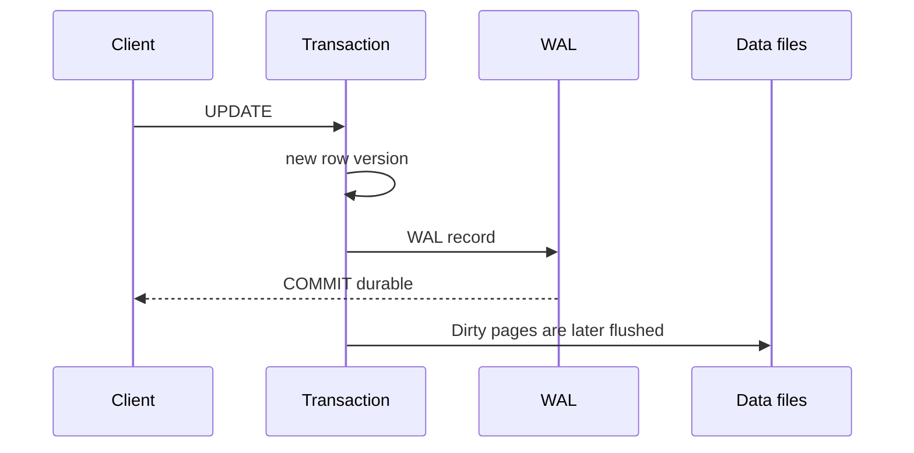

# MVCC, WAL and query plan

## Terms introduced in this chapter

- **commit**: This is an action that confirms the transaction change as final success. **Why it matters / when to use it:** Confirm that a transaction's accepted changes reached its configured success and durability boundary. **Concrete situation (illustrative):** A transfer updates both account balances and passes its consistency check. → Commit the transaction using the configured durability policy. → Verify other transactions see the accepted result and test the intended recovery guarantee.
- **rollback**: This is an action to cancel changes made in a transaction and return to the state before starting. **Why it matters / when to use it:** Cancel an unfinished transaction's changes after an error or failed business check. **Concrete situation (illustrative):** A transfer debits one account, but the destination check fails before commit. → Roll back the unfinished transaction. → Confirm no partial balance change becomes the accepted database state.
- **MVCC**: This is a method of managing which versions of rows are shown to each other by transactions executing simultaneously. **Why it matters / when to use it:** Give concurrent transactions defined visibility rules without treating every read as an exclusive write lock. **Concrete situation (illustrative):** Two concurrent transactions observe different versions of an order. → Inspect their snapshots and isolation rules. → Reproduce which version each query is allowed to see.
- **WAL**: A log that records changes in order before changing the data file. It serves as the basis for failure recovery and replication. **Why it matters / when to use it:** Retain ordered change records needed to recover or replicate durable database progress. **Concrete situation (illustrative):** A database restarts after losing its process. → Inspect recovery from retained WAL under the configured durability policy. → Verify committed test records survive.
- **VACUUM**: This is the task of organizing old row space that is no longer needed for any transaction so that it can be used again. **Why it matters / when to use it:** Make obsolete row space reusable and manage PostgreSQL's transaction-age maintenance needs. **Concrete situation (illustrative):** Repeated updates leave a table with many obsolete versions. → Inspect vacuum progress and blocking old transactions. → Check reusable space and transaction-age health.
- **query plan**: The table access order and method chosen by PostgreSQL to execute SQL. **Why it matters / when to use it:** Find expensive scans, joins, and estimate errors before changing indexes or SQL. **Concrete situation (illustrative):** A query becomes slow after data distribution changes. → Compare estimates and actual work in its plan. → Identify the expensive scan or join before tuning.

At first, only follow one flow: `BEGIN → execute SQL → COMMIT`. MVCC answers “what is visible” and WAL answers “what can be recreated after a failure,” so they are not combined into the same function.

## Understand the model first

Imagine that two users read and modify the same account row at almost the same time. A database does not simply overwrite a single line of a file immediately. It determines which row versions can be seen for each transaction, leaves WAL necessary for change recovery, and cleans up past versions that are no longer visible later. MVCC, WAL, and VACUUM solve problems at different levels.

| concept | question to answer | easy to confuse |
|---|---|---|
| snapshot | What version can I see for this transaction? | When to disk backup |
| MVCC | How do readers and writers share row versions? | Remove all locks |
| WAL | How to reproduce committed changes after a crash? | query audit log |
| checkpoint | How do we advance the baseline from which recovery begins? | Every transaction backup |
| VACUUM | When do I make an old version reusable? | Always shrinking the table |

For example, if transaction A is open for a long time and maintains past snapshots, VACUUM cannot arbitrarily remove the version visible to A even if other transactions UPDATE a row several times. This is why an application’s “idle in transaction” can lead to increased storage and transaction ID risk.

## Follow each data change step by step

1. The client opens a database connection and begins a transaction.
2. `UPDATE` searches for the target row and waits for the necessary lock if there are conflicting changes.
3. PostgreSQL creates a new row version instead of immediately overwriting the existing row for all readers.
4. A relevant WAL record is created so that changes can be recovered.
5. If the commit is successful, other transactions can see the new value according to the isolation rules.
6. Checkpoint writes changed memory pages to the data file, and VACUUM cleans up old row versions that are no longer needed.

“Visible to the user,” “commit was successful,” and “reflected in the data file” do not mean the same moment. Because of WAL and recovery rules, this difference must be understood separately.

## The process by which a change is visible and remains

PostgreSQL determines which row versions each statement can see using snapshot and isolation rules. The write-ahead rule, in which WAL records are written to durable storage first before changed pages are written to data files, is the basis for crash recovery.



Checkpoints advance the WAL point where recovery begins, but if they are too frequent, write pressure can increase, and if they are too rare, the crash recovery time can increase. WAL creation rate, storage latency, and recovery goals are viewed together.

The diagram assumes ordinary logged tables, `fsync=on`, and a commit mode that waits for local WAL flush. With `synchronous_commit=off`, an acknowledged transaction can be lost after a crash even though database consistency is preserved. Local durability also does not prove that a standby has received or applied the commit; inspect synchronous replication settings before defining failover RPO.

## VACUUM Responsibilities

UPDATE and DELETE leave old row versions that may still be visible to existing snapshots. VACUUM can reclaim their space only after they are no longer needed. It also maintains the visibility map and helps prevent transaction ID wraparound. General VACUUM and `VACUUM FULL`, which rewrites the table and requires a stronger lock, are not treated the same.

Long-running transactions or neglected replication slots can delay cleanup and WAL retention. Don't just look at table size, but also observe transaction age, dead tuple, autovacuum activity, and retained WAL of slots.

## Query plan divides hypothesis and actual measurements

```sql
EXPLAIN SELECT * FROM orders WHERE customer_id = 42;
EXPLAIN (ANALYZE, BUFFERS) SELECT * FROM orders WHERE customer_id = 42;
```

Since `EXPLAIN ANALYZE` actually executes queries, it first checks the scope of influence in change queries or large workloads. Differences between estimated rows and actual rows can reveal statistics, data skew, and predicate correlation problems. Even if an index exists, sequential scan may be cheaper depending on selectivity and I/O cost.

## Connection and lock

Each backend connection consumes resources. A pool buffers connection storms, but holding transactions for too long or misusing session state can hide bottlenecks.

```sql
SELECT pid, state, wait_event_type, wait_event, xact_start, query_start
FROM pg_stat_activity
WHERE datname = current_database();
```

Before ending a blocking query, check the owner, transaction contents, rollback cost, and retry possibility. If only the lock waiter is killed, a blocker remains and the failure repeats.

## Explain it in your own words

1. Why is it not necessary for all changed pages to be recorded in the data file at the time of COMMIT response?
2. How can differences between estimated rows and actual rows affect join strategies?
3. Why is an idle in transaction session more dangerous than a simple idle connection?

<!-- source: https://www.postgresql.org/docs/18/mvcc-intro.html | checked: 2026-09-03 | version: PostgreSQL 18 -->
<!-- source: https://www.postgresql.org/docs/18/wal-intro.html | checked: 2026-09-03 | version: PostgreSQL 18 -->
<!-- source: https://www.postgresql.org/docs/18/routine-vacuuming.html | checked: 2026-09-03 | version: PostgreSQL 18 -->
<!-- source: https://www.postgresql.org/docs/18/using-explain.html | checked: 2026-09-03 | version: PostgreSQL 18 -->
<!-- source: https://www.postgresql.org/docs/18/runtime-config-wal.html | checked: 2026-09-10 | version: PostgreSQL 18 -->
