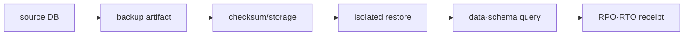

# Lock, backup and restore lab

> lab level: **Local**. Uses disposable PostgreSQL 18 instance. Do not copy and run the production query as is.

## Lab prerequisites

- **Environment**: Use PostgreSQL 18 test instance. Do not connect to production databases or important local databases.
- **Tool**: `psql`, `pg_dump`, `pg_restore`, `createdb`, and `dropdb` must be prepared based on the same major version.
- **database**: Create a source database for lab and change `replace_source_db` in the document to the actual name.
- **terminal**: Open three sessions: session A to hold the lock, session B to wait, and session C to check the status.
- **File**: `accounts.dump` must not exist in the current directory. If there is a file with the same name, do not overwrite it but use a separate directory.
- **Cleanup targets**: restore database, dump files, and unfinished transactions.

First, check with `SELECT current_database(), pg_backend_pid();` whether all three terminals are viewing the same test instance and database. If the PIDs are different, there are three separate sessions.

## Understand the model first

In the first lab, session A does not complete the transaction with a row lock, so session B waits. B's query is slow, but the CPU or disk is not the cause. PostgreSQL waits B to prevent conflicting changes to the same row from breaking consistency, and `pg_blocking_pids` points to session A, which is the direct cause of the wait.

The second lab separates backup creation from restore success. `pg_dump` exit code 0 means that a dump artifact has been created, and you must read the schema·constraint·representative row after `pg_restore` in a separate database to confirm that the recovery path actually worked.

| step | success criteria | Confirmation that remains even if successful |
|---|---|---|
| lock observation | Connecting waiter and blocker PID | Business meaning of blocker transaction |
| blocker exit | Waiter progress/rollback completed | Consistency with application retry |
| Create dump | Existence code·artifact exists | Artifact damage/recoverability |
| restore | Create schema and data in a separate DB | application query·RPO·RTO |
| failover | New primary accepts write | Client endpoint·old primary processing |

## 1. lab data

```sql
CREATE TABLE accounts (
  id bigint PRIMARY KEY,
  balance numeric(12,2) NOT NULL CHECK (balance >= 0)
);
INSERT INTO accounts VALUES (1, 100.00), (2, 100.00);
```

Open two sessions. Change the row in session A and maintain the transaction.

```sql
BEGIN;
UPDATE accounts SET balance = balance - 10 WHERE id = 1;
```

If you change the same row in session B, it waits.

```sql
UPDATE accounts SET balance = balance + 10 WHERE id = 1;
```

In the third session, observe the waiter and blocker.

```sql
SELECT a.pid, a.wait_event_type, a.wait_event, pg_blocking_pids(a.pid) AS blockers, a.query
FROM pg_stat_activity AS a
WHERE cardinality(pg_blocking_pids(a.pid)) > 0;
```

After `COMMIT` or `ROLLBACK` session A, check how B progresses. After completion, check whether there are any remaining transactions.

## 2. Separate restore from logical backup

```bash
pg_dump --format=custom --file=accounts.dump replace_source_db
createdb replace_restore_db
pg_restore --dbname=replace_restore_db --clean --if-exists accounts.dump
psql replace_restore_db -c 'TABLE accounts ORDER BY id;'
```

A successful backup exit code and file size alone do not prove recoverability. Restore to a separate database and check row count, constraints, representative queries, and application compatibility.



## 3. PITR and failover determination

PITR requires a continuous WAL archive and a preceding base backup and recovery target. In actual operational training, record the following:

- Last recoverable timestamp and expected RPO
- Actual RTO from restore start to read/write approval
- Marker rows before and after the timeline and target
- Application DNS/endpoint conversion and stale client processing
- replica promotion back primary rejoining procedure

Even if a managed service provides backup and promotion APIs, the responsibility for verifying application consistency and client conversion does not disappear.

## Cleanup

Delete the two test databases and `accounts.dump`. The same cleanup is not applied to the artifacts of the actual backup storage policy.

```bash
dropdb replace_restore_db
rm -f accounts.dump
```

## How to interpret the results

If session B's `wait_event_type` is `Lock` and `pg_blocking_pids` points to A, B is not slow on its own but is waiting for A's transaction to end. Before exiting A, check whether any changes will be rolled back and whether the application can be retried. If only the waiter is canceled, the blocker remains and can block the next request again.

If the restored `accounts` row is visible, the minimum path of dump→restore has been verified. Judging production completion requires more actual usage elements such as owner·privilege, sequence, extension, large object, and application query. Logical backup is a recovery method that is also different from WAL-based PITR.

RTO does not only measure the restore command execution time. This includes DNS or endpoint switching, connection pool updates, application readiness, and write authorization. RPO confirms the actual last recovery point using marker data, not the backup schedule.

## Explain it in your own words

1. Why do we need to find the blocker first and not the waiter?
2. Why is recovery verification insufficient even if the restored row count is the same?
3. What is the difference between completing database promotion and completing service recovery?

<!-- source: https://www.postgresql.org/docs/18/explicit-locking.html | checked: 2026-09-03 | version: PostgreSQL 18 -->
<!-- source: https://www.postgresql.org/docs/18/monitoring-stats.html | checked: 2026-09-03 | version: PostgreSQL 18 -->
<!-- source: https://www.postgresql.org/docs/18/app-pgdump.html | checked: 2026-09-03 | version: PostgreSQL 18 -->
<!-- source: https://www.postgresql.org/docs/18/continuous-archiving.html | checked: 2026-09-03 | version: PostgreSQL 18 -->
