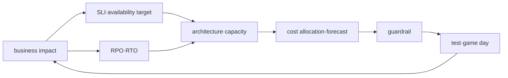

# 신뢰성·DR·FinOps 로드맵

## 무엇을 해결하는가

가용성, 복구와 비용은 독립 최적화 항목이 아니다. 더 많은 redundancy는 일부 failure를 견디지만 비용과 운영 복잡성을 높이고, 무조건적인 절감은 recovery margin을 없앨 수 있다. 이 과정은 workload마다 목표와 증거를 연결한다.

## 선수 지식

- AWS shared responsibility와 multi-AZ resource의 의미
- Terraform·Helm deployment와 observability
- PostgreSQL/Redis backup, messaging retry와 Kubernetes scheduling

## 학습 순서

1. **Reliability·capacity·cost model**: 목표, failure mode와 budget을 설계한다.
2. **통합 capstone**: local 장애 복구를 필수로 수행하고 AWS optional 설계를 별도 검증한다.

## 완료 조건

- RPO·RTO를 숫자로 정하고 측정 시작·종료 event를 정의한다.
- 정상 peak와 degraded mode의 capacity margin을 분리한다.
- cost allocation tag, owner, forecast와 anomaly 대응을 운영 runbook에 넣는다.

## 범위 밖

무조건적인 multi-region, 특정 구매 옵션의 고정 할인율과 실제 청구액 예측을 정답으로 제시하지 않는다.

## 스스로 설명해 보기

1. multi-AZ가 모든 application failure를 막지 못하는 이유는 무엇인가?
2. RTO를 “빠르게”가 아니라 event로 정의해야 하는 이유는 무엇인가?
3. 낮은 평균 utilization만으로 rightsizing하면 위험한 이유는 무엇인가?

<!-- source: https://docs.aws.amazon.com/wellarchitected/latest/reliability-pillar/welcome.html | checked: 2026-09-03 -->
<!-- source: https://docs.aws.amazon.com/wellarchitected/latest/cost-optimization-pillar/welcome.html | checked: 2026-09-03 -->
<!-- source: https://docs.aws.amazon.com/aws-backup/latest/devguide/whatisbackup.html | checked: 2026-09-03 -->
