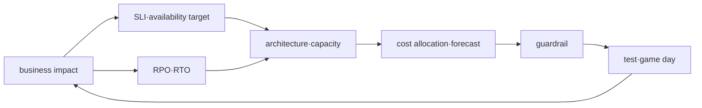

# 신뢰성·DR·FinOps 로드맵

## 처음 보는 사람을 위한 출발점

“절대 멈추면 안 된다”는 요구는 현실적으로 설계하거나 비용을 계산하기 어렵다. 대신 사용자가 어느 정도 성공해야 하는지, 장애가 나면 언제까지 복구할지, 데이터는 얼마나 잃어도 되는지를 숫자와 사건으로 정한다. 그 목표를 만족하기 위해 필요한 여유 자원과 비용을 함께 판단한다.

| 처음 만나는 말 | 학습용 쉬운 뜻 |
|---|---|
| 가용성(availability) | 사용자가 필요한 기능을 실제로 사용할 수 있었던 정도 |
| 장애(failure) | 시스템의 일부가 기대한 기능을 수행하지 못하는 상태 |
| 중복 구성(redundancy) | 하나가 실패해도 계속 동작하도록 같은 역할을 여러 곳에 두는 설계 |
| RTO | 장애가 시작된 뒤 서비스를 다시 사용할 수 있을 때까지 허용하는 목표 시간 |
| RPO | 복구 과정에서 과거로 돌아가 잃을 수 있다고 허용한 데이터 시간 범위 |
| 용량(capacity) | 시스템이 감당할 수 있는 요청·저장·처리의 양 |

이 과정에서는 숫자를 외우지 않는다. 작은 서비스 하나의 목표를 직접 정하고 장애 실험에서 실제 복구 시간과 데이터 손실을 측정한 뒤, 그 결과가 비용에 어떤 선택을 요구하는지 설명한다.

## 무엇을 해결하는가

가용성, 복구와 비용은 독립 최적화 항목이 아니다. 더 많은 redundancy는 일부 failure를 견디지만 비용과 운영 복잡성을 높이고, 무조건적인 절감은 recovery margin을 없앨 수 있다. 이 과정은 workload마다 목표와 증거를 연결한다.

## 선수 지식

- AWS shared responsibility와 multi-AZ resource의 의미
- Terraform·Helm deployment와 observability
- PostgreSQL/Redis backup, messaging retry와 Kubernetes scheduling

## 학습 순서

1. **Reliability·capacity·cost model**: 목표, failure mode와 budget을 설계한다.
2. **통합 capstone**: local 장애 복구를 필수로 수행하고 AWS optional 설계를 별도 검증한다.

## 완료 조건

이 주제는 한 번 읽고 끝내지 않는다. 먼저 용어 표를 자신의 말로 바꾸고, 개념 장에서 한 요청의 흐름을 따라간다. 실습에서는 정상 상태를 먼저 기록한 뒤 조건 하나만 바꿔 실패를 만들고, 증거로 원인을 설명한 뒤 복구한다. 마지막으로 아래 운영 판단 질문에 답하면서 더 복잡한 환경으로 확장한다.

- RPO·RTO를 숫자로 정하고 측정 시작·종료 event를 정의한다.
- 정상 peak와 degraded mode의 capacity margin을 분리한다.
- cost allocation tag, owner, forecast와 anomaly 대응을 운영 runbook에 넣는다.

## 범위 밖

무조건적인 multi-region, 특정 구매 옵션의 고정 할인율과 실제 청구액 예측을 정답으로 제시하지 않는다.

## 처음 이해했는지 확인

1. RTO는 서비스의 어떤 시간을 나타내는가?
2. RPO가 5분이라는 말은 데이터에 어떤 허용 범위를 뜻하는가?

**확인 기준:** RTO는 장애에서 사용 가능한 상태로 돌아오기까지의 목표 시간이고, RPO는 복구 데이터가 장애 직전보다 최대 어느 정도 과거여도 되는지를 뜻한다고 설명하면 된다.

## 운영 판단으로 확장하기

1. multi-AZ가 모든 application failure를 막지 못하는 이유는 무엇인가?
2. RTO를 “빠르게”가 아니라 event로 정의해야 하는 이유는 무엇인가?
3. 낮은 평균 utilization만으로 rightsizing하면 위험한 이유는 무엇인가?

<!-- source: https://docs.aws.amazon.com/wellarchitected/latest/reliability-pillar/welcome.html | checked: 2026-09-03 -->
<!-- source: https://docs.aws.amazon.com/wellarchitected/latest/cost-optimization-pillar/welcome.html | checked: 2026-09-03 -->
<!-- source: https://docs.aws.amazon.com/aws-backup/latest/devguide/whatisbackup.html | checked: 2026-09-03 -->
