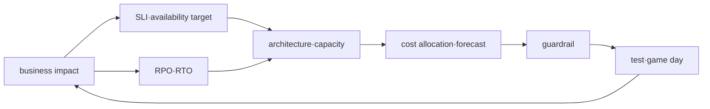

# Reliability·DR·FinOps roadmap

## Starting point for beginners

The requirement to “never stop” is difficult to realistically design or cost. Instead, numbers and events determine how successful the user must be, how long it will take to recover if a failure occurs, and how much data can be lost. Together, we determine the necessary resources and costs to satisfy that goal.

| New term | Plain-language meaning |
|---|---|
| availability | The extent to which users were actually able to use the functionality they needed |
| failure | A state in which part of a system fails to perform its expected function. |
| Redundancy | A design that places the same role in multiple places so that operation continues even if one fails |
| RTO | Target time allowed for service to be available again after a failure begins |
| RPO | The time range of data you allow yourself to go back in time and lose during the recovery process. |
| Capacity | Amount of requests, storage, and processing that the system can handle |

In this process, numbers are not memorized. We set a goal for one small service, measure the actual recovery time and data loss in a failure experiment, and then explain what choices the results require regarding cost.

## What does it solve

Availability, recovery and cost are not independent optimization items. More redundancy will tolerate some failures but increase costs and operational complexity, while unconditional savings can eliminate recovery margins. This process connects goals and evidence for each workload.

## prerequisite knowledge

- Meaning of AWS shared responsibility and multi-AZ resource
- Terraform·Helm deployment and observability
- PostgreSQL/Redis backup, messaging retry and Kubernetes scheduling

## learning sequence

1. **Reliability·capacity·cost model**: Design the goal, failure mode, and budget.
2. **Integrated capstone**: Local failure recovery is required and AWS optional design is separately verified.

## Completion criteria

This topic is not something you read once and then stop. First, convert the terminology table into your own words and follow the flow of requests made in the concepts chapter. In the lab, the normal state is first recorded, then a failure is created by changing only one condition, and the cause is explained with evidence before recovery. Finally, expand to more complex environments by answering the operational judgment questions below.

- Set RPO·RTO as a number and define measurement start/end events.
- Separate the capacity margin of normal peak and degraded mode.
- Insert cost allocation tag, owner, forecast and anomaly response into operation runbook.

## out of range

It does not provide unconditional multi-region, fixed discount rates for specific purchase options, and prediction of actual billing amounts as correct answers.

## Check your understanding

1. What time of service does RTO represent?
2. What does an RPO of 5 minutes mean to my data?

**Verification criteria:** RTO is the target time to return to a usable state from a failure, and RPO refers to how far back the recovery data can be at most before the failure.

## Develop operational judgment

1. Why doesn't multi-AZ prevent all application failures?
2. Why should RTO be defined as an event rather than “fast”?
3. Why is it dangerous to rightsize with only low average utilization?

<!-- source: https://docs.aws.amazon.com/wellarchitected/latest/reliability-pillar/welcome.html | checked: 2026-09-03 -->
<!-- source: https://docs.aws.amazon.com/wellarchitected/latest/cost-optimization-pillar/welcome.html | checked: 2026-09-03 -->
<!-- source: https://docs.aws.amazon.com/aws-backup/latest/devguide/whatisbackup.html | checked: 2026-09-03 -->
