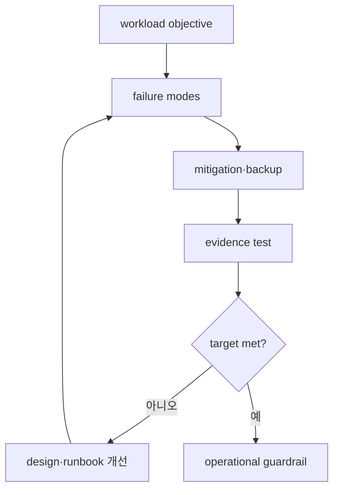

# Reliability, capacity와 cost model

## 목표부터 failure mode로 내려간다

availability target은 architecture 그림이 아니라 측정한 사용자 결과의 목표다. RPO는 복구 시 허용할 수 있는 data loss의 시간 범위, RTO는 disruption 이후 service level을 복원하기까지의 목표 시간이다. 둘 다 시작·종료 event와 측정 책임자가 필요하다.



failure domain은 process, node, AZ, region, identity/control plane과 dependency로 나눈다. multi-AZ는 AZ failure 대응에 도움을 주지만 bad deployment, credential revocation, data corruption과 regional dependency를 자동으로 해결하지 않는다.

## Backup과 restore의 계약

backup policy에는 source, frequency, retention, encryption, immutability 또는 deletion guard와 cross-account/region 필요성을 적는다. restore test에서는 다음을 측정한다.

- 마지막 recoverable point와 실제 data gap
- restore 요청 시각부터 dependency 포함 service readiness까지의 시간
- schema·row·object integrity와 representative request
- owner 승인과 cleanup 또는 promoted environment의 후속 상태

## Capacity는 tail과 degraded mode를 본다

```text
required capacity = forecast peak × safety margin × failure-mode factor
```

이 식은 답이 아니라 가정을 드러내는 틀이다. traffic mix, p95/p99 latency, queue depth, dependency quota와 한 AZ 상실 시 남은 capacity를 load test로 검증한다. autoscaling은 늦게 반응할 수 있으므로 startup·warm-up 시간도 budget에 넣는다.

## FinOps는 소유권과 단위를 연결한다

| 요소 | 운영 질문 |
|---|---|
| allocation | account·tag·cost category로 owner와 workload를 찾을 수 있는가? |
| unit cost | request, tenant, job 또는 GB당 비용이 어떻게 움직이는가? |
| forecast | growth·seasonality·commitment를 어떤 가정으로 계산했는가? |
| optimization | rightsizing이 SLO와 recovery margin을 침해하지 않는가? |
| purchase | On-Demand·commitment·Spot 위험을 workload interruption tolerance와 맞췄는가? |

비용 숫자는 region, 시점과 usage에 따라 달라진다. 문서에 고정 가격을 박기보다 공식 pricing 도구와 실제 billing data의 확인 시점을 기록한다.

## 스스로 설명해 보기

1. backup frequency와 실제 RPO가 다를 수 있는 이유는 무엇인가?
2. 한 AZ가 사라진 상태의 capacity를 따로 시험해야 하는 이유는 무엇인가?
3. unit cost 상승이 infrastructure 단가 외에 어떤 신호일 수 있는가?

<!-- source: https://docs.aws.amazon.com/wellarchitected/latest/reliability-pillar/design-principles.html | checked: 2026-09-03 -->
<!-- source: https://docs.aws.amazon.com/wellarchitected/latest/reliability-pillar/rel_planning_network_topology.html | checked: 2026-09-03 -->
<!-- source: https://docs.aws.amazon.com/wellarchitected/latest/cost-optimization-pillar/cost-aware-culture.html | checked: 2026-09-03 -->
<!-- source: https://docs.aws.amazon.com/aws-backup/latest/devguide/whatisbackup.html | checked: 2026-09-03 -->
