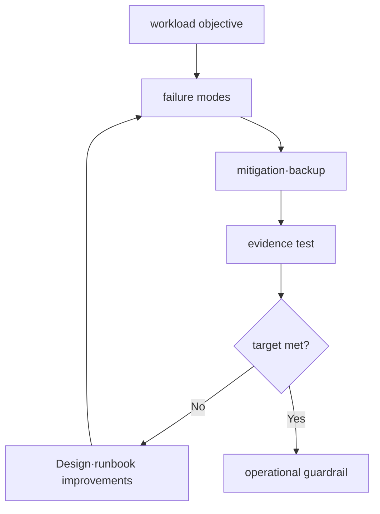

# Reliability, capacity and cost model

## Terms introduced in this chapter

- **Reliability**: The property of a system to continue performing its expected function for a required period of time. **Why it matters / when to use it:** Evaluate sustained successful operation across failures, changes, and recovery periods.
- **SLI/SLO**: How to measure real user results and what the goals are for those measurements. **Why it matters / when to use it:** Connect measured user outcomes to an agreed target when prioritizing reliability work.
- **failure mode**: A scenario that specifically describes what can fail and how. **Why it matters / when to use it:** Design focused failure drills and controls for a specific way the system can break.
- **Restore/recovery**: The process of making data and services usable again using a backup or remaining system. **Why it matters / when to use it:** Prove that retained data and replacement components can actually restore usable service.
- **Capacity margin**: Processing capacity reserved to withstand surges beyond normal usage or some failures. **Why it matters / when to use it:** Absorb demand spikes or lost replicas without immediately exhausting all remaining capacity.
- **FinOps**: An operating method that measures and improves cloud costs by linking them with technology and business ownership. **Why it matters / when to use it:** Connect infrastructure spending to accountable owners and meaningful business outcomes.

At first, using the small order API as an example, we asked questions such as “What percentage of requests should succeed in 30 days?” and “If the database disappears, how long do we have to recover from it?” Add numbers to both questions. Complex architectures are chosen after a goal has been established.

## Understand the model first

The “always on” requirement is difficult to use as design input. Which user requests are considered successful, how long failures are allowed, how long service is restored after a failure, and to what point data must be recovered must be converted into measurable values. This will explain why redundancy and costs are necessary.

For example, let's say that the ordering API's 30-day availability SLO is 99.9%, RTO is 15 minutes, and RPO is 5 minutes. SLO evaluates the overall request results under normal circumstances, RTO refers to the time to restore service level after a specific disruption, and RPO refers to how far the recovered data can move back from the brink of failure. The three values ​​are related but not the same.

| Goal | Questions that change design | verification evidence |
|---|---|---|
| availability SLO | How many failures do you absorb and when do you page? | valid request based SLI |
| RTO | From what event and what readiness do you measure? | game-day timeline |
| RPO | When was the last recoverable data point? | Marker data and restore results |
| capacity margin | How much is left from peak·AZ loss? | load test and queue/tail latency |
| cost budget | Which owner and unit creates the costs? | Allocation and unit cost trend |

Choosing multi-AZ increases costs but does not solve all obstacles. Although it may be resistant to failures in one AZ, faulty deployment or data corruption can spread to multiple AZs simultaneously. Cost judgment should be related to which failure mode and objective are purchased, not the number of resources.

## Turn vague demands into verifiable designs

1. First, determine the outcome that makes the user feel successful. Example: A valid order request succeeds within the time limit.
2. The results are measured by SLI such as success rate and latency.
3. Set the SLO as the range of failures to be tolerated for 30 days.
4. Choose a specific failure mode, such as database loss or one AZ outage.
5. Design mitigation measures such as redundant configuration, backup, and autoscaling, as well as necessary capacity.
6. Measure actual user results, RTO and RPO during test or game days.
7. Evidence of meeting the goals is reviewed along with the ongoing costs of the design.

Instead of reducing costs first or increasing resources first, chain together choices to address user impact and failure first.

## From the goal, we go down to failure mode.

The availability target is not an architecture picture, but a target for measured user outcomes. RPO is the time range of data loss that can be tolerated during recovery, and RTO is the target time to restore service level after disruption. Both require start and end events and a person responsible for measurement.



The failure domain is divided into process, node, AZ, region, identity/control plane, and dependency. Multi-AZ helps respond to AZ failure, but does not automatically resolve bad deployment, credential revocation, data corruption, and regional dependency.

## Backup and restore contract

The backup policy includes source, frequency, retention, encryption, immutability or deletion guard, and the need for cross-account/region. The restore test measures the following:

- Last recoverable point and actual data gap
- Time from restore request to service readiness including dependencies
- schema·row·object integrity and representative request
- Subsequent status of owner approval and cleanup or promoted environment

## Capacity looks at tail and degraded mode

```text
required capacity = forecast peak × safety margin × failure-mode factor
```

This equation is not an answer, but a framework that reveals assumptions. Traffic mix, p95/p99 latency, queue depth, dependency quota, and remaining capacity when one AZ is lost are verified through load tests. Since autoscaling can respond slowly, startup and warm-up times are also included in the budget.

## FinOps connects ownership and units

| element | operational questions |
|---|---|
| allocation | Can I find the owner and workload by account·tag·cost category? |
| unit cost | How does cost per request, tenant, job or GB work? |
| forecast | What assumptions were used to calculate growth·seasonality·commitment? |
| optimization | Doesn't rightsizing violate SLO and recovery margin? |
| purchase | Have you matched your On-Demand·commitment·Spot risk with workload interruption tolerance? |

Cost numbers vary depending on region, timing and usage. Rather than putting a fixed price in the document, record the confirmation time of the official pricing tool and actual billing data.

## Explain it in your own words

1. Why can backup frequency and actual RPO be different?
2. Why do we need to test capacity separately when one AZ is missing?
3. Could the increase in unit cost be a signal other than the cost of infrastructure?

<!-- source: https://docs.aws.amazon.com/wellarchitected/latest/reliability-pillar/design-principles.html | checked: 2026-09-03 -->
<!-- source: https://docs.aws.amazon.com/wellarchitected/latest/reliability-pillar/rel_planning_network_topology.html | checked: 2026-09-03 -->
<!-- source: https://docs.aws.amazon.com/wellarchitected/latest/cost-optimization-pillar/cost-aware-culture.html | checked: 2026-09-03 -->
<!-- source: https://docs.aws.amazon.com/aws-backup/latest/devguide/whatisbackup.html | checked: 2026-09-03 -->
