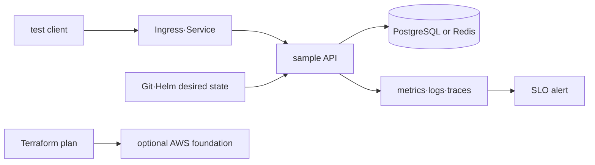
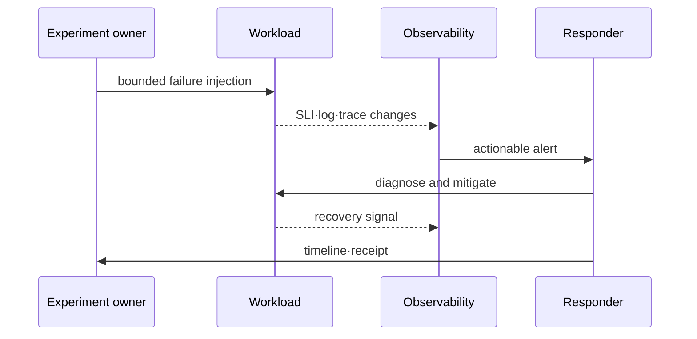

# DevOps integration capstone

> Lab level: **Local required + AWS optional**. The AWS stage can be performed only up to design and plan without changing the actual account. When running live, resource inventory, billing possibility, and cleanup approval are left first.

## Lab prerequisites

This document is not the first lab, but a graduation assignment that connects the previous topics. Complete the basic labs of Linux·networking·Kubernetes·Helm·observability and PostgreSQL or Redis first.

- **local cluster**: Requires a kind or minikube context that can be deleted.
- **Tools**: Requires `kubectl`, `helm`, `curl` and selected data store client.
- **sample workload**: `/ready`, `/metrics`, a test API and Helm chart that provide request ID and data store connection are required.
- **Observation environment**: At a minimum, you must be able to see the request success rate/latency and application log. If there is a trace, connect with the same request ID.
- **Choose only one failure**: Initially choose only one of incorrect image, connection exhaustion, or network denial.
- **Safe Conditions**: Failure scope, abort conditions, rollback command and cleanup list are written before injection.

Since the current repository does not include the completed sample workload and chart, it cannot be determined that the local capstone has been completed through this document alone. The section below is a necessary execution contract and is treated as a design/review stage until the actual sample bundle is provided.

## Understand the model first

The purpose of the capstone is not to run multiple tools at once, but to provide evidence of how a single user request passes through the entire infrastructure to fail and recover. Helm release, Pod status, database connection, telemetry and SLO should be placed on the same timeline.

For example, selecting DB connection exhaustion does not end with simply reducing the number of database connections. Check which traffic caused the pool to become saturated, how the API returned a timeout or 503, whether metrics·log·trace point to the same event, and whether the backlog and SLO were restored after mitigation.

| step | question | evidence to leave |
|---|---|---|
| baseline | How much do you process when normal? | request rate, p95, pool, resource usage |
| injection | What are the failure boundaries and termination conditions? | Start time, change diff, safety limit |
| detection | Does it catch it before the user knows about it? | SLI and alert timeline |
| diagnosis | Which boundary is the bottleneck? | event, log, trace, dependency state |
| mitigation | Has impact actually decreased? | rollout·rollback and recovery signal |
| learning | What's automated next? | Actions with owner and verification method |

The fact that the Pod is Running or that the alert has disappeared is not enough. User requests and dependency states that have returned to normal standards must be checked and temporary changes reflected in the desired state.

## Common workload contract

The sample API relies on PostgreSQL or Redis and provides `/ready`, `/metrics` and trace context. The following goals are examples, so calculate them according to your environment.

```yaml
objectives:
  availability_slo: "99.9% over 30d"
  recovery_time_objective: "15m"
  recovery_point_objective: "5m"
  peak_requests_per_second: 50
  monthly_cost_budget: "set after region-specific estimate"
failure_scenario: "database connection exhaustion"
```



## A. Local required capstone

### 1. Preparation and normal standards

1. Create a namespace and resource quota in local Kubernetes.
2. Install sample API and data dependency with Helm.
3. Store rendered manifest, image digest and release revision.
4. Records normal request success rate, p95 latency, connection usage and resource baseline.

```bash
helm lint ./sample-chart
helm template sample ./sample-chart -n infra-capstone > rendered.yaml
kubectl apply --dry-run=client -f rendered.yaml
helm upgrade --install sample ./sample-chart -n infra-capstone --create-namespace --wait
kubectl get deploy,pod,service -n infra-capstone
```

### 2. Disorder injection

Select only one of incorrect image, DB connection exhaustion, or NetworkPolicy denial. Prepare rollback command and observation dashboard before injection.



### 3. Proof of Completion

- Incident timeline from alert time to SLO recovery
- One metric and request/trace ID before and after change
- Evidence closest to the root cause
- Rollback or fix revision and action to prevent recurrence
- Helm uninstall, namespace and local artifact cleanup receipt

```bash
helm uninstall sample -n infra-capstone
kubectl delete namespace infra-capstone
rm -f rendered.yaml
```

## B. AWS optional capstone

Design isolated VPC/IAM roles and EKS dependent resources using Terraform and review saved plans. Karpenter only adds to the following in-depth topics:

### gate before execution

- Verify the caller identity, region, and expected account of the temporary credential.
- Check expected resource, quota, public exposure, tag, and price by region in the official tool.
- Set the state backend, lock, encryption and recovery owner.
- Two people review the number of create·replace·destroy and data egress possibilities of `terraform plan`.

### Receipt when running live

Leaves architecture diagram, resource inventory, apply/deploy evidence, SLI, incident timeline and cleanup results. Secret, state, account ID and private endpoint are removed from public receipt. CI does not create live AWS resources.

### Clearance Judgment

`terraform destroy` Don't just believe in success, check AWS resource inventory, load balancer·volume·snapshot·backup, DNS, log retention, and billing view. Backup or audit logs that need to be preserved leave an owner and an expiration date.

## How to interpret the results

If the SLI drops immediately after fault injection and an alert sounds, the detection path has been confirmed. If the request fails even without an alert, check whether the threshold, measurement point, or traffic volume does not match the assumptions. Do not just lower the threshold to force an alert to sound.

Pod readiness has recovered after rollback, but if the DB pool continues to be saturated or the queue backlog increases, the service is still recovering. The recovery completion event must be defined in advance as a combination of normal request rate, tail latency, and dependency health to measure RTO consistently.

The success of the AWS optional phase plan is not proof that the cloud architecture can withstand actual traffic and failure. This is static evidence that examines the account·region·authority·resource graph. If live execution is not performed, load, failover, cost, and cleanup results remain unverified.

## Explain it in your own words

1. Why can’t local capstone success be completed with “Pod Running”?
2. What is an example of a change that might be dangerous even if destroy is 0 in an AWS plan?
3. Why is billing and backup confirmation necessary upon cleanup receipt?

<!-- source: https://helm.sh/docs/helm/helm_upgrade/ | checked: 2026-09-03 -->
<!-- source: https://developer.hashicorp.com/terraform/cli/commands/plan | checked: 2026-09-03 | version: Terraform 1.16.x -->
<!-- source: https://docs.aws.amazon.com/wellarchitected/latest/reliability-pillar/test-reliability.html | checked: 2026-09-03 -->
<!-- source: https://docs.aws.amazon.com/wellarchitected/latest/cost-optimization-pillar/practice-cloud-financial-management.html | checked: 2026-09-03 -->
