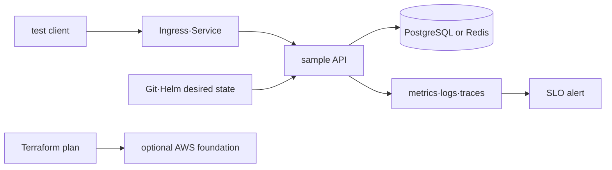
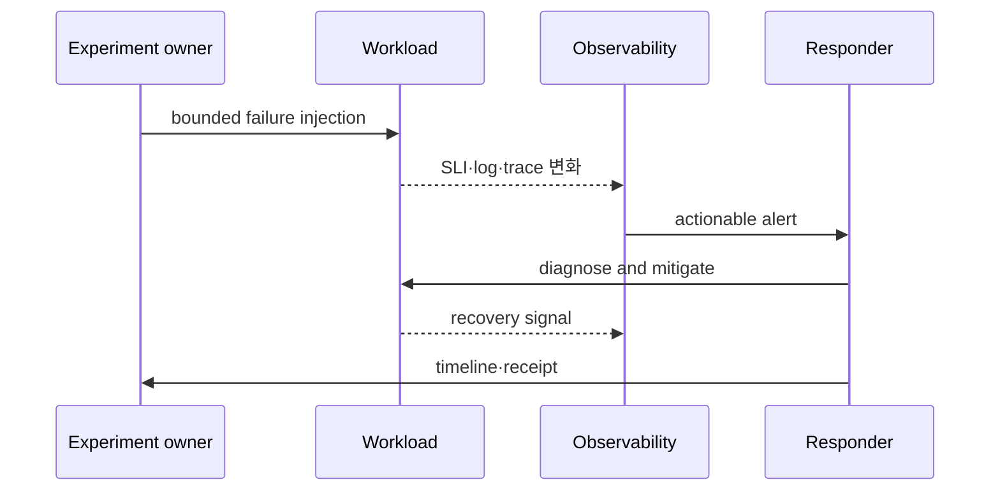

# DevOps 통합 capstone

> 실습 등급: **Local 필수 + AWS optional**. AWS 단계는 실제 계정 변경 없이 design·plan까지만 수행해도 된다. live 실행 시 resource inventory, 과금 가능성과 cleanup 승인을 먼저 남긴다.

## 실습 전에 준비할 것

이 문서는 첫 실습이 아니라 앞선 주제를 연결하는 졸업 과제다. Linux·networking·Kubernetes·Helm·observability와 PostgreSQL 또는 Redis의 기본 실습을 먼저 끝낸다.

- **local cluster**: 지워도 되는 kind 또는 minikube context가 필요하다.
- **도구**: `kubectl`, `helm`, `curl`과 선택한 data store client가 필요하다.
- **sample workload**: `/ready`, `/metrics`, request ID와 data store 연결을 제공하는 test API와 Helm chart가 필요하다.
- **관측 환경**: 최소한 request 성공률·latency와 application log를 볼 수 있어야 한다. trace까지 있으면 같은 request ID로 연결한다.
- **실패 하나만 선택**: 잘못된 image, connection exhaustion, network denial 중 처음에는 하나만 고른다.
- **안전 조건**: 실패 범위, 중단 조건, rollback 명령과 cleanup 목록을 주입 전에 작성한다.

현재 저장소에는 완성된 sample workload와 chart가 포함돼 있지 않으므로, 이 문서만으로 Local capstone을 실행 완료했다고 판정할 수 없다. 아래 절은 필요한 실행 계약이며 실제 sample bundle이 제공되기 전까지는 설계·검토 단계로 취급한다.

## 먼저 이해하기

capstone의 목적은 여러 도구를 한 번씩 실행하는 것이 아니라 하나의 사용자 요청이 infrastructure 전체를 지나 실패하고 회복되는 과정을 증거로 설명하는 것이다. Helm release, Pod 상태, database connection, telemetry와 SLO를 같은 timeline에 놓아야 한다.

예를 들어 DB connection exhaustion을 선택하면 단순히 database connection 수를 줄이는 데서 끝나지 않는다. 어떤 traffic에서 pool이 포화됐는지, API가 timeout 또는 503을 어떻게 반환했는지, metric·log·trace가 같은 사건을 가리키는지, 완화 뒤 backlog와 SLO가 회복됐는지 확인한다.

| 단계 | 질문 | 남길 증거 |
|---|---|---|
| baseline | 정상일 때 얼마를 처리하는가? | request rate, p95, pool, resource 사용량 |
| injection | 실패 범위와 종료 조건은 무엇인가? | 시작 시각, 변경 diff, safety limit |
| detection | 사용자가 먼저 알기 전에 잡는가? | SLI와 alert timeline |
| diagnosis | 어느 경계가 병목인가? | event, log, trace, dependency state |
| mitigation | impact가 실제로 줄었는가? | rollout·rollback과 recovery signal |
| learning | 다음에는 무엇이 자동화되는가? | owner 있는 action과 검증 방법 |

Pod가 Running이거나 alert가 사라진 사실 하나만으로 완료하지 않는다. 정상 기준으로 돌아온 사용자 요청과 dependency 상태를 확인하고 임시 변경을 desired state에 반영해야 한다.

## 공통 workload 계약

sample API는 PostgreSQL 또는 Redis에 의존하고 `/ready`, `/metrics`와 trace context를 제공한다. 다음 목표는 예시이므로 자신의 환경에 맞게 계산한다.

```yaml
objectives:
  availability_slo: "99.9% over 30d"
  recovery_time_objective: "15m"
  recovery_point_objective: "5m"
  peak_requests_per_second: 50
  monthly_cost_budget: "set after region-specific estimate"
failure_scenario: "database connection exhaustion"
```



## A. Local 필수 capstone

### 1. 준비와 정상 기준

1. local Kubernetes에 namespace와 resource quota를 만든다.
2. sample API와 data dependency를 Helm으로 설치한다.
3. rendered manifest, image digest와 release revision을 보관한다.
4. 정상 요청 성공률, p95 latency, connection usage와 resource baseline을 기록한다.

```bash
helm lint ./sample-chart
helm template sample ./sample-chart -n infra-capstone > rendered.yaml
kubectl apply --dry-run=client -f rendered.yaml
helm upgrade --install sample ./sample-chart -n infra-capstone --create-namespace --wait
kubectl get deploy,pod,service -n infra-capstone
```

### 2. 장애 주입

잘못된 image, DB connection exhaustion 또는 NetworkPolicy denial 중 하나만 선택한다. 주입 전에 rollback command와 관찰 dashboard를 준비한다.



### 3. 완료 증거

- alert 시각부터 SLO 회복까지 incident timeline
- 변경 전후 metric과 request/trace ID 한 개
- root cause와 가장 가까운 evidence
- rollback 또는 fix revision과 재발 방지 action
- Helm uninstall, namespace와 local artifact cleanup receipt

```bash
helm uninstall sample -n infra-capstone
kubectl delete namespace infra-capstone
rm -f rendered.yaml
```

## B. AWS optional capstone

Terraform으로 격리 VPC·IAM role과 EKS 의존 자원을 설계하고 saved plan을 검토한다. Karpenter는 다음 심화 topic에서만 추가한다.

### 실행 전 gate

- temporary credential의 caller identity, region과 예상 account를 검증한다.
- 예상 resource, quota, public exposure, tag와 region별 가격을 공식 도구에서 확인한다.
- state backend, lock, encryption과 recovery owner를 정한다.
- `terraform plan`의 create·replace·destroy 수와 data egress 가능성을 두 명이 검토한다.

### live 실행 시 receipt

architecture diagram, resource inventory, apply/deploy evidence, SLI, incident timeline과 cleanup 결과를 남긴다. secret, state, account ID와 private endpoint는 공개 receipt에서 제거한다. CI는 live AWS resource를 만들지 않는다.

### 정리 판정

`terraform destroy` 성공만 믿지 않고 AWS resource inventory, load balancer·volume·snapshot·backup, DNS, log retention과 billing view를 확인한다. 보존해야 할 backup이나 audit log는 owner와 만료일을 남긴다.

## 결과를 이렇게 읽는다

장애 주입 직후 SLI가 하락하고 alert가 울렸다면 detection path를 확인한 것이다. alert가 없더라도 요청이 실패했다면 threshold, measurement point 또는 traffic volume이 가정과 맞지 않는지 조사한다. alert를 억지로 울리기 위해 threshold만 낮추지 않는다.

rollback 뒤 Pod readiness가 회복됐지만 DB pool이 계속 포화되거나 queue backlog가 증가한다면 서비스는 아직 회복 중이다. recovery 완료 event를 정상 요청률, tail latency와 dependency health의 조합으로 미리 정의해야 RTO를 일관되게 잴 수 있다.

AWS optional 단계의 plan 성공은 cloud architecture가 실제 traffic과 failure를 견딘다는 증거가 아니다. account·region·권한·resource graph를 검토한 정적 증거다. live 실행을 하지 않았다면 load, failover, 비용과 cleanup 결과는 미검증으로 남긴다.

## 스스로 설명해 보기

1. local capstone의 성공을 “Pod Running”으로 끝낼 수 없는 이유는 무엇인가?
2. AWS plan에 destroy가 0이어도 위험한 변경일 수 있는 예는 무엇인가?
3. cleanup receipt에 billing과 backup 확인이 필요한 이유는 무엇인가?

<!-- source: https://helm.sh/docs/helm/helm_upgrade/ | checked: 2026-09-03 -->
<!-- source: https://developer.hashicorp.com/terraform/cli/commands/plan | checked: 2026-09-03 | version: Terraform 1.16.x -->
<!-- source: https://docs.aws.amazon.com/wellarchitected/latest/reliability-pillar/test-reliability.html | checked: 2026-09-03 -->
<!-- source: https://docs.aws.amazon.com/wellarchitected/latest/cost-optimization-pillar/practice-cloud-financial-management.html | checked: 2026-09-03 -->
