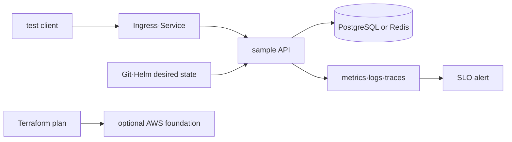
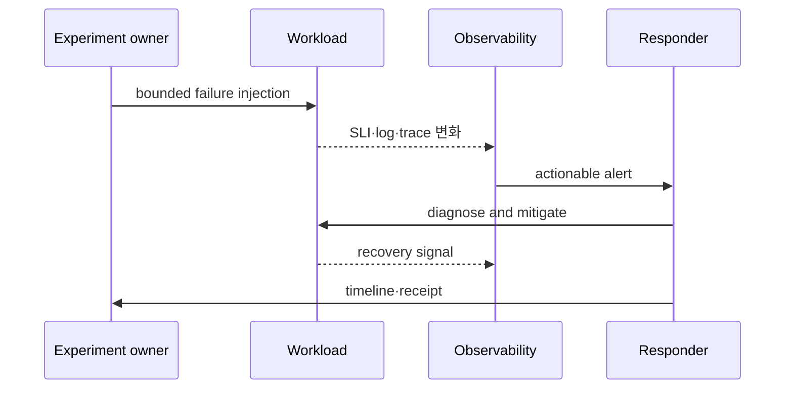

# Infra Specialist 통합 capstone

> 실습 등급: **Local 필수 + AWS optional**. AWS 단계는 실제 계정 변경 없이 design·plan까지만 수행해도 된다. live 실행 시 resource inventory, 과금 가능성과 cleanup 승인을 먼저 남긴다.

## 공통 workload 계약

sample API는 PostgreSQL 또는 Redis에 의존하고 `/ready`, `/metrics`와 trace context를 제공한다. 다음 목표는 예시이므로 자신의 환경에 맞게 계산한다.

```yaml
objectives:
  availability_slo: "99.9% over 30d"
  recovery_time_objective: "15m"
  recovery_point_objective: "5m"
  peak_requests_per_second: 50
  monthly_cost_budget: "set after region-specific estimate"
failure_scenario: "database connection exhaustion"
```



## A. Local 필수 capstone

### 1. 준비와 정상 기준

1. local Kubernetes에 namespace와 resource quota를 만든다.
2. sample API와 data dependency를 Helm으로 설치한다.
3. rendered manifest, image digest와 release revision을 보관한다.
4. 정상 요청 성공률, p95 latency, connection usage와 resource baseline을 기록한다.

```bash
helm lint ./sample-chart
helm template sample ./sample-chart -n infra-capstone > rendered.yaml
kubectl apply --dry-run=client -f rendered.yaml
helm upgrade --install sample ./sample-chart -n infra-capstone --create-namespace --wait
kubectl get deploy,pod,service -n infra-capstone
```

### 2. 장애 주입

잘못된 image, DB connection exhaustion 또는 NetworkPolicy denial 중 하나만 선택한다. 주입 전에 rollback command와 관찰 dashboard를 준비한다.



### 3. 완료 증거

- alert 시각부터 SLO 회복까지 incident timeline
- 변경 전후 metric과 request/trace ID 한 개
- root cause와 가장 가까운 evidence
- rollback 또는 fix revision과 재발 방지 action
- Helm uninstall, namespace와 local artifact cleanup receipt

```bash
helm uninstall sample -n infra-capstone
kubectl delete namespace infra-capstone
rm -f rendered.yaml
```

## B. AWS optional capstone

Terraform으로 격리 VPC·IAM role과 EKS 의존 자원을 설계하고 saved plan을 검토한다. Karpenter는 다음 심화 topic에서만 추가한다.

### 실행 전 gate

- temporary credential의 caller identity, region과 예상 account를 검증한다.
- 예상 resource, quota, public exposure, tag와 region별 가격을 공식 도구에서 확인한다.
- state backend, lock, encryption과 recovery owner를 정한다.
- `terraform plan`의 create·replace·destroy 수와 data egress 가능성을 두 명이 검토한다.

### live 실행 시 receipt

architecture diagram, resource inventory, apply/deploy evidence, SLI, incident timeline과 cleanup 결과를 남긴다. secret, state, account ID와 private endpoint는 공개 receipt에서 제거한다. CI는 live AWS resource를 만들지 않는다.

### 정리 판정

`terraform destroy` 성공만 믿지 않고 AWS resource inventory, load balancer·volume·snapshot·backup, DNS, log retention과 billing view를 확인한다. 보존해야 할 backup이나 audit log는 owner와 만료일을 남긴다.

## 스스로 설명해 보기

1. local capstone의 성공을 “Pod Running”으로 끝낼 수 없는 이유는 무엇인가?
2. AWS plan에 destroy가 0이어도 위험한 변경일 수 있는 예는 무엇인가?
3. cleanup receipt에 billing과 backup 확인이 필요한 이유는 무엇인가?

<!-- source: https://helm.sh/docs/helm/helm_upgrade/ | checked: 2026-09-03 -->
<!-- source: https://developer.hashicorp.com/terraform/cli/commands/plan | checked: 2026-09-03 | version: Terraform 1.16.x -->
<!-- source: https://docs.aws.amazon.com/wellarchitected/latest/reliability-pillar/test-reliability.html | checked: 2026-09-03 -->
<!-- source: https://docs.aws.amazon.com/wellarchitected/latest/cost-optimization-pillar/practice-cloud-financial-management.html | checked: 2026-09-03 -->
