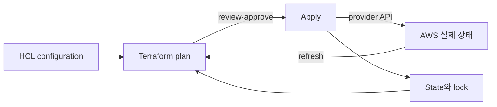

# Terraform on AWS 로드맵

Terraform의 핵심은 HCL 문법이 아니라 **configuration의 resource address와 실제 AWS object를 state로 연결하고 변경 순서를 계산하는 것**이다.

## 한 문장 모델

> Terraform은 `configuration + prior state + refreshed remote state`로 plan을 만들고, 승인된 plan을 provider API 호출로 적용한 뒤 새 state를 기록한다.

## 읽는 순서

1. [Resource graph와 state](01-resource-graph-and-state.md): resource address, dependency, provider, state와 remote backend의 책임을 구분한다.
2. [Plan, drift와 import 실습](02-plan-drift-import-lab.md): cloud 변경 없이 core workflow를 실행하고 AWS plan의 승인·복구 절차를 설계한다.

## 학습 범위

- Terraform 1.16.x 문서 기준 language와 CLI
- AWS provider version constraint와 lock file
- root module과 reusable child module
- S3 backend, bucket versioning과 `use_lockfile`
- `fmt → init → validate → test → plan → approval → apply`
- import, `moved` block, drift와 state recovery
- sensitive data와 plan/state artifact 보호

S3 backend의 DynamoDB 기반 locking은 현재 공식 문서에서 deprecated다. 새 예시는 S3 lockfile을 우선하고 기존 환경 마이그레이션 맥락에서만 DynamoDB 방식을 언급한다.

## 책임 경계

| Terraform이 하는 일 | 별도 책임 |
|---|---|
| resource graph와 변경 plan | architecture가 안전한지 판단 |
| provider API 호출 | AWS quota·service availability |
| state binding 기록 | state backend IAM·암호화·versioning·복구 |
| dependency 순서 계산 | application readiness와 data migration |
| configuration drift 탐지 | out-of-band 변경을 허용할 정책 |

## 완료 기준

- state를 Git에 넣지 않고 remote backend, lock과 recovery를 설명한다.
- plan의 create/update/replace/destroy와 unknown 값을 구분한다.
- console에서 만든 object를 import할 때 configuration·state·remote object의 일대일 binding을 보존한다.
- [Helm Charts와 GitOps](../helm-gitops/00-roadmap.md)와 같은 resource를 동시에 관리하지 않도록 ownership을 정한다.

## 스스로 설명해 보기

1. HCL 파일만 있으면 기존 infrastructure를 안전하게 인수할 수 없는 이유는 무엇인가?
2. state lock이 있어도 잘못된 plan을 막지 못하는 이유는 무엇인가?
3. Terraform과 Argo CD가 같은 Kubernetes object를 관리하면 어떤 형태의 drift loop가 생기는가?

<!-- source: https://developer.hashicorp.com/terraform/language/state | checked: 2026-09-03 | version: Terraform 1.16.x -->
<!-- source: https://developer.hashicorp.com/terraform/language/backend/s3 | checked: 2026-09-03 | version: Terraform 1.16.x -->
<!-- source: https://developer.hashicorp.com/terraform/language/modules | checked: 2026-09-03 | version: Terraform 1.16.x -->
