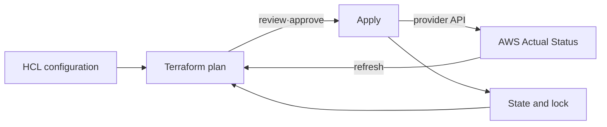

# Terraform on AWS Roadmap

## Starting point for beginners

You can create servers and networks by directly clicking them on the AWS screen. But when you want to recreate the same experience or review the reasons for a change, you rely on your memory of “who pressed what.” Terraform is a tool that writes down the infrastructure you want to create in a file, compares it to the current state, and shows the change schedule.

| New term | Plain-language meaning |
|---|---|
| configuration | A file containing the code you want to create |
| resource | Objects that Terraform creates, searches, and changes as a unit |
| provider | Plugin to forward Terraform requests to external service APIs such as AWS |
| state | A record to remember that the resources in your code and the actual AWS resources are the same thing. |
| plan | A proposal that shows what will be created, changed, or deleted if applied now. |
| Apply | Steps to request the reviewed plan from an actual external service |

The first lab does not create AWS resources. After learning the `write → validate → inspect the plan` flow with small local resources, you first learn the habit of checking accounts and scope of changes in AWS.

The core of Terraform is not HCL grammar, but **connecting the resource address of the configuration and the actual AWS object to the state and calculating the change order**.

## The model in one sentence

> Terraform creates a plan with `configuration + prior state + refreshed remote state`, applies the approved plan by calling the provider API, and records a new state.

## Reading order

1. [Resource graph and state](01-resource-graph-and-state.md): Separate responsibilities of resource address, dependency, provider, state, and remote backend.
2. [Plan, drift, and import lab](02-plan-drift-import-lab.md): Execute core workflow without changing cloud and design approval and recovery procedures for AWS plan.

## scope of study

- Terraform 1.16.x document based language and CLI
- AWS provider version constraints and lock file
- root module and reusable child module
- S3 backend, bucket versioning and `use_lockfile`
- `fmt → init → validate → test → plan → approval → apply`
- import, `moved` block, drift and state recovery
- Protect sensitive data and plan/state artifacts

S3 backend's DynamoDB-based locking is currently deprecated in the official documentation. The new example prioritizes the S3 lockfile and mentions the DynamoDB approach only in the context of migrating an existing environment.

## responsibility boundaries

| What Terraform Does | separate responsibility |
|---|---|
| Resource graph and change plan | Determine if the architecture is safe |
| provider API call | AWS quota·service availability |
| state binding record | state backend IAM·encryption·versioning·recovery |
| Calculate dependency order | Application readiness and data migration |
| configuration drift detection | Policy to allow out-of-band changes |

## Completion criteria

This topic is not something you read once and then stop. First, convert the terminology table into your own words and follow the flow of requests made in the concepts chapter. In the lab, the normal state is first recorded, then a failure is created by changing only one condition, and the cause is explained with evidence before recovery. Finally, expand to more complex environments by answering the operational judgment questions below.

- It explains remote backend, lock, and recovery without putting the state in Git.
- Distinguish between plan's create/update/replace/destroy and unknown values.
- When importing an object created in the console, one-to-one binding of configuration·state·remote objects is preserved.
- [Set ownership so that resources such as Helm Charts and GitOps](../helm-gitops/00-roadmap.md) are not managed simultaneously.

## Check your understanding

1. What do configuration, state, and actual AWS resources each represent?
2. What is the difference between checking `plan` and checking `apply`?

**Confirmation criteria:** Configuration can be divided into the desired structure, state is the connection record between code and actual resources, and remote resource can be divided into objects that exist in AWS. Plan is a change proposal and apply is the actual execution.

## Develop operational judgment

1. Why can't we safely take over an existing infrastructure with just an HCL file?
2. Why can't a bad plan be prevented even if there is a state lock?
3. What type of drift loop occurs when Terraform and Argo CD manage the same Kubernetes object?

<!-- source: https://developer.hashicorp.com/terraform/language/state | checked: 2026-09-03 | version: Terraform 1.16.x -->
<!-- source: https://developer.hashicorp.com/terraform/language/backend/s3 | checked: 2026-09-03 | version: Terraform 1.16.x -->
<!-- source: https://developer.hashicorp.com/terraform/language/modules | checked: 2026-09-03 | version: Terraform 1.16.x -->
