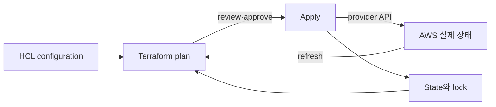

# Terraform on AWS 로드맵

## 처음 보는 사람을 위한 출발점

AWS 화면에서 서버와 네트워크를 직접 클릭해 만들 수 있다. 하지만 같은 환경을 다시 만들거나 변경 이유를 검토하려면 “누가 무엇을 눌렀는지” 기억에 의존하게 된다. Terraform은 만들고 싶은 인프라를 파일에 적고, 현재 상태와 비교해 변경 예정표를 보여 주는 도구다.

| 처음 만나는 말 | 학습용 쉬운 뜻 |
|---|---|
| 구성(configuration) | 만들고 싶은 자원을 코드로 적은 파일 |
| 자원(resource) | Terraform이 하나의 단위로 생성·조회·변경하는 대상 |
| 공급자(provider) | Terraform 요청을 AWS 같은 외부 서비스 API로 전달하는 플러그인 |
| 상태(state) | 코드의 자원과 실제 AWS 자원이 서로 같은 대상임을 기억하는 기록 |
| 계획(plan) | 지금 적용하면 무엇이 생성·변경·삭제될지 보여 주는 제안서 |
| 적용(apply) | 검토한 계획을 실제 외부 서비스에 요청하는 단계 |

첫 실습은 AWS 자원을 만들지 않는다. 작은 로컬 자원으로 `작성 → 검사 → 계획 확인` 흐름을 익힌 뒤, AWS에서는 계정과 변경 범위를 확인하는 습관부터 배운다.

Terraform의 핵심은 HCL 문법이 아니라 **configuration의 resource address와 실제 AWS object를 state로 연결하고 변경 순서를 계산하는 것**이다.

## 한 문장 모델

> Terraform은 `configuration + prior state + refreshed remote state`로 plan을 만들고, 승인된 plan을 provider API 호출로 적용한 뒤 새 state를 기록한다.

## 읽는 순서

1. [Resource graph와 state](01-resource-graph-and-state.md): resource address, dependency, provider, state와 remote backend의 책임을 구분한다.
2. [Plan, drift와 import 실습](02-plan-drift-import-lab.md): cloud 변경 없이 core workflow를 실행하고 AWS plan의 승인·복구 절차를 설계한다.

## 학습 범위

- Terraform 1.16.x 문서 기준 language와 CLI
- AWS provider version constraint와 lock file
- root module과 reusable child module
- S3 backend, bucket versioning과 `use_lockfile`
- `fmt → init → validate → test → plan → approval → apply`
- import, `moved` block, drift와 state recovery
- sensitive data와 plan/state artifact 보호

S3 backend의 DynamoDB 기반 locking은 현재 공식 문서에서 deprecated다. 새 예시는 S3 lockfile을 우선하고 기존 환경 마이그레이션 맥락에서만 DynamoDB 방식을 언급한다.

## 책임 경계

| Terraform이 하는 일 | 별도 책임 |
|---|---|
| resource graph와 변경 plan | architecture가 안전한지 판단 |
| provider API 호출 | AWS quota·service availability |
| state binding 기록 | state backend IAM·암호화·versioning·복구 |
| dependency 순서 계산 | application readiness와 data migration |
| configuration drift 탐지 | out-of-band 변경을 허용할 정책 |

## 완료 기준

이 주제는 한 번 읽고 끝내지 않는다. 먼저 용어 표를 자신의 말로 바꾸고, 개념 장에서 한 요청의 흐름을 따라간다. 실습에서는 정상 상태를 먼저 기록한 뒤 조건 하나만 바꿔 실패를 만들고, 증거로 원인을 설명한 뒤 복구한다. 마지막으로 아래 운영 판단 질문에 답하면서 더 복잡한 환경으로 확장한다.

- state를 Git에 넣지 않고 remote backend, lock과 recovery를 설명한다.
- plan의 create/update/replace/destroy와 unknown 값을 구분한다.
- console에서 만든 object를 import할 때 configuration·state·remote object의 일대일 binding을 보존한다.
- [Helm Charts와 GitOps](../helm-gitops/00-roadmap.md)와 같은 resource를 동시에 관리하지 않도록 ownership을 정한다.

## 처음 이해했는지 확인

1. configuration, state와 실제 AWS resource는 각각 무엇을 나타내는가?
2. `plan`을 확인하는 것과 `apply`하는 것은 어떻게 다른가?

**확인 기준:** configuration은 원하는 구조, state는 코드와 실제 자원의 연결 기록, remote resource는 AWS에 존재하는 대상이라고 나눌 수 있으면 된다. plan은 변경 제안이고 apply는 실제 실행이다.

## 운영 판단으로 확장하기

1. HCL 파일만 있으면 기존 infrastructure를 안전하게 인수할 수 없는 이유는 무엇인가?
2. state lock이 있어도 잘못된 plan을 막지 못하는 이유는 무엇인가?
3. Terraform과 Argo CD가 같은 Kubernetes object를 관리하면 어떤 형태의 drift loop가 생기는가?

<!-- source: https://developer.hashicorp.com/terraform/language/state | checked: 2026-09-03 | version: Terraform 1.16.x -->
<!-- source: https://developer.hashicorp.com/terraform/language/backend/s3 | checked: 2026-09-03 | version: Terraform 1.16.x -->
<!-- source: https://developer.hashicorp.com/terraform/language/modules | checked: 2026-09-03 | version: Terraform 1.16.x -->
