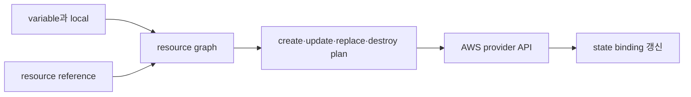

# Resource graph와 state

## 먼저 이해하기

Terraform에는 서로 다른 세 상태가 있다. **configuration**은 코드에 적은 의도, **state**는 Terraform resource address와 remote object ID의 연결 장부, **remote object**는 AWS에 실제로 존재하는 VPC나 subnet이다. 셋이 같아 보일 때도 있지만 역할은 다르다.

예를 들어 AWS에 `vpc-123`이 있고 state가 이를 `aws_vpc.main`에 연결한다고 하자. HCL block 이름만 `aws_vpc.platform`으로 바꾸면 AWS object가 자동으로 이름을 바꾼 것이 아니다. Terraform은 기존 address가 사라지고 새 address가 생겼다고 해석할 수 있다. `moved` block이나 state migration으로 “같은 object의 주소만 이동했다”는 의도를 알려야 불필요한 destroy/create를 피할 수 있다.

| 대상 | 무엇을 담는가 | 사람이 주로 하는 일 |
|---|---|---|
| configuration | 원하는 resource와 관계 | 코드 review, versioning, test |
| state | address↔remote ID, 일부 속성 | backend 보호, lock, recovery |
| remote object | AWS의 현재 실제 상태 | API 관찰, health·cost 확인 |
| plan | 셋의 차이를 바탕으로 한 변경 제안 | create/update/replace/destroy review |

plan은 미래를 완벽히 예언하는 문서가 아니라 특정 configuration·state·provider 관찰 시점에서 계산한 제안이다. apply 전까지 외부 상태가 바뀌거나 provider API가 다른 값을 반환할 수 있으므로 실행 후 검증도 필요하다.

## Configuration은 원하는 구조, state는 binding

resource block은 “저 object가 이미 존재한다”는 기록이 아니다. Terraform state가 configuration의 resource instance와 remote system object identity 사이 binding을 저장한다.

```hcl
terraform {
  required_version = "~> 1.16.0"
  required_providers {
    aws = {
      source  = "hashicorp/aws"
      version = "~> 6.0"
    }
  }
}

provider "aws" {
  region              = var.aws_region
  allowed_account_ids = [var.expected_account_id]
}
```

`allowed_account_ids`는 credential이 예상 account인지 확인하는 방어선이다. 실제 account ID를 공개 예제에 넣지 않고 variable과 별도 실행 환경으로 전달한다.

## Graph는 참조에서 생긴다

```hcl
resource "aws_vpc" "study" {
  cidr_block = "10.40.0.0/16"
  tags = { Name = "infra-study" }
}

resource "aws_subnet" "private_a" {
  vpc_id            = aws_vpc.study.id
  cidr_block        = "10.40.1.0/24"
  availability_zone = "ap-northeast-2a"
}
```

`aws_subnet.private_a.vpc_id`가 VPC resource를 참조하므로 dependency edge가 생긴다. `depends_on`은 표현식으로 드러나지 않는 숨은 dependency에만 사용한다. 단순 순서 강제를 남발하면 graph가 실제 data dependency를 설명하지 못한다.



## Module 경계

root module은 environment와 backend, provider wiring을 소유한다. child module은 명확한 input/output 계약을 제공한다.

- module이 account·region을 몰래 선택하지 않는다.
- output은 다음 module에 필요한 최소 값만 노출한다.
- VPC 전체를 하나의 거대한 module로 감춰 plan review가 불가능해지지 않게 한다.
- module version과 provider lock file을 함께 관리한다.

## Remote state와 locking

```hcl
terraform {
  backend "s3" {
    bucket       = "replace-with-private-state-bucket"
    key          = "infra/prod/terraform.tfstate"
    region       = "ap-northeast-2"
    use_lockfile = true
    encrypt      = true
  }
}
```

bucket은 bootstrap 단계에서 먼저 존재해야 한다. bucket versioning, encryption, 최소 IAM과 object 복구 절차가 state lifecycle의 일부다. backend credential을 HCL이나 `-backend-config` 값으로 하드코딩하면 `.terraform` directory와 plan artifact에 남을 수 있으므로 profile·role 같은 외부 credential chain을 사용한다.

## Plan을 읽는 법

| 표시 | 질문 |
|---|---|
| create | address와 name, region이 의도한 범위인가? |
| update in-place | downtime이나 policy 축소가 있는가? |
| replace | 어떤 field가 replacement를 유발했고 data는 이동되는가? |
| destroy | dependency 제거인가, address rename인가, 실제 삭제 의도인가? |
| known after apply | 후속 policy·route가 unknown을 안전하게 처리하는가? |

saved plan도 state와 민감 값을 포함할 수 있으므로 일반 build log나 공개 artifact로 올리지 않는다.

## 스스로 설명해 보기

1. resource rename을 configuration에서만 하면 destroy/create처럼 보일 수 있는 이유는 무엇인가?
2. remote backend의 encryption과 state 내부 secret 최소화가 둘 다 필요한 이유는 무엇인가?
3. module output을 무제한으로 노출할 때 coupling이 어떻게 커지는가?

<!-- source: https://developer.hashicorp.com/terraform/language/state | checked: 2026-09-03 | version: Terraform 1.16.x -->
<!-- source: https://developer.hashicorp.com/terraform/language/modules | checked: 2026-09-03 | version: Terraform 1.16.x -->
<!-- source: https://developer.hashicorp.com/terraform/language/backend/s3 | checked: 2026-09-03 | version: Terraform 1.16.x -->
<!-- source: https://registry.terraform.io/providers/hashicorp/aws/latest/docs | checked: 2026-09-03 | provider-major: 6 -->
