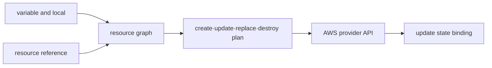

# Resource graph and state

## Terms introduced in this chapter

- **HCL**: Syntax used in Terraform configuration files. Usually written in the `.tf` file. **Why it matters / when to use it:** Express infrastructure blocks, inputs, and references in Terraform's configuration language. **Concrete situation (illustrative):** A configuration repeats an environment-dependent value in many places. → Express the input and references in HCL. → Validate and inspect the resulting plan.
- **resource address**: A unique name that points to a resource within the configuration. Example: `aws_vpc.main`. **Why it matters / when to use it:** Select the exact configured object for inspection, import, or a planned change. **Concrete situation (illustrative):** An import targets the wrong Terraform object. → Match the full resource address to its configuration. → Inspect the resulting binding before further changes.
- **remote object**: A resource that actually exists in a service outside of Terraform, such as AWS. **Why it matters / when to use it:** Distinguish the provider's real object from the local code and state describing it. **Concrete situation (illustrative):** The code declares a bucket but an operator changed its settings in the service console. → Inspect the provider-side identity and current settings. → Explain the difference between configuration, state, and remote object.
- **binding**: A connection relationship in which the Terraform address and the actual remote object are the same. **Why it matters / when to use it:** Prevent one configured address from accidentally managing the wrong existing object. **Concrete situation (illustrative):** One configuration address appears connected to the wrong server. → Compare the recorded remote ID with inventory. → Correct the binding before allowing updates.
- **dependency**: A relationship in which one resource requires the results of another resource and must be created first. **Why it matters / when to use it:** Order creation and changes so required inputs exist before dependent work runs. **Concrete situation (illustrative):** An application resource needs a network created by the same plan. → Declare the actual reference dependency. → Confirm the planned execution respects that dependency.
- **module**: A bundle of related Terraform settings with inputs and outputs. **Why it matters / when to use it:** Reuse a reviewed infrastructure design with explicit inputs across environments. **Concrete situation (illustrative):** Three environments copy nearly identical network configuration. → Extract a module with explicit inputs. → Compare each environment's plan for unintended differences.

At first, you can think of configuration as a “blueprint” and state as “a ledger that lists which resources the items in the blueprint actually are.” However, the difference is that state is not a simple copy, but operational data for finding and changing actual resources.

## Understand the model first

Terraform has three different states: **configuration** is the intention written in the code, **state** is the connection ledger of Terraform resource address and remote object ID, and **remote object** is the VPC or subnet that actually exists in AWS. There are times when the three seem the same, but their roles are different.

For example, let's say there is `vpc-123` in AWS and state connects it to `aws_vpc.main`. If you change the HCL block name to `aws_vpc.platform`, the AWS object does not change its name automatically. Terraform can interpret that the existing address has disappeared and a new address has been created. You can avoid unnecessary destroy/create by informing the intention that “only the address of the same object has been moved” through `moved` block or state migration.

| Target | What does it contain | What people mainly do |
|---|---|---|
| configuration | Relationship with desired resource | Code review, versioning, testing |
| state | address↔remote ID, some properties | backend protection, lock, recovery |
| remote object | Current Real State of AWS | API observation, health/cost check |
| plan | Change suggestions based on the differences between the three | create/update/replace/destroy review |

A plan is not a document that perfectly predicts the future, but rather a proposal calculated from the point of observation of a specific configuration, state, and provider. Verification after execution is also necessary because the external state may change or the provider API may return a different value before applying.

## Take a step-by-step look at how a change plan is created

1. Terraform reads the `.tf` configuration and input variables.
2. Read which remote object each resource address is connected to in the previous state.
3. The provider searches the current value of the actual remote object within the allowed range.
4. Terraform calculates the difference between configuration, state, and search results and creates a plan in dependency order.
5. A person reviews the items created, changed, replaced, deleted and the target account.
6. Only if approved, apply calls the provider API and records the successful result in the new state.

`plan` is the proposal made in step 4. The actual change is step 6, and just because the plan is readable doesn't mean the architecture and application are secure.

## Configuration is the desired structure, state is binding

A resource block is not a record of “that object already exists.” Terraform state stores the binding between the configuration's resource instance and remote system object identity.

```hcl
terraform {
  required_version = "~> 1.16.0"
  required_providers {
    aws = {
      source  = "hashicorp/aws"
      version = "~> 6.0"
    }
  }
}

provider "aws" {
  region              = var.aws_region
  allowed_account_ids = [var.expected_account_id]
}
```

`allowed_account_ids` is a defense line that checks whether the credential is the expected account. The actual account ID is not included in the public example, but is passed to a variable and separate execution environment.

## Graph comes from references

```hcl
resource "aws_vpc" "study" {
  cidr_block = "10.40.0.0/16"
  tags = { Name = "infra-study" }
}

resource "aws_subnet" "private_a" {
  vpc_id            = aws_vpc.study.id
  cidr_block        = "10.40.1.0/24"
  availability_zone = "ap-northeast-2a"
}
```

Because `aws_subnet.private_a.vpc_id` refers to a VPC resource, a dependency edge occurs. `depends_on` is used only for hidden dependencies that are not revealed in expressions. If simple order enforcement is overused, the graph will not account for actual data dependencies.



## Module border

The root module owns the environment, backend, and provider wiring. Child modules provide explicit input/output contracts.

- The module does not secretly select accounts/regions.
- The output exposes only the minimum value required for the next module.
- By hiding the entire VPC as one huge module, plan review is not made impossible.
- Manage module version and provider lock file together.

## Remote state and locking

```hcl
terraform {
  backend "s3" {
    bucket       = "replace-with-private-state-bucket"
    key          = "infra/prod/terraform.tfstate"
    region       = "ap-northeast-2"
    use_lockfile = true
    encrypt      = true
  }
}
```

The bucket must exist first in the bootstrap step. Bucket versioning, encryption, minimal IAM, and object recovery procedures are part of the state lifecycle. If the backend credential is hard-coded as an HCL or `-backend-config` value, it may remain in the `.terraform` directory and plan artifact, so use an external credential chain such as profile·role.

## How to read the plan

| mark | question |
|---|---|
| create | Are the address, name, and region in the intended range? |
| update in-place | Is there any downtime or policy reduction? |
| replace | Which fields caused replacement and is the data moved? |
| destroy | Is it the intention to remove a dependency, rename an address, or actually delete it? |
| known after apply | Does the subsequent policy route handle the unknown safely? |

Since the saved plan may also contain state and sensitive values, it is not uploaded to the general build log or public artifact.

## Explain it in your own words

1. Why does it look like destroy/create when resource rename is done only in configuration?
2. Why are both remote backend encryption and state internal secret minimization necessary?
3. How does coupling increase when module output is exposed indefinitely?

<!-- source: https://developer.hashicorp.com/terraform/language/state | checked: 2026-09-03 | version: Terraform 1.16.x -->
<!-- source: https://developer.hashicorp.com/terraform/language/modules | checked: 2026-09-03 | version: Terraform 1.16.x -->
<!-- source: https://developer.hashicorp.com/terraform/language/backend/s3 | checked: 2026-09-03 | version: Terraform 1.16.x -->
<!-- source: https://registry.terraform.io/providers/hashicorp/aws/latest/docs | checked: 2026-09-03 | provider-major: 6 -->
