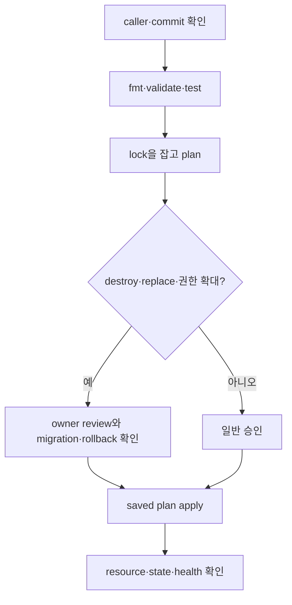

# Plan, drift와 import 실습

> 실습 등급: 첫 절은 **Local**, AWS 예시는 **Plan only**다. 이 장은 `terraform apply`를 실행하지 않는다.

## 1. Provider 없는 core workflow

빈 directory에 `main.tf`를 만든다.

```hcl
terraform {
  required_version = "~> 1.16.0"
}

variable "environment" {
  type        = string
  description = "Logical environment name"

  validation {
    condition     = contains(["dev", "stage", "prod"], var.environment)
    error_message = "environment must be dev, stage, or prod"
  }
}

resource "terraform_data" "contract" {
  input = {
    environment = var.environment
    owner       = "platform"
  }
}

output "contract" {
  value = terraform_data.contract.output
}
```

```bash
terraform fmt -check
terraform init
terraform validate
terraform plan -var='environment=dev' -out=study.tfplan
terraform show study.tfplan
```

`terraform_data`는 provider download 없이 Terraform lifecycle을 연습하는 built-in resource다. `study.tfplan`은 실습 후 삭제하며 실제 environment에서는 공개 artifact로 취급하지 않는다.

## 2. Test로 contract 고정

```hcl
# contract.tftest.hcl
run "valid_dev_contract" {
  command = plan

  variables {
    environment = "dev"
  }

  assert {
    condition     = terraform_data.contract.output.environment == "dev"
    error_message = "planned environment must remain dev"
  }
}
```

```bash
terraform test
terraform plan -var='environment=unknown'
```

두 번째 plan은 validation 때문에 실패해야 한다. test 성공과 잘못된 input 거부를 함께 확인한다.

## 3. AWS plan review 설계

AWS provider를 쓰는 configuration에는 최소한 다음 gate를 둔다.

```bash
aws sts get-caller-identity
terraform fmt -check -recursive
terraform init -lockfile=readonly
terraform validate
terraform test
terraform plan -detailed-exitcode -out=planned-change.tfplan
terraform show -no-color planned-change.tfplan
```

`-detailed-exitcode`는 no change, change, error를 구분하므로 CI가 “변경 있음”을 실패로 오해하지 않게 한다. apply job은 review된 saved plan과 같은 commit, workspace와 account에서만 실행한다.



## Drift 진단

plan이 예상 밖 변경을 보이면 다음 셋을 비교한다.

1. 현재 commit의 configuration
2. backend가 가진 state binding
3. AWS API가 반환하는 remote object

console 변경을 무조건 되돌릴지, configuration에 채택할지는 ownership 정책의 결정이다. 먼저 plan과 CloudTrail 등 변경 주체 증거를 남긴다.

## Import와 rename

기존 object를 import할 때는 configuration을 먼저 작성하고 정확한 resource address와 remote ID를 확인한다. import 뒤에는 반드시 plan이 추가 변경 0인지 또는 의도한 차이만 있는지 검토한다.

address rename은 remote object rename과 다르다. `moved` block으로 old address와 new address의 binding 이동 의도를 기록한다.

## 실패와 복구

| 실패 | 먼저 확인 | 금지할 반응 |
|---|---|---|
| state lock 획득 실패 | active run과 lock owner | 확인 없이 force-unlock |
| wrong account | caller identity와 allowed account | plan을 계속 진행 |
| 예상 밖 destroy | address rename, count/for_each key, import | plan review 생략 |
| state object 손상·삭제 | S3 version과 audit log | 빈 state로 apply |

## 정리

```bash
rm -f study.tfplan planned-change.tfplan
rm -rf .terraform
```

이 정리는 실습 directory 안에서 경로를 확인한 뒤 실행한다. 실제 backend state나 lockfile은 삭제하지 않는다.

## 스스로 설명해 보기

1. `validate` 성공이 AWS plan의 안전성을 보장하지 않는 이유는 무엇인가?
2. force-unlock 전에 active apply 여부를 확인해야 하는 이유는 무엇인가?
3. import 직후 plan이 0이 아니면 어떤 세 상태를 비교할 것인가?

<!-- source: https://developer.hashicorp.com/terraform/cli/commands/plan | checked: 2026-09-03 | version: Terraform 1.16.x -->
<!-- source: https://developer.hashicorp.com/terraform/language/tests | checked: 2026-09-03 | version: Terraform 1.16.x -->
<!-- source: https://developer.hashicorp.com/terraform/language/import | checked: 2026-09-03 | version: Terraform 1.16.x -->
<!-- source: https://developer.hashicorp.com/terraform/language/modules/develop/refactoring | checked: 2026-09-03 | version: Terraform 1.16.x -->
