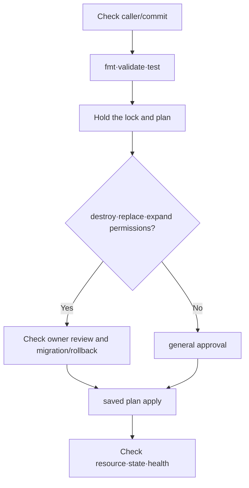

# Plan, drift and import lab

> Lab level: The first section is **Local**, and the AWS example is **Plan only**. This chapter does not run `terraform apply`.

## Lab prerequisites

- **Tools**: Install Terraform 1.16.x and check with `terraform version`.
- **directory**: Create a new directory with no other Terraform state and run only within it.
- **File**: Create `main.tf` in the first step and `contract.tftest.hcl` in the second step.
- **AWS Step**: Optional. Proceed only if you have the minimum privileges required for AWS CLI, temporary credentials, and inquiry/plan.
- **Creation or not**: This chapter does not create AWS resources because it does not `apply`. Only local saved plan files are created.
- **Correction target**: `study.tfplan`, `planned-change.tfplan`, `.terraform/`, and the actual backend state and `.terraform.lock.hcl` are not treated as the same target.

If you are using Terraform for the first time, the success criterion in the first section is to see one creation proposal, `terraform_data.contract` in `plan`. The AWS connection will proceed only after the results can be explained.

## Understand the model first

This lab examines how each step reduces uncertainty rather than whether the Terraform command is successful. `fmt` unifies the expression format but does not verify the meaning. `validate` checks the configuration structure and provider schema, but does not determine which AWS account to change. `plan` reads the state and remote object to make changes, but does not guarantee application health.

| step | checking | Risk that remains even after passing |
|---|---|---|
| `fmt -check` | canonical formatting | Bad resource design |
| `init` | Prepare backend·module·provider | Correct account/change? |
| `validate` | syntax and internal consistency | Quota·cost·runtime impact |
| `test` | The assertion you wrote | Actions not written in assertions |
| `plan` | Proposal to change current input criteria | Race and service normality during apply |
| post-apply check | actual resources and health | Long-term operation and recovery potential |

The first two clauses use `terraform_data` to check this difference even without an AWS provider. At the AWS plan stage, credentials and remote state are added, so output and artifacts are handled sensitively.

## 1. Core workflow without provider

Create `main.tf` in an empty directory.

```hcl
terraform {
  required_version = "~> 1.16.0"
}

variable "environment" {
  type        = string
  description = "Logical environment name"

  validation {
    condition     = contains(["dev", "stage", "prod"], var.environment)
    error_message = "environment must be dev, stage, or prod"
  }
}

resource "terraform_data" "contract" {
  input = {
    environment = var.environment
    owner       = "platform"
  }
}

output "contract" {
  value = terraform_data.contract.output
}
```

```bash
terraform fmt -check
terraform init
terraform validate
terraform plan -var='environment=dev' -out=study.tfplan
terraform show study.tfplan
```

`terraform_data` is a built-in resource that practices Terraform lifecycle without provider download. `study.tfplan` is deleted after lab and is not treated as a public artifact in the actual environment.

## 2. Fix the contract by testing

```hcl
# contract.tftest.hcl
run "valid_dev_contract" {
  command = plan

  variables {
    environment = "dev"
  }

  assert {
    condition     = terraform_data.contract.output.environment == "dev"
    error_message = "planned environment must remain dev"
  }
}
```

```bash
terraform test
terraform plan -var='environment=unknown'
```

The second plan should fail due to validation. Check test success and incorrect input rejection together.

## 3. AWS plan review design

Place at least the following gate in the configuration using the AWS provider.

```bash
aws sts get-caller-identity
terraform fmt -check -recursive
terraform init -lockfile=readonly
terraform validate
terraform test
terraform plan -detailed-exitcode -out=planned-change.tfplan
terraform show -no-color planned-change.tfplan
```

`-detailed-exitcode` distinguishes between no change, change, and error, so CI does not misunderstand “there is a change” as a failure. Apply job runs only in the same commit, workspace, and account as the reviewed saved plan.



## Drift Diagnosis

If the plan shows unexpected changes, compare the following three:

1. Configuration of current commit
2. State binding of the backend
3. remote object returned by AWS API

Whether to unconditionally revert console changes or adopt them in the configuration is a decision of ownership policy. First, leave evidence of the change agent, such as plan and CloudTrail.

## Import and rename

When importing an existing object, write the configuration first and check the correct resource address and remote ID. After import, be sure to check whether the plan has zero additional changes or only intended differences.

Address rename is different from remote object rename. Record the binding movement intention of the old address and new address with the `moved` block.

## Failure and Recovery

| failure | check first | reaction to inhibit |
|---|---|---|
| Failed to acquire state lock | active run and lock owner | force-unlock without confirmation |
| wrong account | caller identity and allowed account | Continue with the plan |
| unexpected destruction | address rename, count/for_each key, import | Skip plan review |
| State object damage/deletion | S3 version and audit log | apply with empty state |

## Cleanup

```bash
rm -f study.tfplan planned-change.tfplan
rm -rf .terraform
```

This cleanup is executed after checking the path in the lab directory. The actual backend state or lockfile is not deleted.

## How to interpret the results

`+ create` in the first plan occurs because the built-in resource is not in the state yet. Since you did not apply, it is normal for the create suggestion to remain even if you create the same plan again. If `environment=unknown` fails, variable validation has operated on an input boundary. This is not verification that AWS resources are safe, but verification of a piece of module contract.

AWS plan's `known after apply` may be a value that the API determines only after creation. Rather than erasing it as an error, check whether the policy or route that depends on the unknown value is not overly widened during the planning stage.

When a drift plan appears, do not immediately assume that the console change was wrong. An emergency change may be warranted, or a configuration deployment may be missing. After checking the subject, time, and owner of the change, decide whether to adopt remote as the code or revert to the code.

## Explain it in your own words

1. `validate` Why doesn't success guarantee the safety of your AWS plan?
2. Why do I need to check whether the application is active before force-unlock?
3. If plan is non-zero immediately after import, which three states will be compared?

<!-- source: https://developer.hashicorp.com/terraform/cli/commands/plan | checked: 2026-09-03 | version: Terraform 1.16.x -->
<!-- source: https://developer.hashicorp.com/terraform/language/tests | checked: 2026-09-03 | version: Terraform 1.16.x -->
<!-- source: https://developer.hashicorp.com/terraform/language/import | checked: 2026-09-03 | version: Terraform 1.16.x -->
<!-- source: https://developer.hashicorp.com/terraform/language/modules/develop/refactoring | checked: 2026-09-03 | version: Terraform 1.16.x -->
