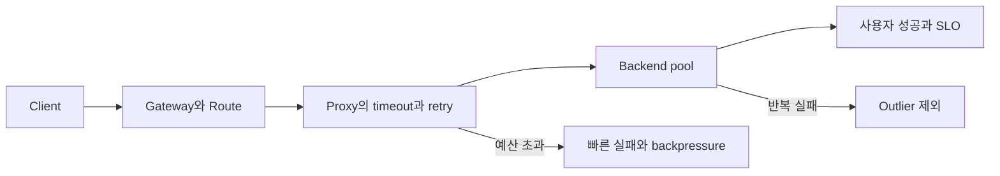

# 트래픽 제어와 서비스 복원력 로드맵

## 처음 보는 사람을 위한 출발점

서비스 A가 서비스 B를 부를 때 요청은 한 번에 목적지로 순간 이동하지 않는다. 이름을 찾고, 연결을 만들고, 어느 서버로 보낼지 고르고, 답을 기다리는 여러 단계를 지난다. 이 중 한 서버가 느려졌을 때 무조건 다시 시도하면 같은 서버나 다른 서버에 부하가 더해져 작은 실패가 전체 장애로 커질 수 있다.

이 주제는 네트워크 기초를 다시 설명하는 과정이 아니다. 먼저 [네트워크와 요청 경로](../networking/00-roadmap.md)를 읽고, Kubernetes의 Service와 workload를 이해한 뒤, **누가 route를 소유하는가**, **한 요청이 얼마 동안 몇 번 시도할 수 있는가**, **실패한 upstream을 언제 제외하고 언제 복귀시키는가**를 연결한다. 재시도 가능한 업무 의미와 application queue는 [운영 가능한 백엔드 엔지니어링](../backend-engineering/00-roadmap.md)에서 받고, AIOps의 자동 복구가 트래픽을 바꾸려면 이 경계가 먼저 있어야 하므로 [승인된 자동 복구와 운영 학습](../aiops-remediation/00-roadmap.md)의 선수 주제이기도 하다.

| 처음 만나는 말 | 학습용 쉬운 뜻 |
|---|---|
| Gateway | 외부 또는 다른 서비스에서 들어온 요청을 받는 공용 진입점 |
| Route | 어떤 조건의 요청을 어느 backend로 보낼지 적은 규칙 |
| upstream | proxy가 대신 요청을 보내는 뒤쪽 서비스 |
| deadline | 최초 요청부터 최종 응답까지 허용한 전체 시간 |
| retry budget | 정상 요청량에 비례해 허용하는 추가 시도 상한 |
| circuit breaker | 연결·대기·요청·재시도가 상한을 넘으면 빠르게 거부하는 경계 |
| outlier detection | 반복 실패하는 backend를 일정 시간 healthy 집합에서 제외하는 기능 |
| blast radius | 한 변경이나 실패가 영향을 미칠 수 있는 범위 |

## 이 주제가 답하는 질문

이 흐름에서 Gateway API는 조직의 설정 소유권과 route 부착을 다루고, Envoy 같은 data-plane proxy는 실제 연결·대기·재시도 상한을 집행한다. 둘을 한 YAML 기능으로 뭉개면 application 팀이 공용 listener를 바꾸거나, platform 팀이 업무 요청의 멱등성을 모른 채 재시도를 켜는 문제가 생긴다.

## 학습 순서

1. [Gateway에서 upstream까지의 실패 예산](01-request-budget-and-ownership.md)에서 GatewayClass·Gateway·Route와 전체 deadline·시도별 timeout·retry budget을 한 요청 경로에 놓는다.
2. [Route 소유권과 retry storm 검토 실습](02-route-and-retry-review-lab.md)에서 변경을 적용하지 않고 YAML을 읽어 route attachment와 재시도 폭증 가능성을 찾는다.
3. [Observability와 SRE](../observability-sre/00-roadmap.md)로 이동해 overflow·retry·ejection 신호를 사용자 증상과 연결한다.
4. [이상 탐지와 장애 진단](../aiops-diagnosis/00-roadmap.md)에서 route·deployment 변경과 오류 급증의 시간 상관을 원인 후보로 다룬다.

## 정상에서 실패와 복구까지

| 단계 | 확인할 증거 | 아직 결론 내리면 안 되는 것 |
|---|---|---|
| 정상 route | Gateway와 Route의 Accepted·ResolvedRefs 조건 | 실제 사용자 요청 성공 |
| 정상 upstream | healthy endpoint 수와 성공 요청 | 모든 endpoint의 동일한 성능 |
| 실패 분리 | 연결 실패·5xx·timeout·overflow counter | 실패 원인이 application인지 network인지 |
| 완화 | retry 감소, outlier 제외, traffic weight 변경 | 근본 원인이 제거됐다는 결론 |
| 복구 | 사용자 오류율·지연과 endpoint 상태 회복 | 같은 조건에서 재발하지 않는다는 보장 |

## 완료

- 공용 listener, application route, backend 정책의 소유자를 구분해 설명할 수 있다.
- 전체 deadline 안에 연결과 각 시도 시간이 어떻게 들어가는지 계산할 수 있다.
- retry가 성공률을 높일 조건과 부하를 증폭할 조건을 나눌 수 있다.
- circuit breaker가 원인을 고치는 장치가 아니라 피해 상한을 닫는 장치임을 설명할 수 있다.
- 자동 traffic switch 전에 필요한 관측 증거, 승인 또는 정책, abort condition을 적을 수 있다.

## 처음 이해했는지 확인

1. 실패한 요청을 세 번 재시도하면 upstream이 받는 최대 요청 수는 왜 단순히 평소의 세 배라고 확정할 수 없는가?
2. Route가 Accepted여도 사용자가 성공 응답을 받는다고 보장할 수 없는 이유는 무엇인가?
3. outlier detection과 circuit breaker가 서로 다른 실패 범위를 제한하는 방식을 설명해 보자.

## 운영 판단으로 확장하기

- application이 안전하게 재시도할 수 있는 메서드와 업무 작업을 문서화했는가?
- proxy·SDK·job runner가 각자 재시도해 곱셈식 증폭이 생기지 않는가?
- 자동 완화가 모든 region이나 tenant에 동시에 적용되지 않도록 범위를 제한했는가?
- traffic change 뒤 사용자 증상과 backend 포화가 모두 회복됐는지 검증하는가?

<!-- source: https://gateway-api.sigs.k8s.io/ | checked: 2026-09-03 | api-channel: Standard -->
<!-- source: https://gateway-api.sigs.k8s.io/docs/concepts/security/ | checked: 2026-09-03 -->
<!-- source: https://www.envoyproxy.io/docs/envoy/latest/intro/arch_overview/upstream/circuit_breaking | checked: 2026-09-03 -->
<!-- source: https://www.envoyproxy.io/docs/envoy/latest/faq/load_balancing/transient_failures.html | checked: 2026-09-03 -->
