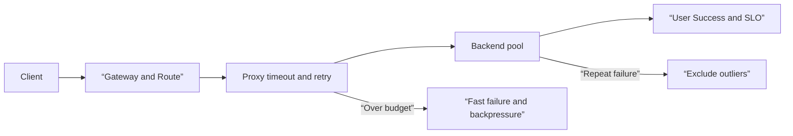

# Traffic Control and Service Resiliency Roadmap

## Starting point for beginners

When service A calls service B, the request does not travel to the destination all at once. It goes through several steps: finding a name, making a connection, choosing which server to send to, and waiting for a response. If you try again when one of these servers becomes slow, the load will be added to the same server or other servers, and a small failure may grow into a total failure.

This topic is not a refresher on network fundamentals. First, read [Network and Request Path](../networking/00-roadmap.md), understand Kubernetes' service and workload, and then connect **who owns the route**, **how many times a request can be attempted**, and **when to exclude a failed upstream and when to return it**. Retryable business semantics and application queues are [received from Operational Backend Engineering](../backend-engineering/00-roadmap.md), and are also a prerequisite topic of [Approved Automated Recovery and Operations Learning](../aiops-remediation/00-roadmap.md), since this boundary must exist first for AIOps' autohealing to change traffic.

| New term | Plain-language meaning |
|---|---|
| Gateway | A common entry point that receives requests from external sources or other services. |
| Route | Rules that state which condition requests will be sent to which backend |
| upstream | A back-end service where the proxy sends the request on behalf of |
| deadline | Total time allowed from initial request to final response |
| retry budget | A cap on additional attempts allowed relative to normal request volume |
| circuit breaker | A boundary that quickly rejects connections, waiting, requests, and retries when they exceed the upper limit. |
| outlier detection | Ability to exclude backends that repeatedly fail from the healthy set for a certain period of time |
| blast radius | The extent to which a change or failure can affect |

## Questions This Topic Answers

In this flow, the Gateway API handles the organization's configuration ownership and route attachment, and a data-plane proxy like Envoy enforces the actual connection, waiting, and retry limits. Combining the two into one YAML function creates a problem where the application team changes the common listener or the platform team turns on retries without knowing the idempotence of business requests.

## learning sequence

1. [In the failure budget ](01-request-budget-and-ownership.md) from Gateway to upstream, GatewayClass·Gateway·Route and overall deadline·timeout·retry budget for each attempt are placed on one request path.
2. [Route ownership and retry storm review In lab](02-route-and-retry-review-lab.md), read YAML without applying any changes to find route attachments and the possibility of a retry storm.
3. [Go to Observability and SRE](../observability-sre/00-roadmap.md) and connect overflow·retry·ejection signals with user symptoms.
4. [In anomaly detection and fault diagnosis](../aiops-diagnosis/00-roadmap.md), the temporal correlation between route·deployment changes and error surges is treated as a cause candidate.

## From Normal to Failure and Recovery

| step | evidence to check | Things that shouldn't be concluded yet |
|---|---|---|
| normal route | Accepted·ResolvedRefs conditions of gateway and route | Real user request successful |
| normal upstream | Number of healthy endpoints and success request | Same performance on all endpoints |
| failure separation | Connection failure·5xx·timeout·overflow counter | Is the cause of failure application or network? |
| mitigation | Reduce retry, exclude outliers, change traffic weight | Conclusion that the root cause has been removed |
| restoration | User error rate/delay and endpoint state recovery | Guaranteed not to recur under the same conditions |

## Completion criteria

- The owners of the public listener, application route, and backend policies can be distinguished and explained.
- You can calculate how the connection and each attempt time fit into the overall deadline.
- Retry can be divided into conditions that will increase the success rate and conditions that will increase the load.
- It can be explained that a circuit breaker is not a device that fixes the cause, but rather a device that closes the upper limit of damage.
- You can write down observation evidence, approvals or policies, and abort conditions required before automatic traffic switch.

## Check your understanding

1. If we retry a failed request three times, why can't we simply confirm that the maximum number of requests upstream will receive is three times the usual number?
2. Why can't the user be guaranteed to receive a success response even if the route is Accepted?
3. Let us explain how outlier detection and circuit breaker limit different failure ranges.

## Develop operational judgment

- Has the application documented methods and tasks that can be safely retried?
- Wouldn't multiplicative amplification occur if the proxy, SDK, and job runner each retry?
- Have you limited the scope of automatic mitigation so that it is not applied to all regions or tenants simultaneously?
- Do you verify whether user symptoms and backend saturation have all recovered after a traffic change?

<!-- source: https://gateway-api.sigs.k8s.io/ | checked: 2026-09-03 | api-channel: Standard -->
<!-- source: https://gateway-api.sigs.k8s.io/docs/concepts/security/ | checked: 2026-09-03 -->
<!-- source: https://www.envoyproxy.io/docs/envoy/latest/intro/arch_overview/upstream/circuit_breaking | checked: 2026-09-03 -->
<!-- source: https://www.envoyproxy.io/docs/envoy/latest/faq/load_balancing/transient_failures.html | checked: 2026-09-03 -->
